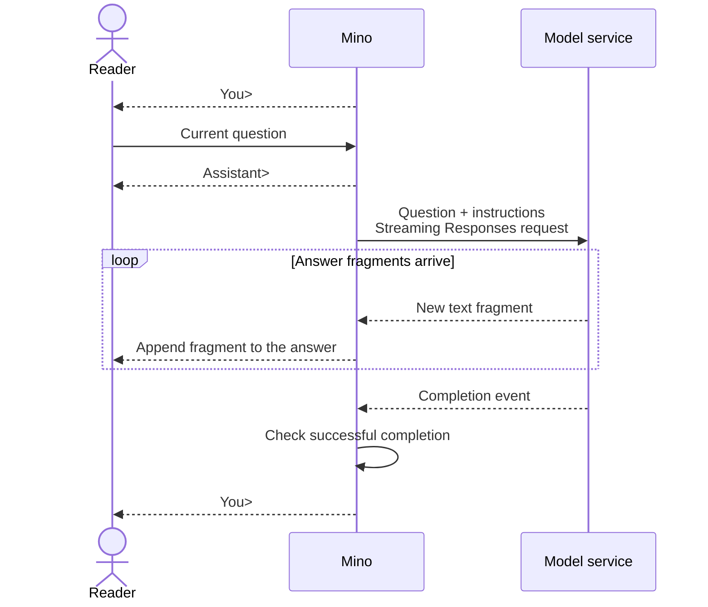

# Chapter 01: Your first terminal conversation

Applies to **0.1.x** · Source checked against the **v0.1.0 streaming reissue**, implementation **[ce6ba86](https://github.com/qshine/mino/tree/ce6ba867d97d81c7bcc114e8ca6384eed5bcf542)**

The previous answer is still sitting in your terminal. You ask what you just discussed, yet the model has never received that earlier exchange. A little odd, right? The window is open, but the conversation does not carry over. In this chapter, we follow one question to the model and its answer back to the terminal, until we find where that continuity breaks.

Complete [setup and installation](../getting-started.md) and use the source revision named above. Version `v0.2.0` already adds history; the independent questions in `0.1.x` let you see the problem this chapter starts with.

## 1. Get one answer onto the screen

Leave the follow-up question for a moment. Start the installed streaming release of Mino and give it something it can answer on its own.

```bash
mino
```

Illustrative output. The wording below explains the interaction; it is not a record of a live API call.

```text
Mino - Chapter 01: Terminal Chat
Each question is independent. Use /exit, Ctrl+D, or Ctrl+C to quit.

You> Explain an HTTP request in one sentence.

Assistant> An HTTP request is a message a client sends to a server to retrieve or submit information.

You>
```

Press Enter. Mino prints `Assistant>` and sends the question. The answer then arrives in fragments, each displayed as soon as Mino receives it. The example can only show the assembled text. The service determines the wording, the size of each fragment, and when it arrives.

For now, watch one small detail. `You>` has appeared again.

Your turn.

You can ask another question. Submit only a blank line, and Mino returns to the prompt without sending a request. The program can now keep an exchange going. Whether two questions actually share any information is harder to tell from the window alone.

## 2. The model gets what goes into the request

Think about where you are standing. You can see the question and the answer in your terminal. What can the model service see?

Mino has to put the information into a request. It uses the OpenAI Responses API, with the current question in `input`, instructions that guide the answer in `instructions`, and the configured `model` selecting who receives them.

Take the HTTP question from a moment ago. To keep the request short, suppose your instructions say ‘You are Mino. Answer briefly.’ This is an example of custom instructions, not the bundled default. The placeholder `your-model` stands for your configured model name.

```json
{
  "model": "your-model",
  "instructions": "You are Mino. Answer briefly.",
  "input": "Explain an HTTP request in one sentence.",
  "store": false,
  "stream": true
}
```

That small request already explains quite a bit. With `stream: true`, the service sends events during generation, so text can appear before the whole answer is ready. With `store: false`, Mino asks the service not to retain a response object for later retrieval. Neither setting adds conversation history to the request.

As for the instructions, Mino [reads them once when chat starts](https://github.com/qshine/mino/blob/ce6ba867d97d81c7bcc114e8ca6384eed5bcf542/internal/soul.go#L19), from `~/.mino/SOUL.md`. Every question carries that loaded copy. Edit the file and restart Mino before expecting later requests to use the new instructions. Working-directory `AGENTS.md` and `SOUL.md` are not sent as runtime instructions.

Back to our question. The model receives the question and instructions, routed according to your model setting. The other words visible in your terminal do not travel along by themselves.

## 3. Text is arriving, but completion still matters

Honestly, once an answer starts appearing, it is tempting to count the request as a success. But what if the connection drops halfway through a sentence?

Here it helps to separate the response from the answer you read. The response is a stream of structured events. Mino takes answer text from those events and displays it. An event carrying new words and an event confirming completion have different jobs.



Figure 01-1. Text reaches you first; the completion check decides when you can ask again.

On narrow screens, scroll the diagram horizontally.

### 3.1 Show the words as they arrive

The event `response.output_text.delta` carries new text; a *delta* is the newly arrived fragment. Mino [displays fragments immediately and checks the final state](https://github.com/qshine/mino/blob/ce6ba867d97d81c7bcc114e8ca6384eed5bcf542/internal/responses.go#L52). If the model refuses, Mino also streams the refusal, adding the fixed prefix `Model refused: ` before its first fragment.

Hold on, though. There is still something to check.

Mino waits for `response.completed`, with `status` equal to `completed` and no response error. At least one non-whitespace text or refusal fragment must already have arrived. Only then does Mino accept the generation as successful. A closed connection alone is not enough.

After that check passes, `You>` appears again. The answer already on screen is not printed a second time.

### 3.2 If it stops halfway, you decide what happens next

If the request fails, or the stream ends before successful completion, Mino prints `Error: ...` and returns to the input prompt. The fragments already displayed stay where they are. You can see exactly where the answer stopped.

There is one detail to keep in mind here. Mino does not retry automatically. You decide whether to submit the same question again.

While waiting for input or a response, Ctrl+C cancels and exits. At the input prompt, `/exit` or Ctrl+D on an empty line also ends the chat. Exiting does not erase fragments already displayed in the terminal.

## 4. Check the puzzle we started with

### 4.1 Is the text really displayed before completion

A finished transcript cannot tell you when its words appeared. I would rather use a check that pins down the order. Run this command from the repository root at this chapter's specified source revision.

```bash
go test ./internal -run 'TestRunStreamsBeforeResponseCompletes|TestRespond|TestTerminal'
```

These tests use a local mock HTTP service and simulated input. They do not read your real configuration or call a paid model. A passing run shows `ok` before `github.com/qshine/mino/internal`. The test process must be able to bind a local port.

The [streaming check](https://github.com/qshine/mino/blob/ce6ba867d97d81c7bcc114e8ca6384eed5bcf542/internal/streaming_test.go#L34) is quite direct. The mock service sends one fragment, waits until the test confirms it has reached terminal output, and only then sends the rest. A program that holds everything until completion cannot pass that check. The same command checks that the answer is not printed twice, interrupted streams keep their displayed fragments, and cancellation stops the interaction.

### 4.2 Why an open window still needs the earlier messages

Now return to the opening puzzle. During one run, submit these two questions in order, waiting for the first answer before asking the second.

```text
Explain an HTTP request in one sentence.
What did I just ask you to explain?
```

From your side, this plainly looks like one conversation. The earlier question is right there. Expecting a follow-up to connect is perfectly reasonable.

But in the second request, Mino includes only the second question and the instructions loaded at startup. The first question and its answer never go out. There is no `previous_response_id` or `conversation` linking the two requests, either.

The earlier exchange is still in front of you.

It is absent from what the model receives this time.

That is what *context* refers to, the information actually supplied for the current generation. The screen gives you continuity as a reader. The program still has to supply continuity for the model.

The model might guess HTTP correctly. To be honest, I could not tell from that answer alone whether it had the earlier exchange or simply guessed. The test command above includes an [independent-request check](https://github.com/qshine/mino/blob/ce6ba867d97d81c7bcc114e8ca6384eed5bcf542/internal/responses_test.go#L16) that inspects consecutive request bodies and confirms each contains only the current question. **To establish whether earlier messages were supplied, inspect what went into the request.**

## 5. Chapter outcome and next step

You can now follow that HTTP question all the way there and back. Mino sends the question and instructions, displays streamed answer text, checks completion, and hands the next move to you. These concrete handoffs are the foundation of an agent; tool execution comes later.

The follow-up that failed to connect now has a clear next step. [Chapter 02](./02-jsonl-history.md), in `v0.2.0`, writes exchanges to a JSON Lines (JSONL) file, restores completed turns at startup, and supplies them with the next question. Carry this experiment into that chapter and follow the earlier messages into the request. Tool execution and the agent loop are planned for Chapter 03 in the [chapter roadmap](../plan-todo-chapters.md).
