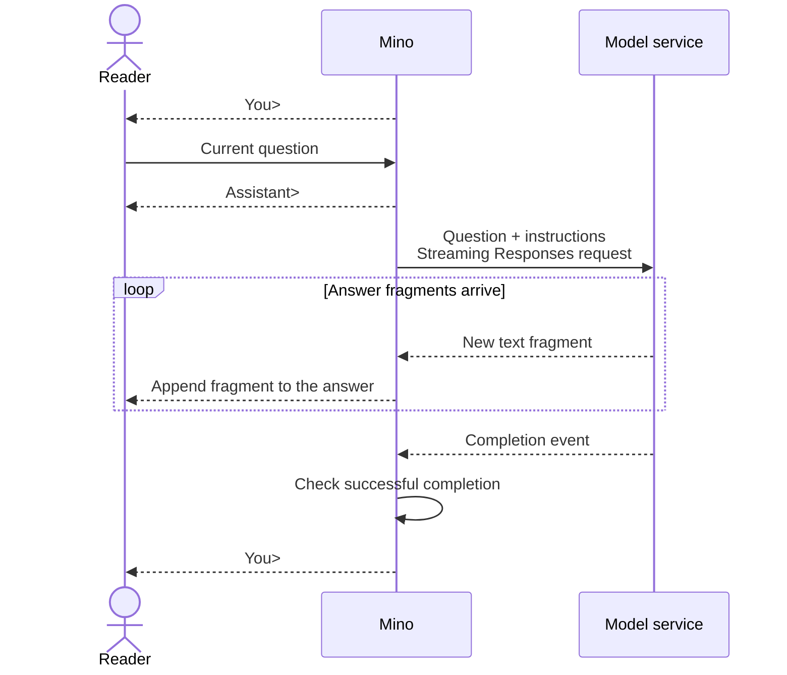

# Chapter 01: Your first terminal conversation

Applies to **0.1.x** · Source and release tag **[chapter-01](https://github.com/qshine/mino/tree/chapter-01)** · Application version **0.1.0**, released **2026-09-26**

You ask Mino to explain an HTTP request, then follow up with “What did I just ask you to explain?” The earlier answer is still in the terminal. It looks like one conversation. To find out whether the model received it that way, you need to follow the question into the request and the answer back to the screen. That round trip is this chapter's first building block for an agent.

Complete [setup and installation](../getting-started.md) and use the source revision named above. Release `chapter-02` already adds history; the independent questions in `0.1.x` let you see the problem this chapter starts with.

## 1. Get one answer onto the screen

Start the installed `chapter-01` streaming release of Mino. Begin with a question that needs no earlier messages.

```bash
mino
```

Illustrative output. The wording below explains the interaction; it is not a record of a live API call.

```text
Mino - Chapter 01: Terminal Chat
Each question is independent. Use /exit, Ctrl+D, or Ctrl+C to quit.

You> Explain an HTTP request in one sentence.

Assistant> An HTTP request is a message a client sends to a server to retrieve or submit information.

You>
```

After you press Enter, Mino prints `Assistant>` and sends the question. It displays the answer in fragments as they arrive, so you can start reading before generation finishes. The transcript above shows the assembled text; the service determines its wording, fragment sizes, and arrival times.

When `You>` appears again, Mino is ready for your next question. A blank line simply brings back the prompt without sending a request. You can keep typing into this window, but that alone does not tell you whether the next question carries any information from the first.

## 2. The model gets what goes into the request

You can read the earlier lines because they are still on your screen. How does the model receive those lines? Mino has to include them in a request; the terminal window is not an input to the model service.

For the HTTP question, Mino uses the OpenAI Responses API. It puts the current question in `input` and the instructions guiding the answer in `instructions`. The `model` field selects the model you configured.

Here is a request example. To keep it short, suppose your custom instructions are “You are Mino. Answer briefly.” This is illustrative instruction text, not the bundled default; `your-model` stands for your configured model name.

```json
{
  "model": "your-model",
  "instructions": "You are Mino. Answer briefly.",
  "input": "Explain an HTTP request in one sentence.",
  "store": false,
  "stream": true
}
```

The two remaining fields affect how the response is handled. `stream: true` requests events during generation. `store: false` asks the service not to retain a response object for later retrieval. Neither field supplies earlier messages.

Mino [reads the instructions once when chat starts](https://github.com/qshine/mino/blob/chapter-01/internal/soul.go), from `~/.mino/SOUL.md`, and sends that loaded copy with every question. If you edit the file during a chat, restart Mino to use the new instructions. Working-directory `AGENTS.md` and `SOUL.md` do not supply runtime instructions.

For this first question, the request contains everything the example needs. A follow-up will be a different test: its meaning depends on words outside the current input.

## 3. Text is arriving, but completion still matters

The first words arrive, and you can already start reading the explanation. Then the connection drops halfway through a sentence. The program has displayed something, but has it received a complete answer?

The service delivers a structured *response* through a stream of events. The *answer* is the text Mino extracts and displays. Events carrying new text let Mino show progress; a completion event tells it when to check the final result. The diagram follows a successful exchange.



Figure 01-1. On the successful path, text appears before the completion check returns control to you.

On narrow screens, scroll the diagram horizontally.

### 3.1 Show the words as they arrive

The event `response.output_text.delta` carries a *delta*: a newly arrived text fragment. Mino [displays these fragments and checks the final state](https://github.com/qshine/mino/blob/chapter-01/internal/agent/responses.go). It also streams refusal text, adding the fixed prefix `Model refused: ` before the first refusal fragment.

Mino accepts the generation as successful only after receiving `response.completed` with `status` equal to `completed` and no response error. At least one non-whitespace text or refusal fragment must also have arrived. Closing the connection without that completion event is not enough.

After the check passes, `You>` appears again. Mino does not print the assembled answer a second time: you have already read it through the fragments.

### 3.2 If it stops halfway, you decide what happens next

If the request fails or the stream ends without successful completion, Mino prints `Error: ...` and returns to the input prompt. The displayed fragments remain visible, but the error tells you the generation did not finish successfully. Mino does not retry automatically; you decide whether to submit the question again.

While waiting for input or a response, Ctrl+C cancels and exits. At the input prompt, `/exit` or Ctrl+D on an empty line also ends the chat. Exiting does not erase fragments already displayed in the terminal.

## 4. Check the puzzle we started with

### 4.1 Is the text really displayed before completion

A finished transcript looks the same whether Mino displayed each fragment immediately or held the whole answer until the end. To distinguish those behaviors, the check needs to control when generation can finish. Run this command from the repository root at the source revision named at the top of this chapter.

```bash
go test ./internal/... -run 'TestRunStreamsBeforeResponseCompletes|TestRespond|TestTerminal'
```

These tests use a local mock HTTP service and simulated input. They do not read your real configuration or call a paid model. A passing run shows `ok` for the `internal`, `internal/agent`, and `internal/gateway` packages. The test process must be able to bind a local port.

In the [streaming check](https://github.com/qshine/mino/blob/chapter-01/internal/streaming_test.go), the mock service sends one fragment and waits. It sends the rest only after the test confirms that the first fragment has reached terminal output. Buffering everything until completion would prevent this test from passing. The same command checks that answers are not printed twice, interrupted streams leave their displayed fragments, and cancellation stops the interaction. These checks establish the program's event ordering, not how fast a live service will answer.

### 4.2 Why an open window still needs the earlier messages

Return to the opening follow-up. In one run of the `chapter-01` streaming release, submit these questions in order, waiting for the first answer before asking the second.

```text
Explain an HTTP request in one sentence.
What did I just ask you to explain?
```

The second question refers to the first, so it is natural to expect Mino to connect them. In this version, however, the second request contains only “What did I just ask you to explain?” and the loaded instructions. The first question and answer are absent. Mino also supplies no `previous_response_id` or `conversation` to link the requests.

*Context* is the information supplied for the current generation. The terminal preserves the exchange for you to read; the program must supply the earlier messages for the model to use them. Keeping the window open does not do that work.

How should you verify this? Trying the follow-up shows you the experience a reader gets, but the model might guess HTTP correctly. A plausible answer cannot distinguish correct history handling from a guess. **To establish which earlier messages Mino supplied, inspect the request.**

The test command above includes an [independent-request check](https://github.com/qshine/mino/blob/chapter-01/internal/agent/responses_test.go). A mock service captures consecutive request bodies and verifies that each `input` contains only its current question, with no field linking it to the previous response or a conversation. Checking this boundary gives a repeatable answer about Mino's behavior without depending on model wording. The tradeoff is narrower evidence: it verifies the information sent, not answer quality or compatibility with every live service.

## 5. Chapter outcome and next step

You can now follow the HTTP question there and back: Mino sends the current input and instructions, displays answer fragments, checks completion, and returns control to you. That is a foundation for an agent, though it does not yet execute tools.

The opening follow-up reveals the next missing piece. The earlier exchange must enter the request before the model can use it as context. [Chapter 02](./02-jsonl-history.md), implemented in `chapter-02`, saves exchanges to a JSON Lines (JSONL) file, restores completed turns at startup, and supplies them with the next question. Tool execution and the Agent loop arrive in [Chapter 03](./03-tools-and-bash.md), available in `chapter-03`.
