# Chapter 01: Your first terminal conversation

Applies to **0.1.x** · Source checked against the reissued **[v0.1.0](https://github.com/qshine/mino/tree/v0.1.0)**

You type a question, and a model answers. What connects those two events? This chapter follows **one line of input → one Responses API request → one displayed reply → the next input prompt**. It is the foundation for an agent: the program controls what the model receives and what happens to its response.

Complete [setup and installation](../getting-started.md) first. By the end of this chapter, you will be able to trace an exchange through the code and explain why another question in the same terminal still has no conversation memory.

## 1. Observe one exchange

Start the installed program:

```bash
mino
```

**Illustrative output**, not a record of a live API call:

```text
Mino - Chapter 01: Terminal Chat
Each question is independent. Use /exit, Ctrl+D, or Ctrl+C to quit.

You> Explain an HTTP request in one sentence.

Assistant> An HTTP request is a message a client sends to a server to retrieve or submit information.

You>
```

After Enter, Mino waits for the complete response and prints the answer at once. It then returns control to you at `You>`. The model generates text; the program handles input, makes the request, and decides how to display the result.

## 2. Follow the question and reply

The model service cannot read the terminal window. Mino must explicitly send the information needed for this question. The normal path is:

```mermaid
sequenceDiagram
    accTitle: One question through Mino
    accDescr: Mino retains optional instructions at startup, prompts for a question, sends the current input through the OpenAI Go SDK to the Responses API, extracts assistant text from the completed response, and displays it before prompting again.
    actor User as Reader
    participant Mino as Mino
    participant API as Responses API
    Note over Mino: Keep optional instructions<br/>read at startup
    Mino-->>User: You>
    User->>Mino: Current question
    Mino->>API: SDK sends POST /responses
    Note over Mino,API: input, instructions<br/>model, store=false
    API-->>Mino: Completed response: output
    Mino->>Mino: Extract assistant text<br/>or refusal
    Mino-->>User: Assistant> answer
    Mino-->>User: You>
```



Figure 01-1. Mino sends the current input and returns control to the reader after displaying the answer.

The diagram can be scrolled horizontally on a narrow screen.

### 2.1 Mino and the SDK

The executable starts in [cmd/mino/main.go](https://github.com/qshine/mino/blob/v0.1.0/cmd/mino/main.go#L12), which passes the build version to `mino.Main`. The application lives in `internal/mino`: [run](https://github.com/qshine/mino/blob/v0.1.0/internal/mino/app.go#L25) loads settings and instructions, creates the Responses client, and passes its `respond` method to the terminal loop. Reading input and deciding what happens next remain Mino's work.

The official [OpenAI Go software development kit (SDK)](https://developers.openai.com/api/docs/libraries) handles API requests and response types. This chapter pins `github.com/openai/openai-go/v3` to **v3.66.0** in [go.mod](https://github.com/qshine/mino/blob/v0.1.0/go.mod). Mino creates a `responses.ResponseService` with explicit settings in [newResponsesClient](https://github.com/qshine/mino/blob/v0.1.0/internal/mino/responses.go#L30). **An API client does not supply Mino's Agent loop**: exposing available tools, executing calls requested by the model, and continuing a task will be responsibilities of Mino's runtime, sometimes called a *harness*.

### 2.2 What goes into the request

[responsesClient.respond](https://github.com/qshine/mino/blob/v0.1.0/internal/mino/responses.go#L53) passes typed parameters to the SDK's `New` method. This excerpt shows only the parameter fields; the full method also handles errors and validates the response:

```go
responses.ResponseNewParams{
	Model:        c.config.Model,
	Instructions: openai.String(c.instructions),
	Input:        responses.ResponseNewParamsInputUnion{OfString: openai.String(prompt)},
	Store:        openai.Bool(false),
}
```

`OfString` selects a text input. `openai.String` and `openai.Bool` explicitly supply optional values, including `false`. The SDK encodes these parameters as JSON and sends them to `{base_url}/responses`. For the earlier question, with the instruction “Answer briefly.”, the body would be:

```json
{
  "model": "your-model",
  "instructions": "Answer briefly.",
  "input": "Explain an HTTP request in one sentence.",
  "store": false
}
```

`your-model` is a placeholder for the configured model. `input` contains only the current question. The optional `instructions` come from the working directory's `AGENTS.md`, read once at startup by [loadInstructions](https://github.com/qshine/mino/blob/v0.1.0/internal/mino/config.go#L189); without that file, the value is an empty string. Instructions guide the answer, but do not give the model tools to execute commands.

### 2.3 How the response becomes terminal text

An API response is structured data. Its `output` array can contain entries other than the final answer, so reading only its first item would be unreliable.

Mino's [checkResponse](https://github.com/qshine/mino/blob/v0.1.0/internal/mino/responses.go#L109) rejects HTTP errors, responses larger than 8 MiB, and invalid JSON before the SDK decodes the data. The [response checks](https://github.com/qshine/mino/blob/v0.1.0/internal/mino/responses.go#L78) then require a completed response. Mino finds `message` entries whose `role` is `assistant`, joining their `content` parts of type `output_text`. A `refusal` becomes text prefixed with `Model refused: `. Failed generation, incomplete responses, and missing text become errors.

[runTerminal](https://github.com/qshine/mino/blob/v0.1.0/internal/mino/terminal.go#L12) displays the returned text after filtering terminal control characters, then starts the next iteration. No model output is executed as a command.

### 2.4 Errors and stopping

A network, HTTP, or response error produces an `Error: ...` message and returns to `You>`. Mino disables SDK retries, sets a two-minute HTTP timeout, and refuses redirects, so one question cannot silently become repeated requests or move to another service. For an HTTP failure, it reports the status without reading or displaying the server's raw error body, which could echo sensitive input.

Blank lines skip the request. `/exit` or Ctrl+D on an empty input line ends the chat. Ctrl+C cancels and exits while waiting for either input or a response: [mino.Main](https://github.com/qshine/mino/blob/v0.1.0/internal/mino/app.go#L14) carries the cancellation signal through the terminal loop and SDK to the HTTP request.

## 3. Test whether a second question has memory

In one run, enter these questions in order, waiting for the first answer before asking the second:

```text
My favorite color is blue.
What did I just say my favorite color was?
```

The second request contains only the second question. Mino does not resend the first statement or its answer, and does not set `previous_response_id` or `conversation`. Text still visible in your terminal is not automatically part of the model's context.

The model might guess “blue.” **A correct guess does not demonstrate memory; the request contents do.** The request also sets `store: false` to ask the service not to retain a response object for later retrieval. That is neither a guarantee of no service logs nor what makes these questions independent: the missing history and association fields are the decisive part.

You can verify this without a paid model. From the repository root, run:

```bash
go test ./internal/mino -run 'TestRespond|TestTerminal'
```

These tests use local mock HTTP services and simulated input, without your real configuration. A successful run prints `ok` for `github.com/qshine/mino/internal/mino`. [TestRespondSendsIndependentRequests](https://github.com/qshine/mino/blob/v0.1.0/internal/mino/responses_test.go#L16) checks the two request bodies and extracts text after a non-message output item. Other response tests check that SDK requests ignore ambient `OPENAI_*` settings and do not retry. The [terminal tests](https://github.com/qshine/mino/blob/v0.1.0/internal/mino/terminal_test.go#L36) check recovery after a request error and cancellation. The test process needs permission to bind a local port.

## 4. Chapter outcome and next step

You now have an observable path from input to model reply and back to input. It has no conversation history, streaming output, session persistence, or model tool execution yet. Repeating this terminal loop is only the starting point for an agent.

Chapter 02 is planned to keep earlier exchanges in memory and send them with the next question. A model requesting tools and receiving their results is a later step in Chapter 03. See the [roadmap](../plan-todo-chapters.md) for the remaining work.
