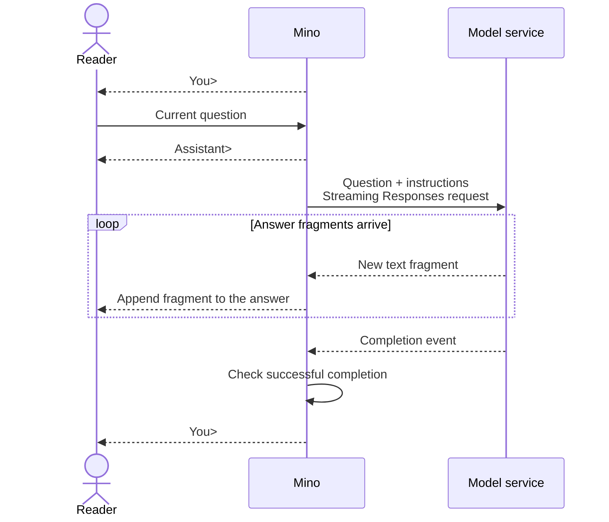

# Chapter 01: Your first terminal conversation

Applies to **0.1.x** · Source checked against the **v0.1.0 streaming reissue**, implementation **[ce6ba86](https://github.com/qshine/mino/tree/ce6ba867d97d81c7bcc114e8ca6384eed5bcf542)**

You type a question and want to see the answer begin before the model finishes. Mino must send your input, display incoming text, and decide when to ask for the next question. This chapter follows that exchange and explains why continuing in the same terminal does not give the model conversation memory.

Complete [setup and installation](../getting-started.md) first. Use this chapter's checked source revision for its experiments; `v0.2.0` includes Chapter 02 history. You will observe what you supply, what reaches the model, and how Mino hands control back to you.

## 1. Observe one exchange

Start the installed streaming release:

```bash
mino
```

**Illustrative output**, not a record of a live API call:

```text
Mino - Chapter 01: Terminal Chat
Each question is independent. Use /exit, Ctrl+D, or Ctrl+C to quit.

You> Explain an HTTP request in one sentence.

Assistant> An HTTP request is a message a client sends to a server to retrieve or submit information.

You>
```

After you press Enter, Mino prints `Assistant>` and sends the question. Answer fragments then appear as they arrive; the transcript shows the final text, while the service determines the wording, fragment sizes, and timing. When `You>` appears again, you can submit another question. Submitting a blank line simply returns to the prompt without sending a request.

## 2. Send the question and instructions

The model service cannot read your terminal window. Mino sends the current question as `input` in a Responses API request, together with `instructions` that describe its identity and guide its answers. The configured `model` selects which model receives this information.

Mino [loads its instructions once when chat starts](https://github.com/qshine/mino/blob/ce6ba867d97d81c7bcc114e8ca6384eed5bcf542/internal/soul.go#L19), from `~/.mino/SOUL.md`. Each question receives the same loaded instructions. Editing that file changes subsequent answers only after you restart Mino; working-directory `AGENTS.md` and `SOUL.md` are not sent as instructions.

For a compact request example, suppose the loaded instructions are “You are Mino. Answer briefly.” This is illustrative custom text, not the bundled default. The earlier question produces this request body; `your-model` stands for your configured model name:

```json
{
  "model": "your-model",
  "instructions": "You are Mino. Answer briefly.",
  "input": "Explain an HTTP request in one sentence.",
  "store": false,
  "stream": true
}
```

`stream: true` asks the service to send events as generation proceeds, so Mino can display text before the answer is complete. `store: false` asks the service not to retain the response object for later retrieval. Neither field supplies earlier questions or answers.

## 3. From answer fragments to the next prompt

A response contains structured events; the answer is the text Mino chooses to display from those events. Some events carry new text, while others report whether generation completed. This distinction lets Mino show useful text immediately without treating an unfinished answer as a success.



Figure 01-1. Text reaches you during generation; the next prompt waits for the completion check.

The diagram can be scrolled horizontally on a narrow screen.

### 3.1 Display text, then confirm completion

Mino [displays each new text fragment and checks the final status](https://github.com/qshine/mino/blob/ce6ba867d97d81c7bcc114e8ca6384eed5bcf542/internal/responses.go#L52). A text fragment arrives in a `response.output_text.delta` event; *delta* means the newly added text. If the model refuses, Mino displays the refusal fragments with `Model refused: ` before the first one. It does not print the assembled answer again when completion arrives.

**Visible text does not prove that generation finished.** Mino requires a `response.completed` event reporting `status: completed` without a response error, and at least one non-whitespace text or refusal fragment. When these conditions are met, it confirms successful completion and returns to `You>`. A connection that simply closes does not establish success.

### 3.2 Handle an error or stop the exchange

If a request fails or the stream ends before successful completion, Mino prints `Error: ...` and returns to `You>`. Any fragments already displayed remain visible, so you can see where the answer stopped. Mino does not automatically retry; you decide whether to submit another question.

Pressing Ctrl+C while waiting for input or a response cancels and exits Mino. Any displayed answer fragments remain in the terminal. At an input prompt, `/exit` or Ctrl+D on an empty line also ends the chat.

## 4. Check the interaction

### 4.1 Verify display before completion

From the repository root, run:

```bash
go test ./internal -run 'TestRunStreamsBeforeResponseCompletes|TestRespond|TestTerminal'
```

These tests use local mock HTTP services and simulated input, without your real configuration or a paid model. A successful run prints `ok` for `github.com/qshine/mino/internal`; the process needs permission to bind a local port.

The [streaming check](https://github.com/qshine/mino/blob/ce6ba867d97d81c7bcc114e8ca6384eed5bcf542/internal/streaming_test.go#L34) sends the first fragment, then waits until it has reached the terminal output before sending the rest. Passing therefore establishes that text is displayed before completion. The same command also checks that completion does not duplicate the answer, a failed stream preserves displayed fragments, and cancellation stops the exchange.

### 4.2 Check what the next question receives

In one run, submit these two questions, waiting for the first answer before asking the second:

```text
Explain an HTTP request in one sentence.
What did I just ask you to explain?
```

The model's *context* is the information supplied for the current generation. The second request contains only the second question and the loaded instructions. Mino does not include the first question or its answer as conversation history, and it does not associate the requests through `previous_response_id` or `conversation`. Text visible above the prompt is not automatically part of the next request.

The model might guess the topic. **A correct guess does not demonstrate memory; the request contents do.** The [independent-request check](https://github.com/qshine/mino/blob/ce6ba867d97d81c7bcc114e8ca6384eed5bcf542/internal/responses_test.go#L16), included in the preceding command, inspects successive request bodies and verifies that each carries only its current question. Streaming changes when you see the answer, while the information supplied for the next question stays independent.

## 5. Chapter outcome and next step

Mino can now carry one question through a streaming response, display its text, and return control to you after completion or an error. This is a foundation for an Agent; it cannot yet continue a task using conversation history or execute model-requested tools.

[Chapter 02](./02-jsonl-history.md), implemented in `v0.2.0`, addresses the missing history: save exchanges in a JSON Lines (JSONL) file, restore completed turns at startup, and include them with the next question. Tool execution and the Agent loop remain planned for Chapter 03; see the [roadmap](../plan-todo-chapters.md).
