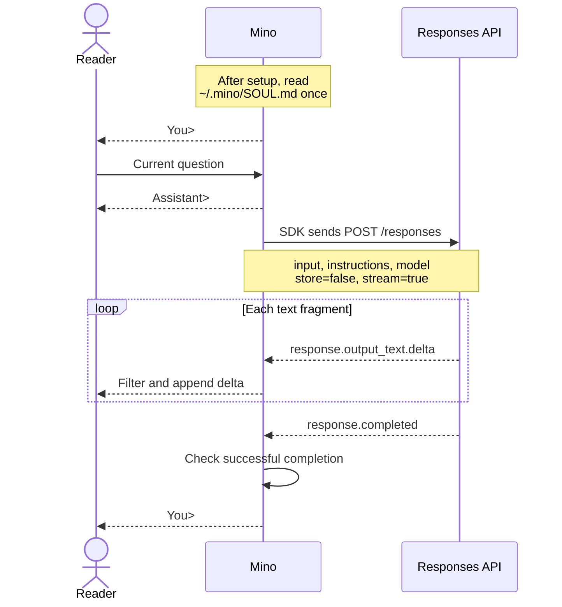

# Chapter 01: Your first terminal conversation

Applies to **0.1.x** · Source checked against the **v0.1.0 streaming reissue**, implementation **[ce6ba86](https://github.com/qshine/mino/tree/ce6ba867d97d81c7bcc114e8ca6384eed5bcf542)**

You type a question and want to see the answer begin before the model finishes. This chapter follows **one line of input → one streaming Responses API request → displayed answer fragments → the next input prompt**. It is the foundation for an agent: the program controls what the model receives and what happens to its response.

Complete [setup and installation](../getting-started.md) first. By the end of this chapter, you will be able to trace an exchange through the code and explain why another question in the same terminal still has no conversation memory.

## 1. Observe one exchange

Start the installed streaming release:

```bash
mino
```

**Illustrative output**, not a record of a live API call:

```text
Mino - Chapter 01: Terminal Chat
Each question is independent. Use /exit, Ctrl+D, or Ctrl+C to quit.

You> Explain an HTTP request in one sentence.

Assistant> An HTTP request is a message a client sends to a server to retrieve or submit information.

You>
```

After Enter, Mino prints `Assistant>`, then appends each answer fragment as it arrives. The transcript shows the final text; the service determines fragment sizes and timing. Mino returns control to you at `You>` only after checking completion or reporting an error. The model generates text; the program handles input, makes the request, and decides how to display the result.

## 2. Follow the question and reply

The model service cannot read the terminal window. Mino must explicitly send the information needed for this question. The normal path is:



Figure 01-1. Text reaches the reader before completion, while the next prompt waits for the completion check.

The diagram can be scrolled horizontally on a narrow screen.

### 2.1 Mino and the SDK

The executable starts in [cmd/mino/main.go](https://github.com/qshine/mino/blob/ce6ba867d97d81c7bcc114e8ca6384eed5bcf542/cmd/mino/main.go#L12), which passes the build version to `mino.Main`. The application lives in `internal/`: [run](https://github.com/qshine/mino/blob/ce6ba867d97d81c7bcc114e8ca6384eed5bcf542/internal/app.go#L25) loads settings and instructions, creates the Responses client, and passes its `respond` method to the terminal loop. Reading input and deciding what happens next remain Mino's work.

The official [OpenAI Go software development kit (SDK)](https://developers.openai.com/api/docs/libraries) handles API requests and response types. This chapter pins `github.com/openai/openai-go/v3` to **v3.66.0** in [go.mod](https://github.com/qshine/mino/blob/ce6ba867d97d81c7bcc114e8ca6384eed5bcf542/go.mod). Mino creates a `responses.ResponseService` with explicit settings in [newResponsesClient](https://github.com/qshine/mino/blob/ce6ba867d97d81c7bcc114e8ca6384eed5bcf542/internal/responses.go#L29). **An API client does not supply Mino's Agent loop**: exposing available tools, executing calls requested by the model, and continuing a task will be responsibilities of Mino's runtime, sometimes called a *harness*.

### 2.2 What goes into the request

[responsesClient.respond](https://github.com/qshine/mino/blob/ce6ba867d97d81c7bcc114e8ca6384eed5bcf542/internal/responses.go#L52) in `internal/responses.go` passes typed parameters to the SDK's `NewStreaming` method, which sets `stream: true`. This excerpt shows only the parameter fields; the full method also handles errors and consumes the event stream:

```go
responses.ResponseNewParams{
	Model:        c.config.Model,
	Instructions: openai.String(c.instructions),
	Input:        responses.ResponseNewParamsInputUnion{OfString: openai.String(prompt)},
	Store:        openai.Bool(false),
}
```

`OfString` selects a text input. `openai.String` and `openai.Bool` explicitly supply optional values, including `false`. The SDK encodes these parameters as JSON and sends them to `{base_url}/responses`. For this example, suppose you set the entire contents of `~/.mino/SOUL.md` to “You are Mino. Answer briefly.” and restart. This is an illustrative customization, not the bundled default. The earlier question would produce this request body:

```json
{
  "model": "your-model",
  "instructions": "You are Mino. Answer briefly.",
  "input": "Explain an HTTP request in one sentence.",
  "store": false,
  "stream": true
}
```

`your-model` is a placeholder for the configured model. `input` contains only the current question. After configuration is complete, [loadInstructions](https://github.com/qshine/mino/blob/ce6ba867d97d81c7bcc114e8ca6384eed5bcf542/internal/soul.go#L19) reads `~/.mino/SOUL.md` once. If it is missing, Mino creates it from the bundled default, which describes Mino's identity, text-help capabilities, and current limits. Each request sends the loaded text in the Responses API `instructions` field.

The program ignores `AGENTS.md` and `SOUL.md` in the working directory. Repository development instructions therefore stay separate from Mino's identity. Editing the user file takes effect after a restart; instructions can guide an answer but cannot add executable tools.

### 2.3 How the response becomes terminal text

Streaming returns a sequence of server-sent events (SSE), using `Content-Type: text/event-stream`. Each event carries structured data. A *delta* is the next fragment of text, not the complete answer.

`responsesClient.respond` iterates with `stream.Next()`. For `response.output_text.delta`, it passes `event.Delta` directly to the `emit` callback supplied by the terminal. It also displays `response.refusal.delta`, adding `Model refused: ` once before the first refusal fragment. Other events do not become answer text; in particular, `done` and `completed` events must not print the answer a second time.

[runTerminal](https://github.com/qshine/mino/blob/ce6ba867d97d81c7bcc114e8ca6384eed5bcf542/internal/terminal.go#L13) in `internal/terminal.go` supplies this callback. The excerpt omits surrounding error and completion handling:

```go
err := respond(ctx, prompt, func(delta string) error {
	_, writeErr = fmt.Fprint(output, terminalText(delta))
	return writeErr
})
```

The callback filters terminal control characters and writes each fragment immediately. A write failure stops the request. No model output is executed as a command.

**Displayed text does not prove that generation finished.** Mino accepts success only after `response.completed` contains `status: completed` with no response error and at least one non-whitespace text or refusal fragment has arrived. It then closes the stream; it does not wait for the server to close the connection. End of file (EOF) or `[DONE]` alone is insufficient.

### 2.4 Errors and stopping

A network, HTTP, or stream error produces an `Error: ...` message and returns to `You>`. If fragments have already appeared, they remain visible: the error means the partial answer did not finish successfully. Failed or incomplete events and a missing completion event follow this path.

[checkResponse](https://github.com/qshine/mino/blob/ce6ba867d97d81c7bcc114e8ca6384eed5bcf542/internal/responses.go#L119) requires a successful HTTP status and the SSE content type. Its body reader enforces an 8 MiB limit on cumulative stream bytes without buffering the whole answer. Mino disables SDK retries, sets a two-minute HTTP timeout covering the stream, and refuses redirects. HTTP failures report the status without reading or displaying the server's raw error body, which could echo sensitive input. An endpoint that only returns a complete JSON response is rejected; there is no non-streaming fallback.

Blank lines skip the request. `/exit` or Ctrl+D on an empty input line ends the chat. Ctrl+C cancels and exits while waiting for either input or a response: [mino.Main](https://github.com/qshine/mino/blob/ce6ba867d97d81c7bcc114e8ca6384eed5bcf542/internal/app.go#L14) carries the cancellation signal through the terminal loop and SDK to the HTTP request.

## 3. Check that text arrives before completion

From the repository root, run:

```bash
go test ./internal -run 'TestRunStreamsBeforeResponseCompletes|TestRespond|TestTerminal'
```

These tests use local mock HTTP services and simulated input, without your real configuration or a paid model. A successful run prints `ok` for `github.com/qshine/mino/internal`; the process needs permission to bind a local port.

In [TestRunStreamsBeforeResponseCompletes](https://github.com/qshine/mino/blob/ce6ba867d97d81c7bcc114e8ca6384eed5bcf542/internal/streaming_test.go#L34), the mock service sends the first fragment and refuses to send the rest until the terminal writer observes it. A passing test therefore establishes that Mino displays text before completion, not merely that the final answer looks correct. Other tests check that completion text is not duplicated, an interrupted stream preserves its displayed fragments, and cancellation or a timeout closes an open stream.

## 4. Test whether a second question has memory

In one run, enter these questions in order, waiting for the first answer before asking the second:

```text
My favorite color is blue.
What did I just say my favorite color was?
```

The second request's `input` contains only the second question; `instructions` still contains the identity loaded at startup. Mino does not resend the first statement or its answer, and does not set `previous_response_id` or `conversation`. Text still visible in your terminal is not automatically part of the model's context. A saved identity is not saved conversation history.

The model might guess “blue.” **A correct guess does not demonstrate memory; the request contents do.** The request also sets `store: false` to ask the service not to retain a response object for later retrieval. That is neither a guarantee of no service logs nor what makes these questions independent: the missing history and association fields are the decisive part.

The preceding command also runs [TestRespondSendsIndependentRequests](https://github.com/qshine/mino/blob/ce6ba867d97d81c7bcc114e8ca6384eed5bcf542/internal/responses_test.go#L16) in `internal/responses_test.go`. It inspects both request bodies, including `stream: true`, and checks that each carries only its current question. Streaming changes when you see the answer; it does not add history to the next request.

## 5. Chapter outcome and next step

You can now trace a question into a streaming request, watch answer fragments arrive, and distinguish a partial answer from successful completion. Mino still has no conversation history, session persistence, or model tool execution. Repeating this terminal loop is only the starting point for an agent.

Chapter 02 is planned to save earlier exchanges in a JSON Lines (JSONL) file, with one JSON record per line, load them into memory at startup, and send them with the next question. A model requesting tools and receiving their results is a later step in Chapter 03. See the [roadmap](../plan-todo-chapters.md) for the remaining work.
