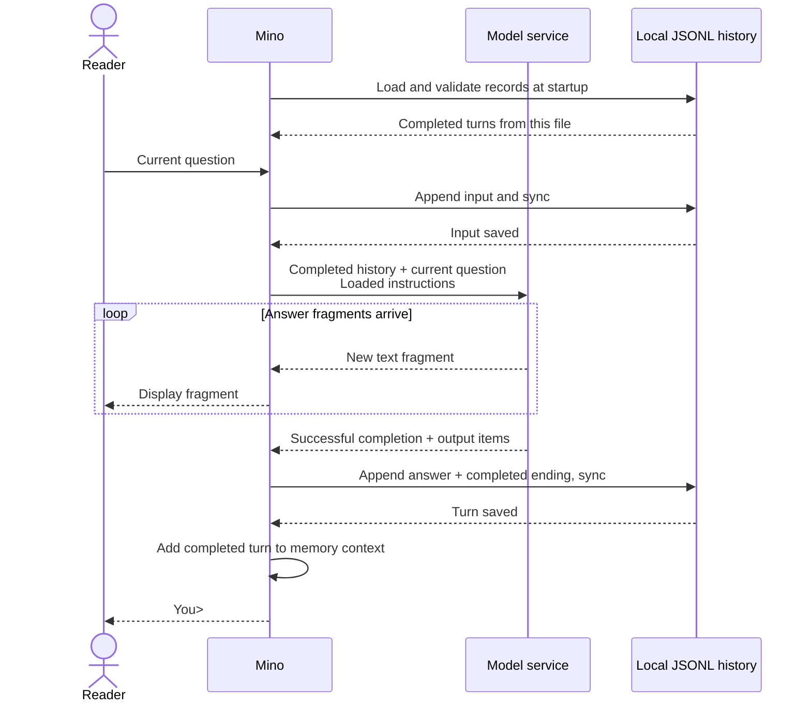

# Chapter 02: Keep a conversation going with JSONL history

Applies to **0.2.x** · Source version **[v0.2.0](https://github.com/qshine/mino/tree/v0.2.0)**

Tell Mino your favorite color is blue, then exit. Open it again and ask which color you mentioned. There is an extra hurdle this time. Even the old process is gone, so where could the earlier exchange come from? In this chapter, we leave that bit of blue in a file and follow it back into the next request.

Use the `v0.2.0` source; prerequisites and installation are in [setup and installation](../getting-started.md). You will work with conversation history and a question that is easy to overlook. When can words already visible on screen actually count as saved?

## 1. Close the program, then ask about the color

Start Mino from the repository root at `v0.2.0`. Give it one piece of information that is easy to check.

```bash
go run ./cmd/mino
```

Illustrative output. This shows the interaction, not a record of a live API call.

```text
Mino - Chapter 02: Conversation History
History is saved locally and restored on startup. Use /exit, Ctrl+D, or Ctrl+C to quit.

You> My favorite color is blue.

Assistant> Your favorite color is blue.

You> /exit
```

Run the same command again and ask ‘What color did I say was my favorite?’

Before looking at the answer, pause at startup. Mino restores the conversation before accepting input. Old messages do not scroll past again, and restarting alone sends no model request. When you submit your new question, the earlier exchange travels with it. The model now has something to refer to, though the service still determines the wording of its answer.

Blue has made it back into the request.

Follow-up questions within the same run use this process too. Think about it for a moment. A file sitting on your Mac is not directly visible to the model service. Mino still has to take the appropriate contents out and supply them. That is the step that lets the conversation carry on.

## 2. Give the conversation a record to return to

Back to the file. Mino saves the current conversation in `~/.mino/history.jsonl` and opens that same file after a restart. A *session* groups the exchanges belonging to one conversation. A *user turn* starts when you submit input and, when successful, ends with a complete answer. For now, there is just this one session file.

JSON Lines (JSONL) takes a direct approach. Each line holds one JSON record. Mino appends new records, so another question does not require rewriting the entire conversation.

At this point, it is easy to think that saving the question and the answer should be enough.

There is still one more thing to record. This turn finished.

Table 02-1. The color exchange leaves three records; the ending determines whether it can enter later context.

| Record kind | When Mino saves it | What it establishes |
| --- | --- | --- |
| `user_message` | Before sending the request | The question submitted for this turn. |
| `assistant_message` | After generation completes successfully | The complete answer text and returned response output items. |
| `turn_end`, `status: completed` | Together with the answer record | The turn succeeded and can enter later context once saving is confirmed. |

A `turn_id` ties those three records together. Each turn gets a fresh ID of 32 lowercase hexadecimal characters. Records within a turn share it; the next turn cannot reuse it. Across the file, `seq` increases consecutively from 1, and every record carries the format version `v: 1`. On loading, Mino checks these fields and the order of exchanges so that one question cannot be paired with another question's answer.

There is no need to add a session ID to each record. The file already identifies which conversation it belongs to. The planned Chapter 04 will put separate sessions in `~/.mino/sessions/<session_id>.jsonl`, with `/new` creating a file and the filename carrying the session identity.

If those fields feel like a lot on a first pass, keep the color exchange in mind. Its three records must belong together, and its ending must confirm completion. That is the evidence Mino will use to restore the conversation.

## 3. Bring the blue in the file back to the model

It helps to untangle two terms here. *Conversation history* is the record on disk. *Context* is the information actually supplied for the current generation. Mino reconstructs completed turns in order, prepares them in memory, then appends your current question to form the request's `input`.

This time, the question about your favorite color has the earlier statement about blue and its answer in front of it.

The instructions loaded from `~/.mino/SOUL.md` still travel separately. Mino also keeps `store: false`, explicitly supplying the earlier items each time rather than connecting requests through `previous_response_id` or a server-managed `conversation`.

But carrying the conversation forward is only part of the job. The program needs to know when it can safely accept your next question.



Figure 02-1. The answer can appear first; the next question waits until the complete turn is saved.

On narrow screens, scroll the diagram horizontally. Follow the arrows and you will reach [two storage confirmations](https://github.com/qshine/mino/blob/v0.2.0/internal/conversation.go#L90). Before the model request, Mino writes and syncs the input. Before showing `You>` again, it writes and syncs the answer and ending. If either write or sync fails, chat stops.

Look a little closer, and saving the answer involves more than copying the words on screen. The `text` field holds answer text; optional `output` holds structured response items. Mino preserves returned assistant message items, including `phase`, and reasoning items with opaque `encrypted_content`. It requests that state through `include: ["reasoning.encrypted_content"]`, so the next request can carry information the service needs to continue. Mino does not display or decrypt it.

If a compatible service supplies no output items at completion, Mino builds an assistant message from the successfully completed streamed text. The terminal label `Assistant>` is printed by the program and never becomes part of the answer.

I think this part deserves a moment. The answer we read on screen is only part of the exchange. To continue that exchange, the program also preserves the relevant state returned by the service.

## 4. An unfinished answer leaves a trace, not a completed turn

Honestly, history looks fairly simple if the only thing you do is exit normally and open the program again. The harder cases are the ones that stop midway. The network fails, you cancel, or the process stops before saving is done.

Start with a failed request. The input has already been saved, so Mino appends a `turn_end` with status `failed`; cancellation uses `cancelled`. Neither turn enters later context. Fragments already displayed remain in the terminal, but they are not saved as a complete answer. An ordinary request error lets you ask again. Ctrl+C cancels and exits.

A refusal is a different case. If the model successfully completes it, it counts as an answer. Mino displays `Model refused: `, but saves only the model's refusal text and returned output items. The prefix added by the program does not get sent back as part of the next request.

Now take a more abrupt stop. If the process ends before saving an ending record, Mino marks the unfinished turn as `interrupted` at the next startup and excludes it from context. Recovery never automatically resubmits the request.

There is another boundary here. If the final line is incomplete or contains malformed JSON, Mino saves a private recovery copy before removing that tail. Invalid records in the middle, unknown fields or versions, and invalid turn IDs or record order cannot be handled that way. Mino stops loading and leaves the history contents unchanged.

Follow that through, and an initially frustrating decision starts to make sense. The answer is already on screen, so why stop chatting just because saving failed?

Because the next question could depend on an exchange that cannot be restored after a restart. **Seeing the answer and confirming it was saved are two separate checkpoints.** If saving the input fails, Mino stops even earlier, before contacting the model.

Only a completed exchange carries forward.

## 5. Check how blue got there, not just whether the answer is blue

To be honest, I would not call recovery proven just because the model answered blue. It could have guessed. To check this chapter's behavior, inspect what the second request actually carried.

Run this command from the repository root containing the Chapter 02 implementation.

```bash
go test ./internal -run 'TestRunRestoresConversationHistory|TestRunFailedTurnDoesNotEnterContext|TestConversation|TestHistory|TestRunStreamsBeforeResponseCompletes'
```

These tests use temporary home directories and a local mock HTTP service. They do not read your real history or call a paid model. A passing run shows `ok` before `github.com/qshine/mino/internal`; the test process must be able to bind a local port.

The [restart check](https://github.com/qshine/mino/blob/v0.2.0/internal/conversation_test.go#L17) follows the color exchange from the opening. Submit the color, close Mino, start it again, and ask a follow-up. The test inspects the second request and confirms that it includes the original input, returned reasoning and answer items, and the new question.

It checks the file as well. Two turns leave six records with consecutive `seq` values and no `session_id` field. Records within a turn share a valid `turn_id`; the two turns use different IDs. Now there is something concrete to follow from saving blue to restoring it and sending it again.

Other checks move into the less comfortable cases. They truncate writes at every byte boundary of an example exchange, simulate write and sync failures, and try opening the same history from a second process. These checks establish that unfinished turns stay out of context, storage failures block subsequent requests, and only one process can use the history at a time. The streaming check also preserves Chapter 01's behavior, with text displayed before the completion event.

## 6. Chapter outcome and next step

Close the program, and that bit of blue now has a way back. Mino saves complete exchanges, restores them at startup, and supplies them to the model. Try the opening experiment again, this time following whether the information makes the round trip instead of judging only the answer.

For now, every request replays all completed history. As the conversation grows, it may exceed the model's context limit. Context compaction, context budgets, and `/new` and `/clear` for managing sessions are still planned.

We can carry the conversation forward. When the model requests an action, Mino still cannot execute it. The planned Chapter 03 adds that handoff, with the model requesting a tool call, the program deciding whether to execute it, and the tool result going back to the model. The rest of the path is in the [chapter roadmap](../plan-todo-chapters.md).
