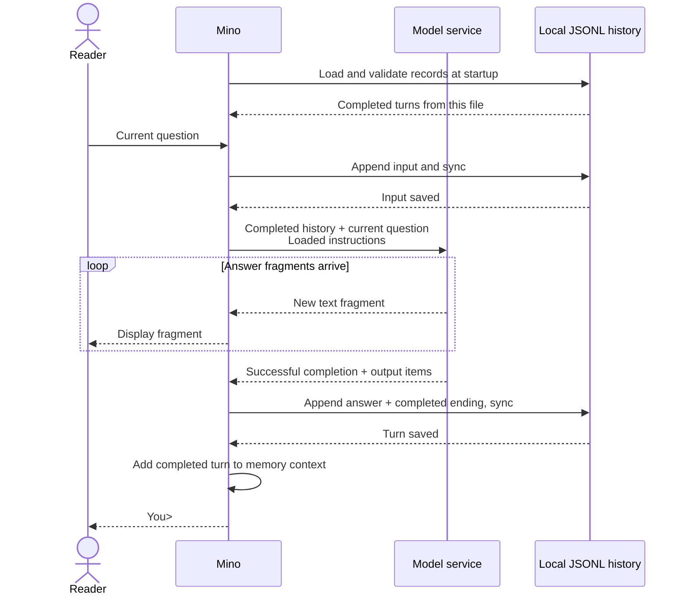

# Chapter 02: Keeping a conversation going with JSONL history

Applies to **0.2.x** · Source version **[v0.2.0](https://github.com/qshine/mino/tree/v0.2.0)**

You tell Mino your favorite color, exit, and later ask what color you named. To answer from that earlier exchange, the model needs Mino to send it again. This chapter adds local conversation history and restores it after a restart.

Use the `v0.2.0` source checkout; see [setup and installation](../getting-started.md) for prerequisites and release installation.

## 1. Continue after a restart

From the repository root at `v0.2.0`, start the application:

```bash
go run ./cmd/mino
```

**Illustrative output**, not a record of a live API call:

```text
Mino - Chapter 02: Conversation History
History is saved locally and restored on startup. Use /exit, Ctrl+D, or Ctrl+C to quit.

You> My favorite color is blue.

Assistant> Your favorite color is blue.

You> /exit
```

Run the same command again. Mino restores the conversation before accepting input; it does not print the old transcript or submit a model request just because you restarted. Ask “What color did I say was my favorite?” The next request includes the earlier question and answer, so the model can use them. Its exact wording still depends on the service.

This continuity also works between questions in one run. **The model receives memory as supplied context**; neither an open terminal nor a file on your Mac gives it automatic access to earlier messages.

## 2. Keep one conversation per file

A *session* groups exchanges that belong to one conversation. A *user turn* starts with one submitted input and, when successful, ends with its completed answer. Mino currently keeps one session in `~/.mino/history.jsonl`. The file itself groups its records into one conversation; restarting reopens the same file.

JSON Lines (JSONL) stores one JSON record per line. Mino appends records in order instead of rewriting the whole conversation after each question. Every record carries a `turn_id`, a consecutive `seq` number starting at 1, and format version `v: 1`. Mino generates a new 32-character lowercase hexadecimal turn ID for each user turn; all records within that turn share the ID. Records do not need a separate session ID because they already belong to one file.

For the color exchange, the file receives three records:

Table 02-1. A completed turn needs an ending record as well as the question and answer.

| Record kind | When Mino saves it | What it establishes |
| --- | --- | --- |
| `user_message` | Before sending the question | A new turn begins in this conversation file. |
| `assistant_message` | After successful model completion | The answer text and any returned response output items are available. |
| `turn_end` with `status: completed` | Together with the answer record | The whole turn can enter the next request once saving succeeds. |

The answer's `text` is what the model said. Its optional `output` retains the structured response items needed to continue the exchange. These are different from the terminal's `Assistant>` label, which is never part of the answer.

When loading the file, Mino checks sequence numbers, turn IDs, and turn order. An answer or ending must match the pending input's turn ID, and a later turn must use a fresh ID. Planned Chapter 04 will keep each session in `~/.mino/sessions/<session_id>.jsonl`, with the session ID carried by the filename; `/new` will create a new file.

## 3. Turn saved history into model context

*Conversation history* is the record of exchanges on disk. *Context* is the information supplied for the current generation. Mino reconstructs an ordered list of completed exchanges in memory, then adds your current question to form the next request's `input`.

The request also carries the instructions loaded from `~/.mino/SOUL.md`. Those instructions remain separate from history. Mino continues to set `store: false` and sends the earlier items explicitly, without `previous_response_id` or a service-managed `conversation`.



Figure 02-1. Text can appear before saving finishes; the next turn waits until the completed exchange has been saved.

The diagram can be scrolled horizontally on a narrow screen. The success path has [two storage boundaries](https://github.com/qshine/mino/blob/v0.2.0/internal/conversation.go#L90): Mino synchronizes the input before contacting the model, then synchronizes the answer and ending before accepting the next question. A write or synchronization failure stops this path.

Some responses contain more than visible text. Mino preserves returned assistant message items, including `phase`, and reasoning items with opaque `encrypted_content`. It requests the latter through `include: ["reasoning.encrypted_content"]` so the service can receive its own state again with the next request. Mino does not display or decrypt that state. If a compatible service omits output items on completion, Mino falls back to the successfully completed streamed text as an assistant message.

## 4. Keep unfinished work out of the next request

The file can retain an attempted question without making it part of future context. A request failure produces a `turn_end` with `failed`; cancellation produces `cancelled`. Neither enters the next request. Fragments already displayed remain in the terminal, but Mino does not save them as a completed answer. An ordinary request error returns control to you; Ctrl+C cancels and exits.

A refusal that completes successfully is still an answer. Mino displays the fixed prefix `Model refused: `, but saves only the model's refusal text and returned output items. The prefix does not become a message for the next request.

If the process stops before saving an ending record, the next startup marks the pending turn `interrupted` and excludes it from context. If the final line is incomplete or malformed JSON, Mino first saves a private recovery copy, then removes that tail. Invalid records in the middle, unknown fields or versions, and invalid turn IDs or record order stop loading without changing the history contents. Recovery never automatically repeats a model request.

**An answer on screen does not prove it was saved.** If saving the answer cannot be confirmed, Mino reports that problem and stops chatting. Continuing with an uncertain file would make the next request depend on history that might not survive a restart. If saving the input fails instead, Mino stops before contacting the model.

## 5. Verify continuity without a live model

From the repository root containing Chapter 02, run:

```bash
go test ./internal -run 'TestRunRestoresConversationHistory|TestRunFailedTurnDoesNotEnterContext|TestConversation|TestHistory|TestRunStreamsBeforeResponseCompletes'
```

These tests use temporary home directories and local mock HTTP services. They do not read your real history or call a paid model. A successful run prints `ok` for `github.com/qshine/mino/internal`; the process needs permission to bind a local port.

The [restart check](https://github.com/qshine/mino/blob/v0.2.0/internal/conversation_test.go#L17) submits the color statement, closes Mino, then starts it again and asks about the color. It inspects the second request for the original input, the returned reasoning and answer items, and the new question. It also checks that all six saved records have consecutive sequence numbers and no `session_id` field. Each turn's records share a valid `turn_id`, and the two turns use different IDs. **The inspected request proves continuity; a plausible answer alone does not.**

The other checks interrupt writes at every byte boundary of a sample turn, inject write and synchronization failures, and try opening the same history from a second process. Passing establishes that incomplete turns stay out of context, storage failures prevent further requests, and only one process can use this history at a time. The streaming check also confirms that answer fragments still appear before completion.

## 6. Chapter outcome and next step

Mino can continue one conversation across questions and restarts by supplying saved, completed exchanges as context. It currently replays all completed history; long conversations can exceed the model's context limit. Compaction and context budgets remain planned, as do `/new` and `/clear` for managing separate sessions.

Mino still cannot execute a tool requested by the model. Planned Chapter 03 adds that handoff: the model requests an action, the program decides whether to execute it, and a tool result returns to the model before its answer. See the [chapter roadmap](../plan-todo-chapters.md) for the remaining work.
