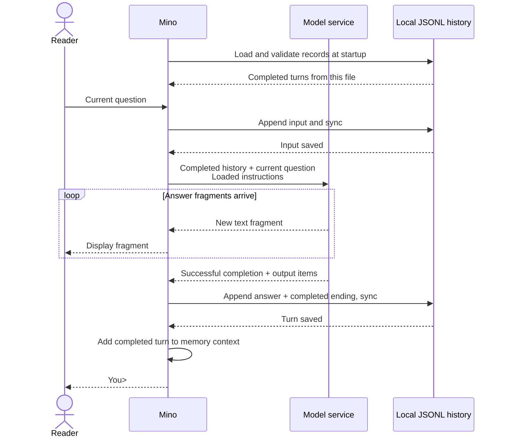

# Chapter 02: Keep a conversation going with JSONL history

Applies to **0.2.x** · Source and release tag **[chapter-02](https://github.com/qshine/mino/tree/chapter-02)** · Application version **0.2.0**, released **2026-09-26**

Tell Mino your favorite color is blue, wait for the answer, then exit. When you open it again and ask about that color, the old process is gone. To continue the conversation, Mino must have saved the exchange somewhere and supply it to the model again. This chapter follows that path from a local file into the next request.

Use the `chapter-02` source; prerequisites and installation are in [setup and installation](../getting-started.md). Along the way, you will separate two moments that can look like one: when an answer appears and when Mino confirms that it has been saved.

## 1. Close the program, then ask about the color

Start Mino from the repository root at `chapter-02`, then give it one piece of information you can recognize in a later request.

```bash
go run ./cmd/mino
```

Illustrative output. This shows the interaction, not a record of a live API call.

```text
Mino - Chapter 02: Conversation History
History is saved locally and restored on startup. Use /exit, Ctrl+D, or Ctrl+C to quit.

You> My favorite color is blue.

Assistant> Your favorite color is blue.

You> /exit
Goodbye.
```

Run the same command again and ask “What color did I say was my favorite?”

Mino restores completed turns before accepting input. It does not print the old conversation again, and restarting alone sends no model request. The earlier exchange travels to the model only when you submit the new question. The model then has the color statement available as context, though its answer wording still depends on the service.

Follow-ups within the same run use the completed turns too. In either case, the model does not read the file on your Mac. Saving the conversation makes it available to Mino; putting it in a request makes it available to the model.

## 2. Give the conversation a record to return to

Mino saves this conversation in `~/.mino/history.jsonl` and opens the same file after a restart. A *session* groups the exchanges in one conversation. A *user turn* starts with your input and, when successful, ends with a complete answer. This version uses one file for one session.

Keeping turns only in memory could support follow-ups until the process exits, but would not solve the opening restart problem. A program could read and rewrite one JSON document after each turn, or use a database to manage its records. Mino currently uses JSON Lines (JSONL): each line is one JSON record, and new records are appended to the file.

For this chapter's single-conversation scope, the benefit is a record you can inspect line by line without introducing database operations or rewriting the whole history for each question. There is a cost: appending lines does not make saving a whole turn an all-or-nothing operation. The process can stop between the question, answer, and ending. Mino must record where each turn ends and decide what is safe to restore.

Table 02-1. The color exchange leaves three records; the ending determines whether it can enter later context.

| Record kind | When Mino saves it | What it establishes |
| --- | --- | --- |
| `user_message` | Before sending the request | The question submitted for this turn. |
| `assistant_message` | After generation completes successfully | The complete answer text and returned response output items. |
| `turn_end`, `status: completed` | Together with the answer record | The turn succeeded and can enter later context once saving is confirmed. |

A `turn_id` ties the three records together. Each turn receives a fresh ID of 32 lowercase hexadecimal characters; all its records share that ID, and later turns cannot reuse it. The file's `seq` values increase consecutively from 1, and every record carries format version `v: 1`. Mino checks these fields and the record order when loading, so it can pair the right question with the right answer and completion record.

One file also keeps the current scope explicit: every completed turn belongs to the same conversation, with no session to select at startup. A file lock allows only one Mino process to use this history at a time. **The single-conversation limit comes from Mino's current design, not from JSONL.**

Records have no `session_id` field because the file identifies their conversation. [Chapter 04](./04-jsonl-sessions.md), available in the `chapter-04` release, separates sessions into `~/.mino/sessions/<session_id>.jsonl`, with `/new` creating a file and its name identifying the session. Commands such as `/new` and `/clear` are not implemented in this chapter.

## 3. Bring the blue in the file back to the model

The file can contain more than the model should receive. *Conversation history* records what happened, including failed or interrupted attempts. *Context* is the information supplied for the current generation. Mino reconstructs the completed turns in order and prepares them in memory, then appends the current question to form the request's `input`.

The new question about your favorite color therefore follows the earlier statement about blue and its answer. The instructions loaded from `~/.mino/SOUL.md` still travel separately in `instructions`.

Mino keeps `store: false` and supplies these earlier items explicitly on every request. It does not connect requests through `previous_response_id` or a server-managed `conversation`. You can check the information carried forward by inspecting the request itself.

Now follow the next turn through the diagram. Text still appears while the model is generating it, but accepting another question requires one more confirmation after generation finishes.



Figure 02-1. The answer can appear first; the next question waits until the complete turn is saved.

On narrow screens, scroll the diagram horizontally. The successful path passes through [two storage confirmations](https://github.com/qshine/mino/blob/chapter-02/internal/agent/conversation.go). Before requesting the model, Mino writes the input and syncs the file to confirm the write. After generation succeeds, it writes and syncs the answer and completed ending. Only then does the turn join the in-memory context and `You>` appear again.

What exactly is saved as the answer? The `text` field holds the text you read, while optional `output` holds structured response items. When the service returns assistant messages, Mino preserves them, including their `phase`; it also preserves returned reasoning items with opaque `encrypted_content`. The request includes `include: ["reasoning.encrypted_content"]` to ask for this state. Mino carries it forward without displaying or decrypting it, so continuing the conversation does not discard that part of the service's response.

If a compatible service supplies no output items at completion, Mino builds an assistant message from the successfully completed streamed text. The terminal label `Assistant>` comes from the program and is not part of the answer. What Mino sends next is the exchange's content and supported response state, not a copy of the terminal display.

## 4. An unfinished answer leaves a trace, not a completed turn

Suppose Mino has saved your question, but the connection fails halfway through the answer. The file now contains an input without a successful answer. Restoring it as a completed exchange would give the next request a misleading history.

Mino appends a `turn_end` with status `failed` for a failed request, or `cancelled` for cancellation. Neither turn enters later context. Already displayed fragments stay in the terminal but are not saved as a complete answer. After an ordinary request error, you can ask again if saving the failed ending succeeds. Ctrl+C cancels and exits.

A successfully completed refusal counts as an answer. Mino displays `Model refused: `, but saves only the model's refusal text and returned output items. The program's prefix does not become part of the next request.

If the process stops before it can save any ending, startup recovery closes the unfinished turn with status `interrupted` and excludes it from context. Recovery does not automatically resubmit a model request.

The file itself may also end halfway through a record. If the final line is incomplete or contains malformed JSON, Mino saves a private copy of the original history before removing that tail. Invalid records in the middle, unknown record fields or format versions, and invalid turn IDs or record order are different: Mino stops loading and leaves the history contents unchanged, rather than guessing how to repair them.

Now consider a failure after the model has finished: the answer is on screen, but writing or syncing its records fails. Mino could keep chatting from memory and warn that saving could not be confirmed. That would preserve the immediate conversation, but a follow-up could rely on information that disappears after a restart.

Mino instead stops on a storage failure. This gives up uninterrupted chat to avoid continuing with history whose persistence cannot be confirmed. The placement of the failure matters: if saving the input fails, no model request is sent; if saving the answer or ending fails, the answer may already be visible, but no subsequent question is sent.

**Stopping chat does not undo displayed text or roll back a partial file write.** A write or sync error does not establish exactly which bytes reached durable storage. Mino cannot promise that the turn was saved, nor that no bytes were written. At the next startup it checks the file again, using valid completed records and the recovery rules above to decide what can enter context.

## 5. Check how blue got there, not just whether the answer is blue

Return to the color question. An answer of “blue” is compatible with successful recovery, but does not prove it: a model could guess. The useful check follows the saved exchange into the second request, including the items that never appeared on screen.

Run this command from the repository root at `chapter-02`.

```bash
go test ./internal/... -run 'TestRunRestoresConversationHistory|TestRunFailedTurnDoesNotEnterContext|TestConversation|TestHistory|TestRunStreamsBeforeResponseCompletes'
```

These tests use temporary home directories and a local mock HTTP service. They do not read your real history or call a paid model. A passing run shows `ok` for the `internal` and `internal/agent` packages; the test process must be able to bind a local port.

The [restart check](https://github.com/qshine/mino/blob/chapter-02/internal/conversation_test.go) follows the opening exchange: submit the color, close Mino, start it again, and ask a follow-up. It inspects the second request for the original input, returned reasoning and answer items, and new question. The mock service supplies known output, so the check does not depend on a model remembering or guessing the color.

It also checks the saved file. Two completed turns leave six records with consecutive `seq` values and no `session_id` field. Each turn's records share a valid `turn_id`, and the two turns use different IDs. This connects the record on disk to the content sent after restarting.

The same command exercises the failure boundaries: truncating an example exchange at every byte position must not replay an unfinished turn; simulated write and sync failures must block further requests; a second process must be unable to open the same history while the first holds it. A separate case fails saving after text is displayed and checks that no second question reaches the model. The streaming check still requires text to appear before completion.

These tests verify recovery and control flow for the supplied fixtures and simulated failures. They do not prove answer quality, cover every possible disk failure, or turn a failed sync into a durability guarantee.

## 6. Chapter outcome and next step

After you close the program, the color statement now has a path back: Mino saves the completed turn, restores it at startup, and includes it with your follow-up. The opening question is no longer supported only by what remains on your screen; you can trace its earlier context through the file and into the request.

Every request still replays all completed history. As the conversation grows, it may exceed the model's context limit; context compaction and context budgets remain planned.

The next missing interaction in `chapter-02` is an action. [Chapter 03](./03-tools-and-bash.md), available in `chapter-03`, adds that handoff: the model requests a tool call, you approve the command, and the program returns its result to the model. See the [chapter roadmap](../plan-todo-chapters.md) for the remaining steps.
