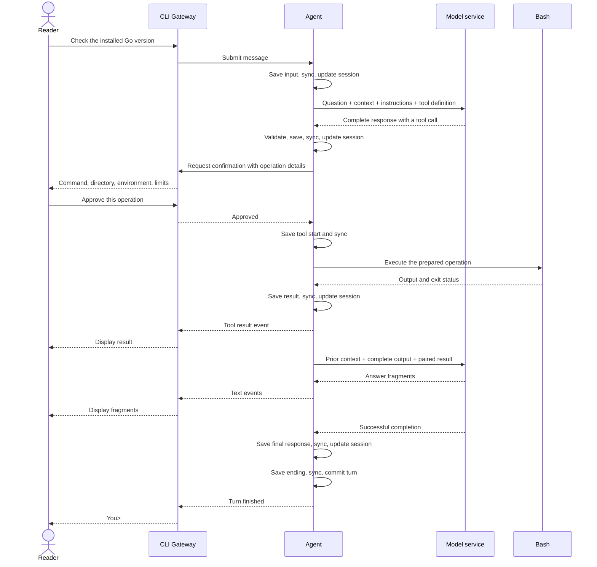

# Chapter 03: The first Agent loop with tools and Bash

Applies to **0.3.x** · Source and release tag **[chapter-03](https://github.com/qshine/mino/tree/chapter-03)** · Application version **0.3.0**, released **2026-09-26**

Ask Mino “Which Go version is installed on this computer?” Conversation history cannot supply a fact nobody has checked. This chapter gives Mino a way to obtain it: the model requests a Bash command, you approve the operation, and the program returns the result to the model.

Use the `chapter-03` release or its matching source checkout. Follow [setup and installation](../getting-started.md#try-chapter-03-from-source) before trying the interaction.

## 1. A question hands control back to you

Start Mino in the directory where you want commands to run. Ask it to check the installed Go version using `go version`. The model decides whether to request the tool; naming a command in an answer does not execute it.

Illustrative output, excerpt. The full approval screen also displays the resolved working directory, escaped environment, timeout, output limit, and account-permissions notice; those lines are omitted here. The version and model wording are examples, not live observations.

```text
You> Run go version and tell me which Go version is installed.

Assistant>
[Tool: bash]
Command: "go version"
Approve this operation? [y/N] y

[Tool result: completed; exit code 0]
go version go1.27.1 darwin/arm64

Assistant> This computer has Go 1.27.1 for macOS on Apple Silicon.

You>
```

The first model response can contain only a tool call, so an empty `Assistant>` is valid. Mino waits for your decision, runs the approved command, displays its result, and sends that result back. The model can then answer or request another tool. This repeated handoff is the *Agent loop*. One user turn now spans the original input, intermediate tool steps, and final answer.

Try the same question and enter `n`, or just press Enter, at the approval prompt. Mino does not run that command. It supplies a result with status `denied`, allowing the model to explain that it could not check. The denial is program behavior; whether the model explains it well is a separate question.

## 2. From the gateway to a paired result

The terminal side of Mino is the *command-line interface (CLI) Gateway*: it accepts input, displays events, and asks for confirmation. It passes your message to the Agent, which sends model requests, consumes the response stream, and runs the tool loop. The Agent sends text, results, and notices back as events. The Gateway does not open session files or execute Bash.

Mino supplies the Agent with its session and available tools when constructing it. This is *constructor injection*: dependencies are provided from outside rather than created inside the loop. It allows a different tool or interaction surface to use the same loop. The current application still has only the CLI, one session, and Bash. The interface is synchronous: the CLI waits for the turn to finish, including approvals, before accepting another question. A concurrent attempt to use that session is rejected as busy before writing its input, so turns cannot interleave.

Each request supplies the current question, replayable history, loaded instructions, and a `tools` definition for `bash`. Its schema requires one string named `command`, with no additional fields. The opening question can produce `{"command":"go version"}`. Bash checks the arguments locally too, rejecting empty commands, duplicate or unknown fields, invalid text, NUL characters, and commands over 16 KiB.

Tools follow three steps: describe the available operation (`Definition`), validate and prepare its arguments and display fields without executing (`Prepare`), then perform the prepared operation (`Execute`). The Agent finds the tool by its registered name and obtains approval before the execution step. The Gateway receives display data; the Agent retains the prepared arguments. This separates presentation from execution while keeping the approved operation stable.

Text fragments still appear as they arrive, without changing the session's replay state. A successful `response.completed` event lets the Agent validate the complete output, save and sync it, then update that state. This applies to intermediate responses containing tool calls too. An argument fragment or a finished individual output item cannot start Bash; a dropped stream leaves no completed response to act on.

A tool call contains a `call_id`. The Agent returns a `function_call_output` with that same ID and a JSON result: status, output, and optional exit code or truncation flag. Missing or duplicate IDs invalidate the response; reuse within the same turn stops that response before any of its calls execute. The ID pairs each result with the operation that requested it.



Figure 03-1. The Gateway handles the conversation with you; the Agent advances execution only after the required approval and storage confirmations.

On narrow screens, scroll the diagram horizontally. Follow-up requests preserve complete output items in order, including assistant `phase` and opaque encrypted reasoning when present. Mino keeps `store: false` and requests `reasoning.encrypted_content`; the Agent supplies context itself rather than linking through `previous_response_id`. The model service does not execute the local command.

## 3. Approval covers one bounded execution

Before asking `Approve this operation? [y/N]`, the Gateway shows the prepared command, resolved startup directory, and environment with special characters escaped. You approve what those fields describe. Only `y` or `yes` approves, ignoring case and surrounding spaces. Each call needs its own decision; piped input cannot approve commands. Chat and approval share one input stream, so your confirmation is consumed as a decision rather than becoming the next question.

Mino starts `/bin/bash --noprofile --norc -c` with the approved command. Each invocation starts in the captured directory with a minimal environment, so a `cd` in one command does not change the next invocation's starting directory. Shell profiles and inherited startup variables do not run. The configured API key is not placed in the child environment; the exact environment is documented in [the source setup notes](../getting-started.md#try-chapter-03-from-source).

Standard output and standard error share a 64 KiB capture limit. After execution stops, Mino displays the captured result and passes it to the model. A nonzero exit code becomes a failed tool result, so the model can reason about the failure. A 30-second timeout or output overflow terminates the process group; overflow also marks the result as truncated. Ctrl+C cancels and exits, stopping the active process group. Already completed file or network changes are not undone.

Mino requests `parallel_tool_calls: false` and processes any returned batch sequentially. A turn permits at most 8 model requests and 16 tool calls. If the eighth response asks for tools, or a new batch would exceed the call limit, Mino records the unstarted calls as `not_executed` and stops the turn. It does not execute a batch without room for the next model request.

These limits make execution bounded, but Bash still runs with your account permissions. It can read files or contact services available to that account, including through commands that change directories or set their own environment. Cleanup covers the process group; a descendant that detaches from it can escape. Mino bounds the wait for inherited output pipes to 250 ms and offers no background-job management or operating-system sandbox. Tool output is treated as untrusted data in the instructions; that guidance does not enforce a filesystem or network boundary.

## 4. Save enough to recover an action honestly

Running a command introduces a problem that text-only history did not have: an interrupted turn can leave a real effect. If a command creates a file and Mino crashes before saving the result, replaying the command may create that effect again. Discarding the entire turn would hide that it might already have happened.

The Agent first saves and syncs your input, before starting the model loop. Its single `Session` holds the replay state and the pending turn, backed by `history.jsonl`. Each validated, complete `model_response` is saved and synced before the Session commits it to memory, including intermediate responses with tool calls. Streamed fragments are display events, not committed conversation state.

After approval, the Agent saves and syncs `tool_start` before execution, then saves and syncs `tool_result` before another model request. A final response without tool calls allows a completed `turn_end`. These records share the turn's `turn_id`; each tool's start and result also carry its `call_id`. A failed write or sync leaves the previously committed memory state unchanged and stops the interaction.

Saving only after execution would reduce writes, but leave no durable indication that a command might have started. Mino chooses the extra storage boundaries and stops chat if writing or syncing fails. The cost is interrupted work even when the command itself could run. The benefit is a recorded boundary for recovery, not a transaction spanning the filesystem and Bash: a saved start does not prove process creation, and a failed result write does not prove the command failed.

On restart, Mino restores records without executing tools or automatically requesting the model. For an unfinished tool turn, it closes every unresolved call according to the evidence available.

Table 03-1. Recovery reports what the saved records establish, without guessing an execution outcome.

| Saved evidence | Recovery result | What you can conclude |
| --- | --- | --- |
| Call without a start | `not_executed` | Mino did not reach the recorded execution boundary. |
| Start without a result | `unknown` | The operation may have happened; the result is unavailable. |
| Call with a result | Retain that result | The recorded outcome can enter later context without another execution. |

For `unknown`, the Agent requires recovery confirmation at startup. The Gateway asks `Do you understand that these commands may already have run? [y/N]` before accepting another question. Review possible effects before continuing. Acknowledgment is saved as `recovery_ack`; until it is saved, the gate remains across restarts. This acknowledgment permits conversation to continue. It neither reruns the command nor verifies its effects.

Failed, cancelled, or interrupted tool turns retain their paired calls and results in later context, followed by an explicit Mino runtime notice. An unfinished text-only turn is still excluded. This distinction keeps possible effects visible to the model without treating partial streamed text as a final answer. File writes and syncs can still fail partially; stopping Mino cannot roll back external effects or guarantee which bytes reached disk.

## 5. Check execution and replay separately

A model saying “Go 1.27.1” cannot prove that Bash ran. From the repository root at `chapter-03`, check the execution and replay boundaries:

```bash
go test ./internal/agent ./internal/gateway ./internal/tools
```

These tests use temporary home and working directories and local mock HTTP services, with no real API key or paid model requests. A successful run prints `ok` for all three package paths. The mock service needs permission to bind a local port.

One contract test injects a test-only `echo` tool without changing the Agent loop. It checks the disk records at each handoff: input before the first model request, complete response before confirmation, start before execution, and result before the next request. Its successful result has no process exit code, demonstrating that the shared result format does not require every tool to run a process. Bash still records its exit code when available; `echo` is not included in the running application.

Separate tests inject a sync failure and verify that Session memory does not advance, and submit a concurrent question to verify that a busy turn is rejected before writing. Approval tests check default refusal and shared input. Protocol tests inspect paired IDs and retained response items, while incomplete responses and invalid calls must never execute.

The Bash integration case writes and reads a known marker in a temporary directory, checks the result sent to the model, then reopens history and verifies that a follow-up does not execute the old command. Recovery cases retain unknown outcomes and acknowledgment across restarts. Bash tests cover failed exit status, environment isolation, timeout, output overflow, cancellation, and ordinary background-child cleanup.

These checks establish the tested control flow and replay contents. They do not prove live answer quality, compatibility with every Responses endpoint, or containment of processes that escape the group. The opening Go-version interaction remains service-dependent; the mock tests provide repeatable evidence.

## 6. Chapter outcome and next step

The Go-version question now has a path to evidence: a complete tool call, your approval, a bounded Bash execution, and a paired result supplied to the model. Mino can continue within the same turn while recording enough to distinguish an unstarted command from an unknown outcome.

All of this still belongs to one conversation in `history.jsonl`. [Chapter 04](../plan-todo-chapters.md), released as `chapter-04`, separates conversations into individual JSONL session files, so a new task can start with its own history while an earlier task remains available to resume.
