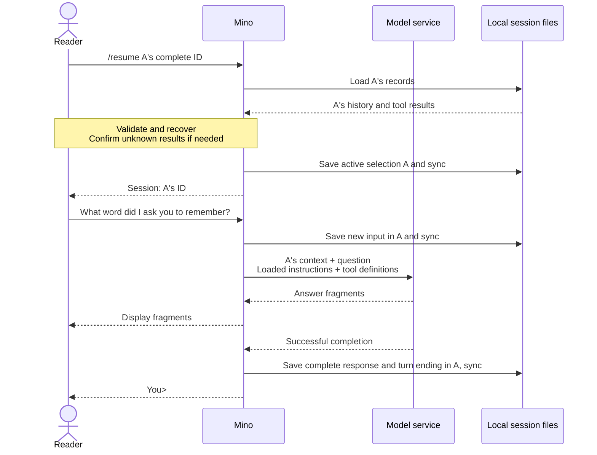

# Chapter 04: Managing multiple conversations with JSONL sessions

Applies to **0.4.x** · Source and release tag **[chapter-04](https://github.com/qshine/mino/tree/chapter-04)** · Application version **0.4.0**, released **2026-09-26**

Tell Mino to remember the word “pine,” then start an unrelated task. You need a way to leave that conversation without deleting it, and return when its earlier context matters again. This chapter gives each conversation its own session and lets you choose which history accompanies the next question.

Use the [Chapter 04 source setup](../getting-started.md#try-chapter-04-from-source). The examples below illustrate the interaction; model answers are not live observations.

## 1. Ask the same question in two sessions

At `You>`, enter `/new` to create a session for the word task. Note the ID Mino prints. After one exchange, use `/new` again to start another session, then return to the first with `/resume`.

Illustrative output, excerpt. The repeated `a` and `b` IDs stand for generated IDs; use the complete IDs printed by your own Mino.

```text
You> /new
Session: aaaaaaaaaaaaaaaaaaaaaaaaaaaaaaaa

You> Remember the word pine.
Assistant> The word is pine.

You> /new
Session: bbbbbbbbbbbbbbbbbbbbbbbbbbbbbbbb

You> What word did I ask you to remember?
Assistant> You have not given me a word in this conversation.

You> /resume aaaaaaaaaaaaaaaaaaaaaaaaaaaaaaaa
Session: aaaaaaaaaaaaaaaaaaaaaaaaaaaaaaaa

You> What word did I ask you to remember?
Assistant> You asked me to remember pine.
```

Call the first session A and the second B. B's request does not contain A's word exchange. After you resume A, that exchange becomes available to the model again. The request contents are deterministic; the model's wording, including whether it admits missing information in B, is not.

Use `/sessions` to find an earlier ID. Mino lists session IDs and file modification times in Coordinated Universal Time (UTC), most recently updated first, with `*` beside the current session. It does not generate titles from your messages. `/resume` accepts only a complete ID of 32 lowercase hexadecimal characters naming an existing session; shortened IDs and paths are rejected. `/help` lists the commands.

These commands belong to [Mino's input handling](https://github.com/qshine/mino/blob/chapter-04/internal/agent/session_commands.go). They are not saved as user messages or sent to the model. An unknown slash command produces an error instead of becoming a model question. Enter commands at the next `You>` prompt: Mino finishes the current turn, including tool approvals, before handling another line. Text such as `/new` inside a model answer or tool result is just text.

## 2. Select the history before sending a question

A session now lives in `~/.mino/sessions/<session_id>.jsonl`. Its filename identifies the conversation, so individual records still have no `session_id` field. Each file has its own consecutive `seq` values and turns paired by `turn_id`; tool calls and results retain their `call_id` values. The existing rules determine which records can be replayed as context.

One alternative would keep every conversation in a shared log and filter records by session ID. Mino instead chooses a file per session. In this design, selecting A means loading A's history; a new file starts without earlier exchanges. The tradeoff is an additional responsibility: Mino must durably remember which file you selected. It [saves that choice separately](https://github.com/qshine/mino/blob/chapter-04/internal/agent/sessions.go) in `active-session.json`, and reports the new session only after saving succeeds.

The next question uses the selected session's replayable history, the new input, the loaded instructions, and the available tool definitions. Merely creating or resuming a session sends no model request. Mino continues to supply context explicitly with `store: false`; it does not ask the service to remember which local session is active.



Figure 04-1. Selection is local; A's history reaches the model only with the next question. This example shows a response without a new tool call.

On narrow screens, scroll the diagram horizontally. **Session isolation applies to conversation context.** It does not create a separate filesystem or execution environment. `/new` and `/resume` keep the SOUL loaded at startup and the Bash working directory captured for this run. Resuming a conversation from another directory does not restore its former working directory; each tool approval shows the actual directory.

## 3. Restore a selection without repeating an action

On a fresh setup, Mino creates an empty session. On later starts, it loads the last selected session and prints its ID without replaying the old terminal display. If existing sessions have no usable active selection, Mino reports the problem and waits for `/sessions` followed by `/resume <id>`, or `/new`. Ordinary questions are rejected until a session is selected. Mino does not silently replace a missing or damaged selection with an empty conversation.

Resuming a session also applies Chapter 03's recovery rules. Mino never executes historical commands. A saved call without a start becomes `not_executed`; a start without a result becomes `unknown`. Before activating a session with an unacknowledged unknown result, Mino asks whether you understand that the command may already have run, and saves your acknowledgment. Declining leaves the previous selection unchanged and exits the CLI. Even a declined attempt may have added recovery records to the target log; keeping the selection unchanged does not mean the target file was untouched.

When you first move from the single `history.jsonl` layout, Mino can import that conversation as one session. It holds the legacy lock during import, preserves the old file as an archive, and retains IDs and paired tool results. Existing validation and tail-repair rules still apply, so the retained legacy file may have recovery records or a separate pre-repair backup. The [migration notes](../getting-started.md#chapter-04-storage-and-migration) explain retries and how to recover a selection without overwriting history.

Mino holds one lock for the whole session store until exit. This keeps creation, selection, clearing, and migration from competing across Mino processes, at the cost of preventing two processes from using different sessions at the same time. A valid ID that cannot be loaded does not replace the current selection. A storage failure while saving changes stops chat: after a rename succeeds but a directory sync fails, the on-disk outcome may be uncertain, so continuing from the old in-memory state would be unsafe.

## 4. Clear A while keeping its identity

Sometimes you want to discard a session's context without creating another ID. `/clear` asks you to type the current session's complete ID in an interactive terminal. A blank answer, `yes`, or a different ID denies the operation; surrounding whitespace is ignored, but the ID's case must match. Piped input cannot approve clearing.

Illustrative output, after returning to A:

```text
You> /clear

Session: aaaaaaaaaaaaaaaaaaaaaaaaaaaaaaaa
Clear this session's saved history? This does not undo executed commands or delete migration archives, recovery copies, or manual backups.
Type the complete session ID to clear it: yes
Session was not cleared.
```

After this denial, A's history remains available. If you repeat `/clear` and enter A's exact ID, Mino confirms `Cleared session: aaaaaaaaaaaaaaaaaaaaaaaaaaaaaaaa`. It replaces A's log with an empty file, then resets its in-memory history. The ID stays the same, B is unchanged, and the next question has no earlier A exchanges. Context compaction and summaries are not implemented in this chapter.

Mino prepares and syncs the empty file before replacing the old log, then syncs the directory before reporting success. A failure stops chat without claiming that clearing succeeded. This is a persistence boundary, not a promise of secure erasure: `/clear` does not undo Bash effects or delete migration archives, recovery copies, or your backups.

## 5. Check the requests, selection, and failure boundaries

To check A → B → A without a live model, run these tests from the repository root at `chapter-04`:

```bash
go test ./internal/agent ./internal/gateway -run 'TestSession|TestMigration|TestResume|TestClear'
```

The tests use temporary directories and a local mock HTTP service. They do not read your real configuration or history and require no paid model calls. A passing run shows `ok` for both packages; the mock service needs permission to bind a local port.

The [request test](https://github.com/qshine/mino/blob/chapter-04/internal/agent/session_commands_test.go) submits “Remember pine.” in A, creates B, and asks “What word?” It checks that B's first request contains only that question. After resuming A, the same question follows A's earlier exchange. Listing, help, and selection commands add no model requests. Denied clearing keeps the history, while approved clearing leaves the next request with only its new input and preserves the other session.

Additional cases check restart selection, invalid IDs, unsafe files, a second process competing for the store lock, and migration retries without duplicate imports or overwritten targets. A recovered tool call keeps its paired result, requires acknowledgment when unknown, and executes zero times during recovery. Simulated rename and directory-sync failures must prevent further chat.

These checks establish the tested request contents and control flow. They do not prove that a live model will answer “pine,” cover every disk failure, or show that clearing erases all copies of private data. If you try the opening interaction yourself, use the displayed IDs to track the selection; judge isolation by the supplied context, not by a plausible answer alone.

## 6. Chapter outcome and next step

You can now leave the word task, start a separate conversation, and return with its earlier history intact. Mino persists the selection, restores paired tool results without rerunning commands, and lets you clear one session after explicit confirmation.

Each selected conversation still supplies all of its replayable history. A long session can outgrow the model's context limit even when other sessions are isolated. [Chapter 05](./05-context-compaction.md), released as `chapter-05` (version `0.5.0`), combines manual `/compact` with automatic budget checks. It summarizes older exchanges while retaining recent detail, using a configurable context window with a default of 128,000 tokens.
