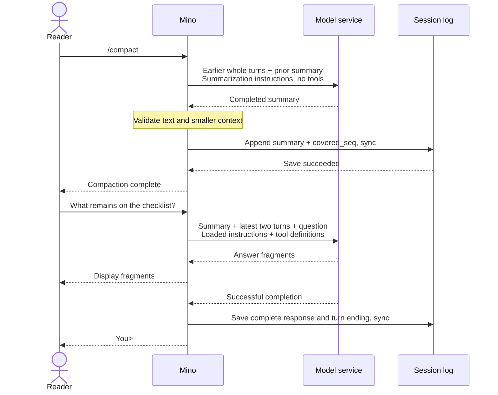

# Chapter 05: Context compaction with manual and automatic triggers

Applies to **0.5.x** · Source and release tag **[chapter-05](https://github.com/qshine/mino/tree/chapter-05)** · Application version **0.5.0**, released **2026-09-26**

A release checklist can stay in one session for a long time: you discuss requirements, inspect files, review results, and ask what remains. Eventually the old discussion takes more room than the next question. This chapter adds context compaction: Mino asks the model to summarize earlier exchanges, then supplies that summary with recent detail.

Use the [Chapter 05 source setup](../getting-started.md#try-chapter-05-from-source). Manual `/compact` and automatic budget checks use the same summary process. **The saved conversation history remains intact; the context sent with later requests becomes shorter.**

## 1. Compact before continuing the task

After several substantial exchanges about the release checklist, enter `/compact` at `You>`. Mino keeps the latest two replayable turns in full and summarizes the older prefix. A user turn includes its input, model responses, and any intervening tool calls and results; it is not just one message.

Illustrative output. The estimates and answer below illustrate a successful run; actual sizes and model wording vary.

```text
You> /compact
Compacting earlier turns; keeping the latest two turns in full...
Context compacted: estimated input 8320 -> 3960 tokens. Original history retained.

You> What remains on the release checklist?
Assistant> The documentation review is still pending.
```

`/compact` is a local command, not a new user message in the log. It can make one request to the configured model, so it can incur a model-service charge. Mino shows progress and size estimates without displaying the generated summary as an answer. With no older turns to summarize, it prints `Nothing to compact; the latest two turns are kept in full.` and makes no request.

For the checklist, a useful summary might retain “macOS only; checks completed; documentation review pending” while losing a discarded wording suggestion or an old log timestamp. The summary instructions ask for goals, constraints, decisions, completed and remaining work, and relevant tool outcomes. Those instructions guide the model; they do not prove that it preserved every important fact. If an exact detail matters again, supply it explicitly.

## 2. Keep the boundary between summary and recent detail

Sending the full conversation preserves detail but eventually exhausts the window. Dropping its oldest messages costs less but can remove a requirement or separate a tool call from its result. Mino chooses a summary of **whole earlier turns**, while retaining the latest two replayable turns and the entire active turn. This preserves recent protocol detail at the cost of an extra model request and a lossy representation of earlier work.

The [summary request](https://github.com/qshine/mino/blob/chapter-05/internal/agent/compact.go) receives the older turn prefix and any existing summary, with dedicated summarization instructions. It has no available tools and uses `tool_choice: none`; Mino rejects a returned tool call. Historical tool calls remain paired with their results in the supplied material, but nothing is executed during compaction.



Figure 05-1. The summary becomes usable context only after it is saved. The final response shown here has no tool call; normal response persistence still applies.

Scroll the diagram horizontally on narrow screens. Automatic compaction uses the same middle steps before continuing a pending normal request, including when an active turn already contains tool results.

The next normal request receives the summary as a labeled **assistant context item**, separate from the SOUL instructions loaded at startup. The label and summary instructions distinguish user requirements, assistant guesses, and untrusted file or tool content. They ask the model to preserve denied, failed, and unknown outcomes. This is guidance about meaning, not a guarantee against misleading summaries: actual tool approval and unknown-result acknowledgment remain enforced by the program. A summary cannot grant permission or turn an unknown result into a confirmed success.

## 3. Check the budget before each request

Mino uses a local context window of **128,000 tokens** by default. You can override it with `context_window`; startup reports the effective value and whether it came from the default or configuration. Mino never queries model metadata. See [context-window configuration](../getting-started.md#configure-the-context-window) for the field and provider requirements.

Before each normal model request, Mino estimates the serialized instructions, input items, and tool definitions. Input includes the summary, retained turns, current question, and active tool results. The estimate counts one token per UTF-8 byte, plus 128 for framing and 16 per input item. It generally overcounts ordinary text, avoiding a model-specific tokenizer, but it is neither an exact token count nor a guarantee for every compatible service.

Mino reserves one eighth of the configured window for output, capped at 8,192 tokens and never below one. The rest is the input budget. With the default window, that leaves 119,808 estimated input tokens. Above 80% of this budget, rounded up to an integer, Mino attempts compaction if older turns are available. Normal and summary requests both set `max_output_tokens` to the reserve and disable server-side truncation.

Checking again after tools matters: a command result may push an otherwise small request over the threshold. Mino can summarize older turns before giving that result to the model, while keeping the active question, calls, and results intact. Compaction never reruns the command.

Each user turn allows at most one automatic compaction attempt, and its summary request counts toward the existing eight-request limit. The 16-tool-call limit stays in place. A smaller result may remain above the automatic threshold; it can proceed if it fits the hard input budget. Mino does not repeatedly summarize within the same turn to chase the threshold.

If recent turns and active input alone are too large, or the older material cannot fit in one summary request, Mino reports an error. It does not split the material into batches or silently truncate it. Failed, cancelled, refused, empty, oversized, or non-shrinking summaries keep the previous context; summaries are limited to 8 KiB of UTF-8 text. A result that still exceeds the hard budget is also rejected. You can shorten new input, start a separate session with `/new`, or correct the configured window and restart. Raising the setting only makes sense when the service actually supports that capacity.

## 4. Recover the same context after restarting

Successful compaction appends a `context_compaction` record containing the summary and `covered_seq`: the sequence number of an earlier replayable `turn_end`. Mino checks that coverage ends at a whole-turn boundary and advances beyond the previous summary. It writes and syncs the record before changing the in-memory context. A write or sync failure stops chat; old memory is retained, but the on-disk result may be uncertain and must be checked at restart.

The original messages, calls, and results stay in the JSONL file. Restarting or resuming the session rebuilds its summary and the uncovered turns without summarizing again or executing historical commands. A later compaction combines the existing summary with newly eligible older turns, rather than adding the already covered messages again. `/new` starts without this summary; confirmed `/clear` removes it along with that session's history.

New records use `v: 3`, while Mino continues reading versions 1–3. Older chapter releases cannot read version 3 records; follow the [upgrade and rollback notes](../getting-started.md#chapter-05-history-compatibility) before running this version on existing sessions. Compaction reduces model input, not disk usage: the existing log-size limits still apply.

## 5. Observe the supplied context without a live model

From the repository root at `chapter-05`, run:

```bash
go test ./internal/agent -run 'TestCompact|TestAutomaticCompaction|TestOversizedInput'
go test ./internal -run TestContextWindow
```

The tests use temporary session files and local mock model services; they require no real API key or paid request. A passing run reports `ok` for each package. The mock service needs permission to bind a local port.

The [manual-compaction test](https://github.com/qshine/mino/blob/chapter-05/internal/agent/compact_test.go) seeds four substantial turns, returns a fixed summary, then submits “Continue.” It checks that the next request contains one assistant summary item, the two recent turns, and the new question, while the original SOUL instructions remain separate and the original log bytes remain a prefix of the file. This establishes which context was supplied; it does not measure a live model's summarization quality.

The automatic tests use a small configured budget to force compaction before a request and after a tool result. They check that the active tool pair survives, the command runs once, and the summary counts toward the eight-request limit. Other cases verify failed summaries, oversized input, invalid coverage, interrupted recovery, repeated compaction, restart and session isolation, clearing, and failed writes. Configuration tests verify omission, zero, overrides, invalid values, and startup without metadata requests.

If you try the opening checklist interaction with your own service, compare a needed fact with a minor older detail after compaction. The answer may reveal information loss, but a plausible answer alone does not prove the summary was used. The mock request checks establish that transition directly.

## 6. Chapter outcome and next step

You can continue the checklist with an explicitly shorter context, triggered manually or by a budget check. Recent interactions remain complete, older work is represented by a durable summary, and the original history remains available locally. Summarization still costs a request and can lose detail; it cannot fit an arbitrarily large active turn into a finite window.

The next problem is supplying task knowledge that was never in the conversation. Planned [Chapter 06: Skills](../plan-todo-chapters.md) will discover available skills and load their contents when needed, instead of placing every instruction document into every request.
