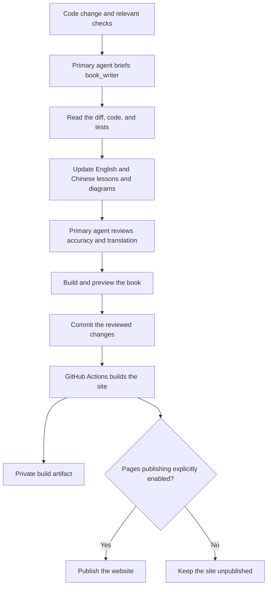

# Writing and updating the book

All book pages live under `docs/books/`: English in `en/`, with complete Simplified Chinese counterparts in `zh/` using the same relative paths. For example, `docs/books/en/chapters/01-terminal-chat.md` pairs with `docs/books/zh/chapters/01-terminal-chat.md`. Do not create book pages directly under `docs/`.

English remains the default website language. VitePress uses `docs/books` as its source directory, rewrites `en/` to the site root, and retains `zh/` in URLs. The local entry points therefore remain `/mino/` and `/mino/zh/`. Website configuration stays in `docs/.vitepress/`; Mermaid diagram sources stay in the Markdown pages.

## The dedicated writer

The project defines a Codex custom agent named **`book_writer`** in [`.codex/agents/book_writer.toml`](https://github.com/qshine/mino/blob/main/.codex/agents/book_writer.toml). Supported Codex clients discover this standalone definition in trusted projects; no explicit registration in `.codex/config.toml` is needed. It inherits the parent task's model and permissions. Open this repository as a trusted Codex project; start a new task if an existing session has not discovered the agent definition.

The [repository instructions](https://github.com/qshine/mino/blob/main/AGENTS.md) require the primary coding agent to invoke the writer after code changes and relevant checks, before final handoff and before committing the completed change. Every code change receives a documentation-impact review, including new features, changes to existing functionality, bug fixes, and refactors; no separate documentation request is needed. The writer reads the diff and implementation, updates affected English and Chinese chapters, examples, diagrams, setup instructions, and the roadmap in the same change, then returns its work for review.

This is part of the **Codex development workflow**. It does not run as an independent background service or on every manual Git push. GitHub Actions builds the written pages; it does not call a model or generate prose. No additional cloud AI key or scheduled task is required.

Wide diagrams can be scrolled horizontally to keep their labels readable.



The primary agent is responsible for the final factual review. A successful website build proves that pages compile and internal links resolve; it does not prove that the explanation matches the code.

## Chapter house style

All numbered tutorial chapters follow the same conventions. The complete authoring contract is in [the writer definition](https://github.com/qshine/mino/blob/main/.codex/agents/book_writer.toml); [Chapter 01](./chapters/01-terminal-chat.md) is the working example. Setup, release, and maintenance pages may keep unnumbered headings.

Use this heading hierarchy, choosing topic titles that fit the lesson:

```markdown
# Chapter 01: Title
## 1. First knowledge point
### 1.1 First subtopic
### 1.2 Second subtopic
## 2. Second knowledge point
### 2.1 First subtopic
## 3. Observable experiment
## 4. Chapter outcome and next step
```

Use one H1 with a two-digit chapter number. Number every H2 and H3 consecutively, including experiments and the ending; restart subtopic numbering under each parent. A new independent point gets a new H2. Do not skip levels or mix numbering styles. Use H4 such as `2.1.1` only when a third level is necessary, and never go deeper. English titles use sentence case without trailing punctuation. Ordered lists describe steps, not heading levels.

- **Progression:** Follow the title with the applicability/source-version line and one or two short paragraphs about the problem and outcome. Link prerequisites once, show an interaction, explain the necessary flow and code, then check an observable result. End with one numbered “Chapter outcome and next step” section; avoid repeated objectives and recaps.
- **Voice:** Address the reader as “you.” Use “Mino,” “the program,” and “the model” as clear actors. Write short, active paragraphs with one idea each; explain why before how, and define new terms and abbreviations. Avoid filler, hype, unexplained jargon, and excessive bold text.
- **Terminology:** Use the writer contract's glossary consistently. A response is structured service data; an answer is displayed text. A user turn spans one input through its final answer, including any intermediate tool steps in later chapters. Context, conversation history, and persisted sessions are different. Introduce Agent（智能体） on first use in Chinese, then Agent; keep identifiers, fields, commands, and filenames unchanged. Separate Mino's runtime behavior from Codex's development workflow.
- **Examples:** Reuse a small scenario. Label invented output “Illustrative output” / “交互示意”; claim observations only with evidence. Use language-tagged fences, copyable `bash` commands without prompt prefixes, `text` for transcripts, valid JSON, and explained placeholders. State the working directory where needed; label pseudocode or incomplete snippets. Never include credentials or private logs.
- **Visuals:** Prefer a focused diagram, usually ordered reader → Mino → model service. Preserve Mermaid accessibility metadata and readable labels. Put `Figure 01-1. Caption` / `图 01-1：说明` immediately below a figure and `Table 01-1. Caption` / `表 01-1：说明` above a table. Figures and tables have separate sequences within each chapter; captions identify what to notice. Supporting pages need no chapter-style captions. Use tables for comparisons, ordered lists for steps, and bullets for parallel points.
- **Experiments and boundaries:** State the action, observable result, and what it establishes. Separate deterministic program behavior, model-dependent wording, and planned work. Explain errors, cancellation, or authorization where they affect the interaction. A guessed answer does not prove memory; a terminal input loop does not imply tool execution.
- **Bilingual checks:** Match heading hierarchy and numbers, figure/table numbers, examples' meaning, version scope, and capability status. Translate example questions, instructions, and answers naturally; preserve fixed application prompts and API fields. Use corresponding-language relative links and immutable implementation links. Check incoming anchors after heading changes.

Keep installation, API-key setup, environment and configuration details, packaging, and long troubleshooting lists in [getting started](./getting-started.md), [releases](./releases.md), or this guide. Include a safety or operational detail in a chapter only when it explains the interaction.

A small fix updates its existing chapter; a new capability belongs in the chapter identified by the roadmap. The writer edits only book prose and illustrative assets under `docs/books/`. The primary agent owns application code, site configuration, workflows, agent settings, README files, and the changelog. If a change has no impact on readers, the writer reports why no content change is needed.

## Preview and check locally

Website tooling is separate from the Go application. Use Node.js 24 (recorded in `.node-version`), then run from the repository root:

```bash
npm ci --ignore-scripts
npm run book:dev
```

Open the local address printed by VitePress, normally `http://127.0.0.1:5173/mino/`. English opens by default; use the language menu for Simplified Chinese.

Before committing:

```bash
npm audit --audit-level=moderate
npm run book:build
npm run book:preview
```

Check both languages, language switching on a chapter, local search, light/dark diagrams, narrow-screen reading, and internal links. Build output and dependencies are ignored by Git.

The lockfile pins the website dependencies. VitePress 1.6.4's default Vite dependency has known advisories, so this project overrides it with patched Vite 6.4.3, which is compatible with the installed Vue plugin. Recheck the override, audit, production build, and browser behavior when upgrading these tools; do not remove checks to silence a failure.

The current book configuration also includes `mermaid` in `vite.optimizeDeps.include`. This pre-bundles the plugin-injected Mermaid imports for the development server, converting CommonJS dependencies such as `fastdom` for browser use. Without it, the pinned Mermaid 11.17.2 dependencies can leave local preview blank with an error about a missing default export. After dependency upgrades, check `npm run book:dev` in a browser as well as running the production build.

## Publishing later

The [Tutorial book workflow](https://github.com/qshine/mino/blob/main/.github/workflows/book.yml) builds on relevant pushes and pull requests. It stores a downloadable build artifact in the private repository. **Public deployment is disabled by default.**

GitHub Pages can host a static book without a separate server. Pages from private repositories requires an eligible paid GitHub plan. A personal private repository does not make its Pages website private; restricted private Pages requires an organization using GitHub Enterprise Cloud. See [GitHub Pages availability](https://docs.github.com/en/pages/getting-started-with-github-pages/what-is-github-pages) and [site visibility](https://docs.github.com/en/enterprise-cloud@latest/pages/getting-started-with-github-pages/changing-the-visibility-of-your-github-pages-site).

When the owner explicitly decides to publish and the plan supports it:

1. Set the repository's Pages source to **GitHub Actions**.
2. Set the repository Actions variable `BOOK_PUBLISH_ENABLED` to `true`.
3. Run **Tutorial book**, or push a documentation update to `main`.

The configured project path is `/mino/`. A public deployment would normally be served at `https://qshine.github.io/mino/`; this is a target address, not an already published site. A separate domain is optional.

Removing the variable prevents future deployments; it does **not** remove an already published website. To take a published site offline, unpublish it in the repository's Pages settings.
