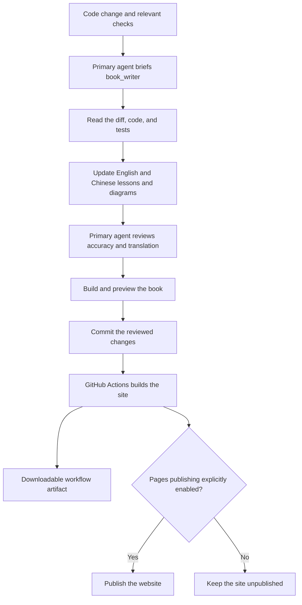

# Writing and updating the book

All book pages live under `docs/books/`: English in `en/`, with complete Simplified Chinese counterparts in `zh/` using the same relative paths. For example, `docs/books/en/chapters/01-terminal-chat.md` pairs with `docs/books/zh/chapters/01-terminal-chat.md`. Do not create book pages directly under `docs/`.

English remains the default website language. VitePress uses `docs/books` as its source directory, rewrites `en/` to the site root, and retains `zh/` in URLs. The local entry points therefore remain `/mino/` and `/mino/zh/`. Website configuration stays in `docs/.vitepress/`; Mermaid diagram sources stay in the Markdown pages.

## The dedicated writer

The project defines a Codex custom agent named **`book_writer`** in [`.codex/agents/book_writer.toml`](https://github.com/qshine/mino/blob/main/.codex/agents/book_writer.toml). Supported Codex clients discover this standalone definition in trusted projects; no explicit registration in `.codex/config.toml` is needed. It inherits the parent task's model and permissions. Open this repository as a trusted Codex project; start a new task if an existing session has not discovered the agent definition.

The [repository instructions](https://github.com/qshine/mino/blob/main/AGENTS.md) require the primary coding agent to invoke the writer after code changes and relevant checks, before final handoff and before committing the completed change. Every code change receives a documentation-impact review, including new features, changes to existing functionality, bug fixes, and refactors; no separate documentation request is needed. The writer reads the diff and implementation, updates affected English and Chinese chapters, examples, diagrams, setup instructions, and the roadmap in the same change, then returns its work for review.

This is part of the **Codex development workflow**. It does not run as an independent background service or on every manual Git push. GitHub Actions builds the written pages; it does not call a model or generate prose. No additional cloud AI key or scheduled task is required.

Wide diagrams can be scrolled horizontally to keep their labels readable.



The primary agent is responsible for the final factual review. A successful website build proves that pages compile and internal links resolve; it does not prove that the explanation matches the code.

## Chapter house style

All numbered tutorial chapters follow the same conventions. The complete authoring contract is in [the writer definition](https://github.com/qshine/mino/blob/main/.codex/agents/book_writer.toml); [Chapter 01](./chapters/01-terminal-chat.md) is the working example. Setup, release, and maintenance pages may keep unnumbered headings.

Use this heading hierarchy, choosing topic titles that fit the lesson:

```markdown
# Chapter 01: Title
## 1. First knowledge point
### 1.1 First subtopic
### 1.2 Second subtopic
## 2. Second knowledge point
### 2.1 First subtopic
## 3. Observable experiment
## 4. Chapter outcome and next step
```

Use one H1 with a two-digit chapter number. Number every H2 and H3 consecutively, including experiments and the ending; restart subtopic numbering under each parent. A new independent point gets a new H2. Do not skip levels or mix numbering styles. Use H4 such as `2.1.1` only when a third level is necessary, and never go deeper. English titles use sentence case without trailing punctuation. Ordered lists describe steps, not heading levels.

- **Progression:** Follow the title with the applicability/source-version line and one or two short paragraphs about the problem and outcome. Link prerequisites once, show an interaction, explain what information is exchanged and who acts next, then check an observable result. End with one numbered “Chapter outcome and next step” section; avoid repeated objectives and recaps.
- **Interaction first:** Use source code to verify behavior, not to outline the chapter. Omit repository tours, entry-point walkthroughs, file/function call chains, SDK construction and helper explanations, and dependency-version inventories. Explain the transition the reader can observe: submitting a question sends the current input and instructions; incoming fragments become the answer; completion or an error returns control to the reader. For each paragraph, identify the input, supplied context, response handling, next actor, or directly related engineering choice it clarifies. Keep the choice's reasoning, cost, boundary, and verification; remove unrelated implementation commentary. Do not move an unwanted code tour into an appendix.
- **Voice:** Address the reader as “you.” Use “Mino,” “the program,” and “the model” as clear actors. Write short, active paragraphs with one idea each and natural conversational warmth; vary sentence length without placing every sentence in its own paragraph. Explain why before how, and define new terms and abbreviations. A genuine question can connect an observation to its explanation. Avoid filler, hype, forced suspense, unexplained jargon, and excessive bold text.
- **Terminology:** Use the writer contract's glossary consistently. A response is structured service data; an answer is displayed text. A user turn spans one input through its final answer, including any intermediate tool steps in later chapters. Context, conversation history, and persisted sessions are different. Introduce Agent（智能体） on first use in Chinese, then Agent; keep identifiers, fields, commands, and filenames unchanged. Separate Mino's runtime behavior from Codex's development workflow.
- **Examples:** Reuse a small scenario and choose only the transcript, request example, or diagram that helps explain it. Code snippets are optional; include one only when the interaction needs it, and explain its behavioral consequence rather than its syntax. Label invented output “Illustrative output” / “交互示意”; claim observations only with evidence. Use language-tagged fences, copyable `bash` commands without prompt prefixes, `text` for transcripts, valid JSON, and explained placeholders. State the working directory where needed; label pseudocode or incomplete snippets. Never include credentials or private logs.
- **Visuals:** Prefer a focused diagram, usually ordered reader → Mino → model service. Preserve Mermaid accessibility metadata and readable labels. Put `Figure 01-1. Caption` / `图 01-1：说明` immediately below a figure and `Table 01-1. Caption` / `表 01-1：说明` above a table. Figures and tables have separate sequences within each chapter; captions identify what to notice. Supporting pages need no chapter-style captions. Use tables for comparisons, ordered lists for steps, and bullets for parallel points.
- **Experiments and boundaries:** State the action, observable result, and what it establishes. Separate deterministic program behavior, model-dependent wording, and planned work. Explain errors, cancellation, or authorization where they affect the interaction. A guessed answer does not prove memory; a terminal input loop does not imply tool execution.
- **Bilingual checks:** Match heading hierarchy and numbers, figure/table numbers, examples' meaning, version scope, and capability status. Preserve the same reasoning, tradeoffs, evidence boundaries, and warmth; use natural English and Chinese rather than translating slang or sentence breaks literally. Translate example questions, instructions, and answers naturally; preserve fixed application prompts and API fields. Use corresponding-language relative links. Keep a small number of immutable source links as evidence, with labels describing the supported behavior; do not introduce symbols or sections just to link them. Check incoming anchors after heading changes.

Keep installation, API-key setup, environment and configuration details, packaging, and long troubleshooting lists in [getting started](./getting-started.md), [releases](./releases.md), or this guide. Include a safety or operational detail in a chapter only when it explains the interaction.

A small fix updates its existing chapter; a new capability belongs in the chapter identified by the roadmap. The writer edits only book prose and illustrative assets under `docs/books/`. The primary agent owns application code, site configuration, workflows, agent settings, README files, and the changelog. If a change has no impact on readers, the writer reports why no content change is needed.

### Narrative style and engineering decisions

The writer adapts selected techniques from `khazix-writer`: concrete openings, gradual discovery, useful questions, varied sentence lengths, natural transitions, and callbacks to the opening interaction. The priority is **facts and evidence → teaching clarity, engineering reasoning, and house style → narrative expression**. Before drafting or polishing, the writer locates the installed skill through the current catalog or a parent-supplied location and reads its instructions and relevant references. If it is unavailable, the writer reports that and uses the adaptation in the writer definition; it does not install the skill or claim to have loaded it. No personal installation path is required in the repository.

This adaptation keeps numbered headings, useful tables and lists, exact code and API fields, and normal punctuation. It imposes no article-length, slang, or one-sentence-paragraph quotas, and does not require profanity, self-deprecation, emotional punctuation, philosophical digressions, or a promotional ending. Mino's author remains **qqling | AI Builder**; the source skill's persona, biography, signature, and contacts are not adopted. Only user-supplied or confirmed material may become an author anecdote or historical design motive. Code establishes behavior, not the author's original thoughts; an agent-run test is test evidence, not the author's personal experience. Label inferred rationale as analysis, and omit unconfirmed personal details unless they are essential; in that case, ask the parent to obtain confirmation before writing them. Clearly labeled illustrative scenarios are welcome.

Make each chapter's main engineering decision visible where the behavior is explained: the problem, plausible alternatives, the current choice and its supported reason, and its cost or applicable boundary. Connect it to a check and explain what that check can and cannot establish. Usually a few short paragraphs in an existing section suffice; small fixes need no invented tradeoff or extra summary. For example, inspecting request contents shows which history was supplied; a plausible answer alone does not prove correct memory handling. A single JSONL file is a choice about the current conversation scope, not a limit of the format. Stopping on a storage failure avoids continuing with history that cannot be reliably persisted, at the cost of interrupting chat; it does not undo displayed text or guarantee that a partial record reached disk. Verify examples against the chapter's applicable version.

Work in three passes: establish the facts and evidence boundaries; organize the interaction, decision, and observable check; then polish the narrative without changing the facts or required structure. Before handoff, review four gates: factual and structural accuracy; a learner can follow and verify the interaction; the decision's reason, cost, and limits are visible; the prose is natural and concise. Apply chapter-specific checks only where relevant to a small fix or supporting page. Report brief evidence to the primary agent, including which skill was loaded or unavailable, rather than appending a style report to the chapter. These are Mino's adapted checks, not the original skill's scoring rubric.

## Preview and check locally

Website tooling is separate from the Go application. Use Node.js 24 (recorded in `.node-version`). To review the current checkout, run one command from the repository root:

```bash
./book_review.sh
```

The script installs website dependencies with `npm ci --ignore-scripts` if the local VitePress or Vite executable is missing, builds the book on every run, and opens the Chinese Chapter 01 in your system's default browser. Use the language menu to switch to English. The preview listens only on `127.0.0.1`, starting at port `4173` and choosing the next available port if needed; the terminal prints the actual address.

Keep the terminal open while reviewing. Press Ctrl+C there to stop the preview. It serves the built pages, so after editing the book, stop it and rerun `./book_review.sh` to see the changes.

For live updates while writing, use the development server instead:

```bash
npm ci --ignore-scripts
npm run book:dev
```

Open the local address printed by VitePress, normally `http://127.0.0.1:5173/mino/`. English opens by default; use the language menu for Simplified Chinese.

Before committing:

```bash
npm audit --audit-level=moderate
npm run book:build
npm run book:preview
```

Check both languages, language switching on a chapter, local search, light/dark diagrams, narrow-screen reading, and internal links. Build output and dependencies are ignored by Git.

The lockfile pins the website dependencies. VitePress 1.6.4's default Vite dependency has known advisories, so this project overrides it with patched Vite 6.4.3, which is compatible with the installed Vue plugin. Recheck the override, audit, production build, and browser behavior when upgrading these tools; do not remove checks to silence a failure.

The current book configuration also includes `mermaid` in `vite.optimizeDeps.include`. This pre-bundles the plugin-injected Mermaid imports for the development server, converting CommonJS dependencies such as `fastdom` for browser use. Without it, the pinned Mermaid 11.17.2 dependencies can leave local preview blank with an error about a missing default export. After dependency upgrades, check `npm run book:dev` in a browser as well as running the production build.

The VitePress component renders each diagram. To prevent Mermaid's window-load handler from also scanning `.mermaid` elements, `docs/.vitepress/theme/index.ts` initializes Mermaid with `startOnLoad: false` before Vue mounts; `docs/.vitepress/config.mts` keeps that option for later plugin initialization. The plugin reads its settings asynchronously, so its configuration alone can arrive too late and leave intermittent `Syntax error` diagrams. After changes, hard-reload a diagram page in each language, then switch languages through the menu; confirm that the diagrams render without `Syntax error` text.

## Publishing the website

The book is published on GitHub Pages: [English](https://qshine.github.io/mino/) and [Simplified Chinese](https://qshine.github.io/mino/zh/). The configured project path is `/mino/`; a separate domain or server is not required.

The owner has enabled publication. The [Tutorial book workflow](https://github.com/qshine/mino/blob/main/.github/workflows/book.yml) builds both languages, checks internal links, and stores a downloadable workflow artifact. Successful builds from `main` publish the website when the repository Actions variable `BOOK_PUBLISH_ENABLED` is `true`. Pull requests only build and check the book.

The repository's Pages source is **GitHub Actions**. To publish an update, push book changes to `main`, or manually run **Tutorial book** on `main`. Keep `BOOK_PUBLISH_ENABLED` set to `true` for automatic publishing.

Removing the variable prevents future deployments; it does **not** remove an already published website. To take a published site offline, unpublish it in the repository's Pages settings.
