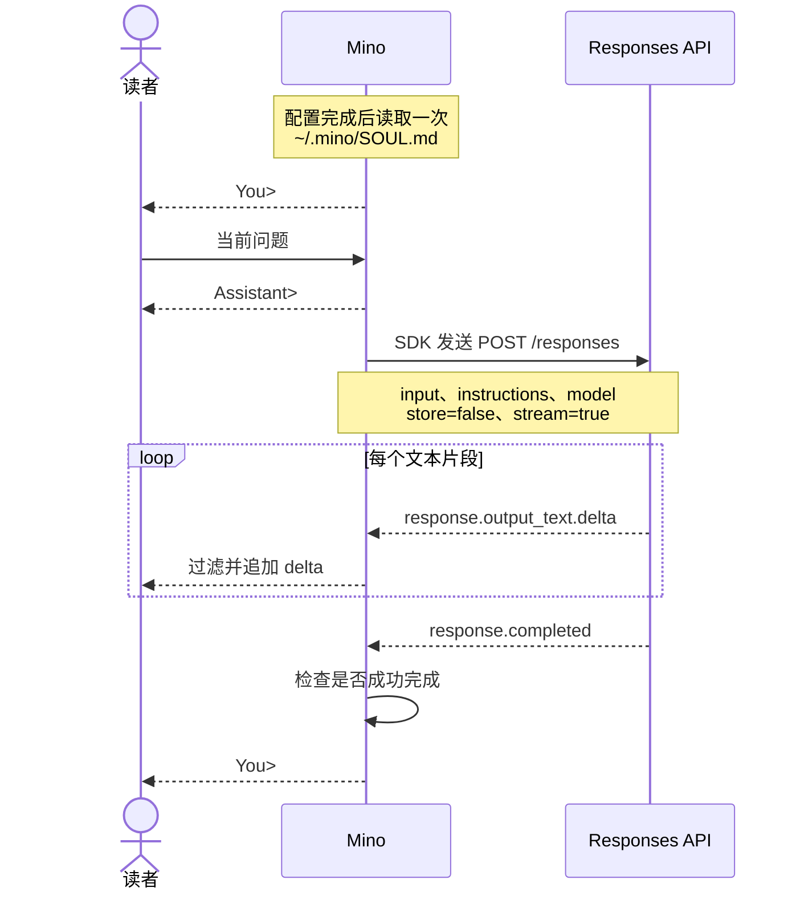

# 第 01 章：与模型对话——第一个终端程序

适用版本：**0.1.x** · 源码核对版本：**重新发布的 v0.1.0 流式版本**，实现提交 **[ce6ba86](https://github.com/qshine/mino/tree/ce6ba867d97d81c7bcc114e8ca6384eed5bcf542)**

你输入问题，希望在模型完成生成前就看到回答开始出现。这一章沿着 **一行输入 → 一次流式 Responses API 请求 → 显示回答片段 → 再次等待输入** 的路径展开。这是 Agent（智能体）的基础：由程序决定模型收到什么，以及怎样处理模型的响应。

先完成[准备与安装](../getting-started.md)。读完本章，你可以沿代码追踪一次问答，也能解释为什么在同一个终端里继续提问，仍然没有对话记忆。

## 1. 观察一次问答

启动安装好的流式版本：

```bash
mino
```

**交互示意**，不是一次真实 API 调用的记录：

```text
Mino - Chapter 01: Terminal Chat
Each question is independent. Use /exit, Ctrl+D, or Ctrl+C to quit.

You> 用一句话解释 HTTP 请求。

Assistant> HTTP 请求是客户端发送给服务端的一条消息，用于获取或提交信息。

You>
```

回车后，Mino 先打印 `Assistant>`，再把收到的回答片段依次追加到终端。上面的记录展示最终文本；片段的大小和到达时间由服务决定。Mino 检查完成状态或报告错误后，才回到 `You>`，由你决定下一次输入。模型负责生成文本；程序负责读取输入、发出请求和显示结果。

## 2. 跟着问题与回答走一遍

模型服务看不到终端窗口。当前问题需要哪些信息，必须由 Mino 明确发送。正常问答的路径如下：



图 01-1：文本在响应完成前就到达读者，下一个输入提示仍需等待完成检查。

小屏幕上可以横向滚动图表。

### 2.1 Mino 与 SDK 的分工

程序从 [cmd/mino/main.go](https://github.com/qshine/mino/blob/ce6ba867d97d81c7bcc114e8ca6384eed5bcf542/cmd/mino/main.go#L12) 启动，把构建版本交给 `mino.Main`。应用实现放在 `internal/` 中：[run](https://github.com/qshine/mino/blob/ce6ba867d97d81c7bcc114e8ca6384eed5bcf542/internal/app.go#L25) 加载配置和指令、创建 Responses 客户端，再把它的 `respond` 方法交给终端循环。读取输入和决定下一步做什么，仍由 Mino 负责。

[OpenAI 官方 Go 软件开发工具包（SDK）](https://developers.openai.com/api/docs/libraries) 负责 API 请求和响应类型。本章在 [go.mod](https://github.com/qshine/mino/blob/ce6ba867d97d81c7bcc114e8ca6384eed5bcf542/go.mod) 中将 `github.com/openai/openai-go/v3` 固定为 **v3.66.0**。Mino 在 [newResponsesClient](https://github.com/qshine/mino/blob/ce6ba867d97d81c7bcc114e8ca6384eed5bcf542/internal/responses.go#L29) 中使用明确的配置创建 `responses.ResponseService`。**API 客户端不会替 Mino 实现 Agent 循环**：提供可用工具、执行模型请求的工具调用并继续任务，将由 Mino 的运行系统负责，这层系统也常称为 *harness*。

### 2.2 请求里放了什么

`internal/responses.go` 中的 [responsesClient.respond](https://github.com/qshine/mino/blob/ce6ba867d97d81c7bcc114e8ca6384eed5bcf542/internal/responses.go#L52) 将带类型的参数交给 SDK 的 `NewStreaming` 方法，由该方法设置 `stream: true`。下面只摘录参数字段；完整方法还包含错误处理和事件流读取：

```go
responses.ResponseNewParams{
	Model:        c.config.Model,
	Instructions: openai.String(c.instructions),
	Input:        responses.ResponseNewParamsInputUnion{OfString: openai.String(prompt)},
	Store:        openai.Bool(false),
}
```

`OfString` 选择文本输入形式。`openai.String` 和 `openai.Bool` 显式传入可选字段的值，包括 `false`。SDK 将参数编码为 JSON，发送到 `{base_url}/responses`。本例假设你将 `~/.mino/SOUL.md` 的全部内容改为“你是 Mino，请简短回答。”，然后重启。这是自定义内容的示意，并非随程序附带的默认文本。前面的提问对应的请求主体为：

```json
{
  "model": "your-model",
  "instructions": "你是 Mino，请简短回答。",
  "input": "用一句话解释 HTTP 请求。",
  "store": false,
  "stream": true
}
```

`your-model` 代表配置的模型名。`input` 只有当前问题。配置完成后，[loadInstructions](https://github.com/qshine/mino/blob/ce6ba867d97d81c7bcc114e8ca6384eed5bcf542/internal/soul.go#L19) 读取一次 `~/.mino/SOUL.md`。文件缺失时，Mino 用随程序附带的默认内容创建它，其中描述 Mino 的身份、文本帮助能力和当前限制。每次请求都将已加载的文本放入 Responses API 的 `instructions` 字段。

程序忽略工作目录中的 `AGENTS.md` 和 `SOUL.md`，因此仓库开发指令与 Mino 的身份相互独立。修改用户文件后需要重启才会生效；指令可以引导回答，但不能添加可执行工具。

### 2.3 响应怎样变成终端文本

流式响应通过服务端发送事件（server-sent events，SSE）逐个返回数据，使用 `Content-Type: text/event-stream`。每个事件都包含结构化数据。*delta* 表示新增的一段文本，而不是完整回答。

`responsesClient.respond` 通过 `stream.Next()` 逐个读取事件。遇到 `response.output_text.delta`，就将 `event.Delta` 直接交给终端提供的 `emit` 回调。它也显示 `response.refusal.delta`，仅在第一个拒绝片段前添加一次 `Model refused: `。其他事件不会显示为回答文本；特别是 `done` 和 `completed` 事件不能把回答重复打印一遍。

`internal/terminal.go` 中的 [runTerminal](https://github.com/qshine/mino/blob/ce6ba867d97d81c7bcc114e8ca6384eed5bcf542/internal/terminal.go#L13) 提供这个回调。下面的摘录省略了外围的错误处理和完成处理：

```go
err := respond(ctx, prompt, func(delta string) error {
	_, writeErr = fmt.Fprint(output, terminalText(delta))
	return writeErr
})
```

回调过滤终端控制字符后，立即写出每个片段。写入失败会停止请求。模型输出不会作为命令执行。

**看到文本，不代表生成已经完成。** 只有收到 `response.completed`，其中的 `status` 为 `completed`、没有响应错误，且此前至少收到一个非空白的文本或拒绝片段，Mino 才确认成功。随后程序关闭流，不继续等待服务端断开连接。仅有文件结束（EOF）或 `[DONE]` 不足以确认完成。

### 2.4 出错和退出时发生什么

网络、HTTP 或流错误会显示为 `Error: ...`，然后回到 `You>`。已经出现的片段仍保留在终端；错误表示这段回答没有成功完成。失败事件、未完成事件和缺失完成事件都按这个路径处理。

[checkResponse](https://github.com/qshine/mino/blob/ce6ba867d97d81c7bcc114e8ca6384eed5bcf542/internal/responses.go#L119) 要求 HTTP 状态成功，且内容类型为 SSE。正文读取器按流的累计字节数执行 8 MiB 上限，无需先缓存整个回答。Mino 关闭 SDK 自动重试、设置覆盖整段流的两分钟 HTTP 超时，并拒绝重定向。HTTP 失败时只报告状态，不读取或显示可能回显敏感输入的服务端错误正文。仅返回完整 JSON 响应的端点会被拒绝，程序不会回退到非流式模式。

空白行不发送请求；`/exit` 或空行上的 Ctrl+D 结束聊天。等待输入或响应时都可以按 Ctrl+C 取消并退出：[mino.Main](https://github.com/qshine/mino/blob/ce6ba867d97d81c7bcc114e8ca6384eed5bcf542/internal/app.go#L14) 将取消信号经终端循环和 SDK 传递到 HTTP 请求。

## 3. 检查文本是否先于完成事件显示

在仓库根目录运行：

```bash
go test ./internal -run 'TestRunStreamsBeforeResponseCompletes|TestRespond|TestTerminal'
```

这些测试使用本机模拟 HTTP 服务和模拟输入，不使用真实配置，也不调用付费模型。通过时，输出会在 `github.com/qshine/mino/internal` 前显示 `ok`；测试进程需要能够绑定本机端口。

在 [TestRunStreamsBeforeResponseCompletes](https://github.com/qshine/mino/blob/ce6ba867d97d81c7bcc114e8ca6384eed5bcf542/internal/streaming_test.go#L34) 中，模拟服务发送第一个片段后，必须等终端写入器观察到它，才发送剩余内容。因此，测试通过能证明 Mino 在完成前就显示了文本，而不只是最终回答看起来正确。其他测试检查完成文本不会重复显示、断流后保留已显示片段，以及取消或超时会关闭尚未结束的流。

## 4. 用第二个问题检验记忆

在同一次运行中依次输入下面两句话，等第一轮回答后再问第二句：

```text
我最喜欢的颜色是蓝色。
我刚才说最喜欢什么颜色？
```

第二次请求的 `input` 只有第二个问题，`instructions` 仍是启动时加载的身份内容。Mino 没有重发第一句及其回答，也没有设置 `previous_response_id` 或 `conversation`。终端里仍然可见的文字，不会自动进入模型的上下文。保存身份不等于保存对话历史。

模型可能猜中“蓝色”。**猜对不代表有记忆，请求内容才能说明问题。** 请求中的 `store: false` 是请服务不要保留可供后续查询的响应对象，既不保证服务完全没有日志，也不是本章问答互相独立的原因；关键在于请求没有前文和历史关联字段。

前面的命令也会运行 `internal/responses_test.go` 中的 [TestRespondSendsIndependentRequests](https://github.com/qshine/mino/blob/ce6ba867d97d81c7bcc114e8ca6384eed5bcf542/internal/responses_test.go#L16)。它检查两轮请求主体，包括 `stream: true`，并确认每次只携带当前问题。流式输出改变的是你看到回答的时间，不会给下一次请求添加历史。

## 5. 本章小结与下一步

现在，你可以追踪问题怎样进入流式请求，观察回答片段逐步出现，并区分部分回答与成功完成的回答。Mino 仍没有对话历史、会话持久化或模型工具执行。重复终端问答，是构建 Agent 的起点。

规划中的第 02 章会在内存中保存前面的问答，并随下一条问题一起发送。模型请求工具并接收执行结果，是第 03 章的后续任务。其余工作见[章节规划](../plan-todo-chapters.md)。
