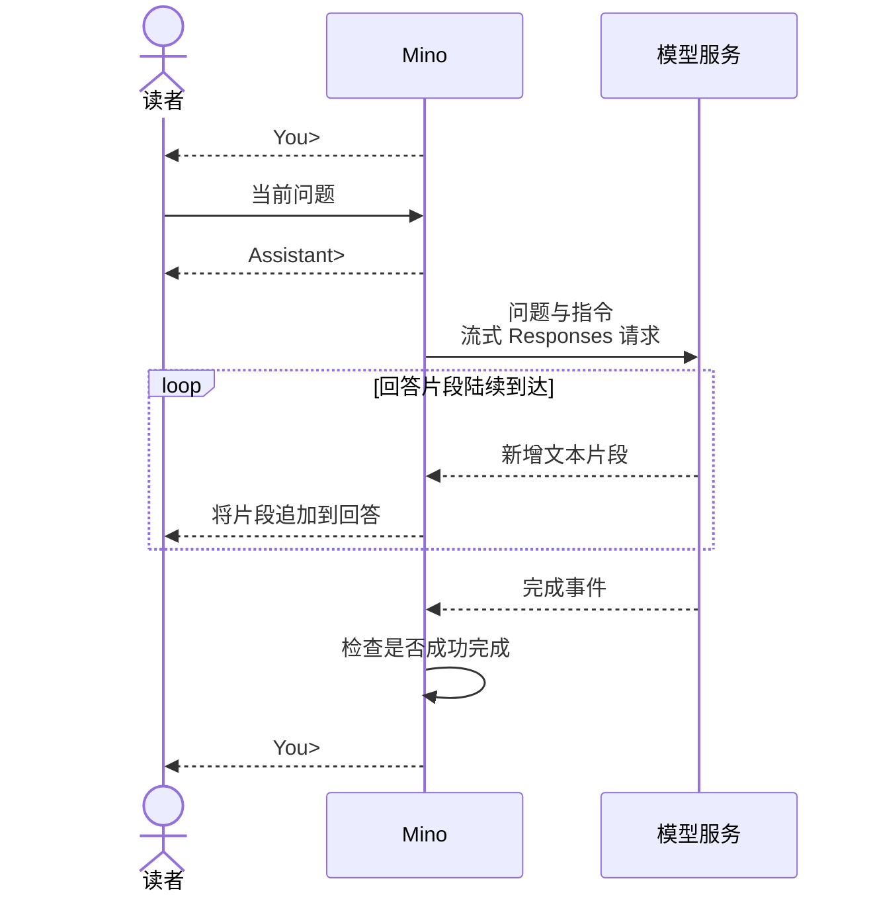

# 第 01 章：与模型对话——第一个终端程序

适用版本：**0.1.x** · 源码核对版本：**重新发布的 v0.1.0 流式版本**，实现提交 **[ce6ba86](https://github.com/qshine/mino/tree/ce6ba867d97d81c7bcc114e8ca6384eed5bcf542)**

终端里，上一句回答还在。你追问一句「我刚才让你解释什么？」，模型却没有收到那段前文。这件事有点反直觉，窗口没关，聊天怎么就接不上了？这一章，我们从一句问题出发，跟着它走到模型，再跟着回答回到终端，把这处断点找出来。

先完成[准备与安装](../getting-started.md)，并使用开头注明的源码版本。`v0.2.0` 已经加入历史功能，要看清这一章的问题，得从 `0.1.x` 的独立问答开始。

## 1. 先让一句回答出现在终端里

先把追问放一放。从安装好的流式版本启动 Mino，给它一个可以独立回答的问题。

```bash
mino
```

交互示意，下面的措辞用于说明流程，并非真实 API 调用记录。

```text
Mino - Chapter 01: Terminal Chat
Each question is independent. Use /exit, Ctrl+D, or Ctrl+C to quit.

You> 用一句话解释 HTTP 请求。

Assistant> HTTP 请求是客户端发送给服务端的一条消息，用于获取或提交信息。

You>
```

按下回车，Mino 打印 `Assistant>`，把问题发出去。随后，回答一段一段地出现，收到多少，就先显示多少。上面的示意只能展示拼完的文本，具体怎么措辞、每段多长、隔多久到达，都由服务决定。

这里先盯住一个很小的变化，`You>` 又出现了。

轮到你了。

你可以继续输入；只敲一个空白行，Mino 就重新提示，不发送请求。这个程序已经能一问一答地跑起来。至于两次问答有没有关系，光看窗口还看不出来。

## 2. 模型收到的，是装进请求里的那些话

你想想看，站在终端前的你，能看到问题，也能看到回答。模型服务能看到什么？

Mino 得把要交给模型的信息装进请求。这里使用 OpenAI Responses API，当前问题放在 `input`，指导回答方式的指令放在 `instructions`，配置里的 `model` 决定由哪个模型接收。

拿刚才的 HTTP 问题举例。为了让请求短一点，假设你把指令写成了「你是 Mino，请简短回答。」。这只是自定义指令示意，随程序附带的默认内容并非这句话。`your-model` 则代表你配置的模型名。

```json
{
  "model": "your-model",
  "instructions": "你是 Mino，请简短回答。",
  "input": "用一句话解释 HTTP 请求。",
  "store": false,
  "stream": true
}
```

这一小段请求，已经能解释不少事。`stream: true` 请服务在生成过程中陆续发送事件，所以你不用等整段回答生成完才看到文字。`store: false` 请服务不要保留可供后续查询的响应对象。两个开关都没有往请求里添加聊天历史。

再说说指令从哪来。Mino [在聊天启动时读取一次](https://github.com/qshine/mino/blob/ce6ba867d97d81c7bcc114e8ca6384eed5bcf542/internal/soul.go#L19) `~/.mino/SOUL.md`，之后每次提问，都带上这份已经加载的内容。修改文件后要重启 Mino，后续请求才会使用新指令。工作目录里的 `AGENTS.md` 和 `SOUL.md` 不会被当作运行时指令发送。

回到刚才那一问。模型拿到了你的问题、指令，以及配置指定的模型选择。终端里其余可见的文字，并不会自己跟过去。

## 3. 文字出来了，还得等一句完成

说真的，看到回答开始出现，很容易就觉得这次请求已经成功了。可如果连接在半句话那里断掉呢？

这就要分清模型的响应和你看到的回答。响应是一串结构化事件，Mino 从中取出回答文本显示给你。负责送来新文字的事件，和负责说明生成结束的事件，各管一件事。



图 01-1：文字先到达你眼前，完成检查决定什么时候可以继续提问。

小屏幕上可以横向滚动图表。

### 3.1 先把收到的文字显示出来

`response.output_text.delta` 带来新增的文本，*delta* 就是这次新到的一段。Mino [收到片段就显示，结束时检查状态](https://github.com/qshine/mino/blob/ce6ba867d97d81c7bcc114e8ca6384eed5bcf542/internal/responses.go#L52)。如果模型拒绝回答，拒绝内容也会逐段出现，第一个片段前加上固定提示 `Model refused: `。

别急，这时还不能收工。

Mino 要等到 `response.completed`，确认其中的 `status` 为 `completed`、没有响应错误，并且前面至少出现过一个非空白的文本或拒绝片段，才认可这次生成成功。连接关闭本身不够。

完成检查通过，Mino 才再次显示 `You>`。已经显示过的回答，也不会在这时从头再打印一遍。

### 3.2 半途断掉，把决定交还给你

请求失败，或者流在成功完成前结束，Mino 会打印 `Error: ...`，再回到输入提示。之前显示的片段还留在原处，回答停在哪里，你就能看到哪里。

这块要留心，Mino 不会自动重试。要不要把同一个问题再发一次，由你决定。

等待输入或响应时，Ctrl+C 会取消并退出程序。在输入提示处，`/exit` 或空行上的 Ctrl+D 也能结束聊天。退出不会抹掉已经显示在终端里的片段。

## 4. 把开头那个疑问查清楚

### 4.1 它真的是边生成边显示吗

一份完整的文字记录，没法证明文字什么时候出现。我更愿意看一个能把先后顺序卡住的检查。在本章指定源码的仓库根目录运行下面的命令。

```bash
go test ./internal -run 'TestRunStreamsBeforeResponseCompletes|TestRespond|TestTerminal'
```

这些测试用本机模拟 HTTP 服务和模拟输入，不读取你的真实配置，也不调用付费模型。通过时，`github.com/qshine/mino/internal` 前会显示 `ok`。测试进程需要能够绑定本机端口。

其中的[流式显示检查](https://github.com/qshine/mino/blob/ce6ba867d97d81c7bcc114e8ca6384eed5bcf542/internal/streaming_test.go#L34)很直观。模拟服务先发一段文字，等测试确认终端已经收到，才继续发剩余内容。这样一来，程序要是憋到结束才显示，测试就过不了。同一条命令也检查回答不会重复打印、断流时保留已有片段，以及取消能让交互停止。

### 4.2 窗口没关，为什么还需要重新给前文

现在回到开头。在同一次运行里依次输入这两句，等第一轮回答后再问第二句。

```text
用一句话解释 HTTP 请求。
我刚才让你解释什么？
```

站在你的角度，这明明是一段连续的对话。问过什么，就在上一行，追问当然应该接得上。这个期待很自然。

可第二次请求里，Mino 只放了第二个问题和启动时加载的指令。第一问和它的回答，都没发过去。程序也没有用 `previous_response_id` 或 `conversation` 把请求关联起来。

前文还在你眼前。

模型这一轮却没收到。

这就是上下文，模型在当前生成时实际拿到的信息。屏幕替你留下了阅读的连续感，程序还需要替模型补上信息的连续性。

模型也可能猜中 HTTP。坦率地讲，只看这个回答，我也没法判断它靠的是前文还是猜测。前面那条测试命令包含[独立请求检查](https://github.com/qshine/mino/blob/ce6ba867d97d81c7bcc114e8ca6384eed5bcf542/internal/responses_test.go#L16)，直接查看连续请求的主体，确认每次只有当前问题。**判断有没有前文，要看请求里送去了什么。**

## 5. 本章小结与下一步

到这里，你可以沿着一句 HTTP 问题走完整个来回了。Mino 发送问题和指令，显示流式回答，检查完成状态，然后把下一步交还给你。Agent（智能体）的基础，就从这些具体的交接开始；工具执行还在后面。

开头那个没接上的追问，也有了明确的去处。[第 02 章](./02-jsonl-history.md)会在 `v0.2.0` 中把问答写进 JSON Lines（JSONL）文件，重启时恢复已完成的问答，再随新问题发给模型。你可以带着刚才的实验继续往下走，看看前文究竟怎样进入下一次请求。工具执行和 Agent 循环安排在规划中的第 03 章，见[章节规划](../plan-todo-chapters.md)。
