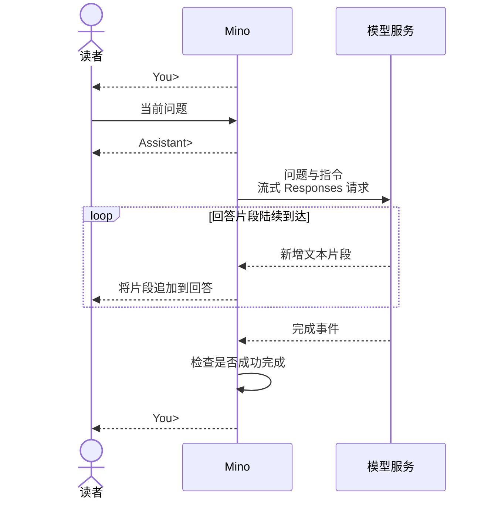

# 第 01 章：与模型对话——第一个终端程序

适用版本：**0.1.x** · 源码核对版本：**重新发布的 v0.1.0 流式版本**，实现提交 **[ce6ba86](https://github.com/qshine/mino/tree/ce6ba867d97d81c7bcc114e8ca6384eed5bcf542)**

你让 Mino 解释 HTTP 请求，然后追问：“我刚才让你解释什么？”上一句回答还留在终端里，看起来就是一段连续的对话。模型收到的也是这样吗？这一章，你会跟着问题进入请求，再跟着回答回到屏幕，弄清一次问答怎样完成，为构建 Agent（智能体）打下第一块基础。

先完成[准备与安装](../getting-started.md)，并使用开头注明的源码版本。`v0.2.0` 已经加入历史功能，要看清这一章的问题，得从 `0.1.x` 的独立问答开始。

## 1. 先让一句回答出现在终端里

启动安装好的 `v0.1.0` 流式版本 Mino，先问一个不依赖前文的问题。

```bash
mino
```

交互示意，下面的措辞用于说明流程，并非真实 API 调用记录。

```text
Mino - Chapter 01: Terminal Chat
Each question is independent. Use /exit, Ctrl+D, or Ctrl+C to quit.

You> 用一句话解释 HTTP 请求。

Assistant> HTTP 请求是客户端发送给服务端的一条消息，用于获取或提交信息。

You>
```

按下回车后，Mino 打印 `Assistant>`，把问题发出去。回答片段陆续到达，程序收到一段就显示一段，你可以在生成结束前开始阅读。上面的记录展示的是拼接后的文本；具体措辞、每段多长、何时到达，都由服务决定。

`You>` 再次出现时，Mino 已经准备好接受下一个问题。只提交空白行，程序会重新提示，不发送请求。你可以在同一个窗口里一直问下去，但这还不能说明下一问带上了上一问的信息。

## 2. 模型收到的，是装进请求里的那些话

你能读到前面的问答，是因为文字还在屏幕上。模型怎样收到这些文字？Mino 必须把它们放进请求；终端窗口本身不是模型服务的输入。

对于刚才的 HTTP 问题，Mino 使用 OpenAI Responses API，把当前问题放进 `input`，把指导回答方式的指令放进 `instructions`。`model` 字段指定你配置的模型。

下面是一份请求示例。为了让它短一点，这里用一条示意指令：“你是 Mino，请简短回答。”它不是程序附带的默认内容；`your-model` 代表你配置的模型名。

```json
{
  "model": "your-model",
  "instructions": "你是 Mino，请简短回答。",
  "input": "用一句话解释 HTTP 请求。",
  "store": false,
  "stream": true
}
```

剩下两个字段影响响应的处理方式。`stream: true` 要求服务在生成过程中陆续发送事件。`store: false` 请服务不要保留可供后续查询的响应对象。两个字段都不会提供前面的消息。

Mino [在聊天启动时读取一次指令](https://github.com/qshine/mino/blob/ce6ba867d97d81c7bcc114e8ca6384eed5bcf542/internal/soul.go#L19)，来源是 `~/.mino/SOUL.md`，之后每次提问都发送这份已加载的内容。如果你在聊天途中修改了文件，需要重启 Mino 才会使用新指令。工作目录里的 `AGENTS.md` 和 `SOUL.md` 不提供运行时指令。

对于第一问，这些信息已经够用。追问就不同了：要理解“我刚才让你解释什么”，还需要当前输入之外的前文。

## 3. 文字出来了，还得等一句完成

前几个字已经出现，你开始读这段解释，连接却在半句话那里断掉了。程序确实显示了文字，但它收到完整回答了吗？

服务通过一串事件传递结构化的“响应”，Mino 从中取出并显示的文本才是你读到的“回答”。新增文本事件让程序展示生成进展，完成事件则告诉程序该检查最终结果了。下面的图展示一次成功问答。



图 01-1：成功问答中，文字先显示，完成检查通过后再把控制权交还给你。

小屏幕上可以横向滚动图表。

### 3.1 先把收到的文字显示出来

`response.output_text.delta` 带来新增的文本，*delta* 就是这次新到的片段。Mino [显示这些片段，并检查最终状态](https://github.com/qshine/mino/blob/ce6ba867d97d81c7bcc114e8ca6384eed5bcf542/internal/responses.go#L52)。拒绝回答的文本也会逐段显示，第一个拒绝片段前加上固定提示 `Model refused: `。

Mino 要收到 `response.completed`，确认其中的 `status` 为 `completed`、没有响应错误，并且前面至少收到过一个非空白的文本或拒绝片段，才认可这次生成成功。没有完成事件，仅仅关闭连接还不够。

检查通过后，`You>` 再次出现。Mino 不会重新打印拼接后的整段回答，因为你已经通过那些片段读过它了。

### 3.2 半途断掉，把决定交还给你

请求失败，或者流在没有成功完成的情况下结束，Mino 会打印 `Error: ...`，再回到输入提示。已经显示的片段仍然可见，但错误提示会说明这次生成没有顺利结束。Mino 不自动重试，是否重新提交问题由你决定。

等待输入或响应时，Ctrl+C 会取消并退出程序。在输入提示处，`/exit` 或空行上的 Ctrl+D 也能结束聊天。退出不会抹掉已经显示在终端里的片段。

## 4. 把开头那个疑问查清楚

### 4.1 它真的是边生成边显示吗

逐段立即显示，还是等生成结束后一次性显示，最终留下的文字记录可能完全相同。要分清这两种行为，检查就得控制生成何时可以结束。在本章开头指定版本的源码根目录运行下面的命令。

```bash
go test ./internal -run 'TestRunStreamsBeforeResponseCompletes|TestRespond|TestTerminal'
```

这些测试用本机模拟 HTTP 服务和模拟输入，不读取你的真实配置，也不调用付费模型。通过时，`github.com/qshine/mino/internal` 前会显示 `ok`。测试进程需要能够绑定本机端口。

在[流式显示检查](https://github.com/qshine/mino/blob/ce6ba867d97d81c7bcc114e8ca6384eed5bcf542/internal/streaming_test.go#L34)中，模拟服务先发一段文字，然后等待。只有测试确认这段文字已经进入终端输出，服务才继续发送剩余内容。如果程序把文字一直攒到生成结束才显示，就无法通过检查。同一条命令还检查回答不重复打印、断流时保留已有片段，以及取消能让交互停止。这些检查验证的是程序处理事件的先后顺序，不是真实服务的回答速度。

### 4.2 窗口没关，为什么还需要重新给前文

回到开头那个追问。在 `v0.1.0` 流式版本的同一次运行中，依次输入这两句，等第一轮回答后再问第二句。

```text
用一句话解释 HTTP 请求。
我刚才让你解释什么？
```

第二问指向第一问，你自然会期待 Mino 把它们接起来。但这个版本的第二次请求里，只有“我刚才让你解释什么？”和已加载的指令，第一问及其回答都不在其中。Mino 也没有提供 `previous_response_id` 或 `conversation` 来关联请求。

“上下文”指当前生成时实际提供给模型的信息。终端保留了问答，方便你阅读；模型要使用前面的消息，仍需要程序把它们提供过去。窗口一直开着，并不会替程序完成这一步。

该怎么验证？直接追问，能让你体验读者会得到什么回答，但模型也可能猜中 HTTP。一个合理答案无法区分“正确处理了历史”和“碰巧猜对”。**要确认 Mino 提供了哪些前文，就检查请求。**

前面的测试命令包含[独立请求检查](https://github.com/qshine/mino/blob/ce6ba867d97d81c7bcc114e8ca6384eed5bcf542/internal/responses_test.go#L16)。模拟服务截取连续请求的主体，核对每个 `input` 是否只有当前问题，以及有没有关联前一次响应或会话的字段。选择在这个交接处检查，可以重复验证 Mino 的行为，不受模型措辞影响。代价是结论更窄：它证明程序发送了什么，不能证明回答质量，也不能保证与所有真实服务兼容。

## 5. 本章小结与下一步

现在，你可以沿着 HTTP 问题走完整个来回：Mino 发送当前输入和指令，显示回答片段，检查完成状态，再把控制权交还给你。这是构建 Agent 的基础，目前还不能执行工具。

开头的追问也指出了下一步缺什么：前面的问答必须进入请求，模型才能把它作为上下文使用。[第 02 章](./02-jsonl-history.md)已在 `v0.2.0` 中实现把问答保存到 JSON Lines（JSONL）文件，启动时恢复已完成的问答，再随新问题发送。工具执行和 Agent 循环仍安排在规划中的第 03 章，见[章节规划](../plan-todo-chapters.md)。
