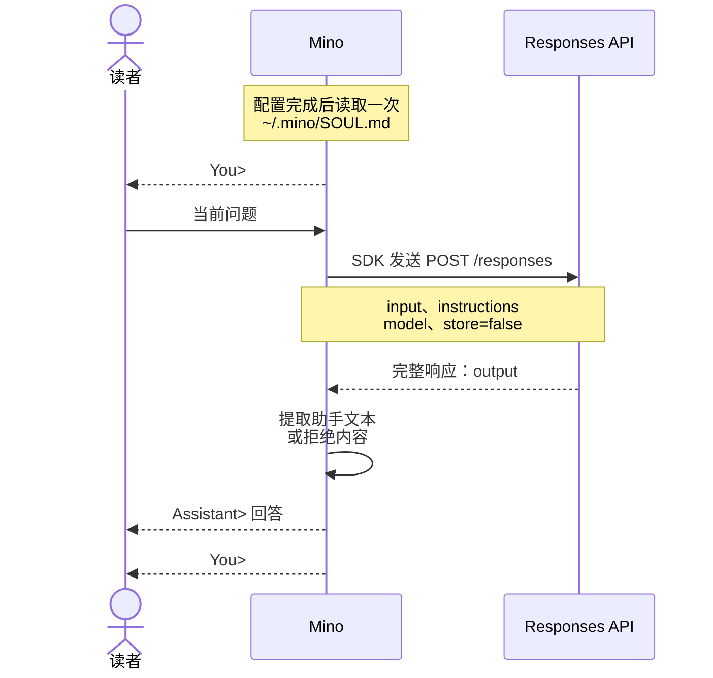

# 第 01 章：与模型对话——第一个终端程序

适用范围：**第一章开发版代码** · 源码核对版本：开发版快照 **[bf851e6](https://github.com/qshine/mino/tree/bf851e61c462f159cae5284a470f4769d12b8201)**

你输入问题，模型给出回答。这两件事之间发生了什么？这一章沿着 **一行输入 → 一次 Responses API 请求 → 显示回答 → 再次等待输入** 的路径展开。这是 Agent（智能体）的基础：由程序决定模型收到什么，以及怎样处理模型的响应。

先完成[准备与安装](../getting-started.md)。读完本章，你可以沿代码追踪一次问答，也能解释为什么在同一个终端里继续提问，仍然没有对话记忆。

## 1. 观察一次问答

在仓库根目录启动本章对应的源码版本：

```bash
go run ./cmd/mino
```

**交互示意**，不是一次真实 API 调用的记录：

```text
Mino - Chapter 01: Terminal Chat
Each question is independent. Use /exit, Ctrl+D, or Ctrl+C to quit.

You> 用一句话解释 HTTP 请求。

Assistant> HTTP 请求是客户端发送给服务端的一条消息，用于获取或提交信息。

You>
```

回车后，Mino 等待完整响应，再一次性打印回答，随后回到 `You>`，由你决定下一次输入。模型负责生成文本；程序负责读取输入、发出请求和显示结果。

## 2. 跟着问题与回答走一遍

模型服务看不到终端窗口。当前问题需要哪些信息，必须由 Mino 明确发送。正常问答的路径如下：



图 01-1：Mino 将已加载的身份与当前输入一起发送，显示回答后把控制交回读者。

小屏幕上可以横向滚动图表。

### 2.1 Mino 与 SDK 的分工

程序从 [cmd/mino/main.go](https://github.com/qshine/mino/blob/bf851e61c462f159cae5284a470f4769d12b8201/cmd/mino/main.go#L12) 启动，把构建版本交给 `mino.Main`。应用实现放在 `internal/` 中：[run](https://github.com/qshine/mino/blob/bf851e61c462f159cae5284a470f4769d12b8201/internal/app.go#L25) 加载配置和指令、创建 Responses 客户端，再把它的 `respond` 方法交给终端循环。读取输入和决定下一步做什么，仍由 Mino 负责。

[OpenAI 官方 Go 软件开发工具包（SDK）](https://developers.openai.com/api/docs/libraries) 负责 API 请求和响应类型。本章在 [go.mod](https://github.com/qshine/mino/blob/bf851e61c462f159cae5284a470f4769d12b8201/go.mod) 中将 `github.com/openai/openai-go/v3` 固定为 **v3.66.0**。Mino 在 [newResponsesClient](https://github.com/qshine/mino/blob/bf851e61c462f159cae5284a470f4769d12b8201/internal/responses.go#L30) 中使用明确的配置创建 `responses.ResponseService`。**API 客户端不会替 Mino 实现 Agent 循环**：提供可用工具、执行模型请求的工具调用并继续任务，将由 Mino 的运行系统负责，这层系统也常称为 *harness*。

### 2.2 请求里放了什么

[responsesClient.respond](https://github.com/qshine/mino/blob/bf851e61c462f159cae5284a470f4769d12b8201/internal/responses.go#L53) 将带类型的参数交给 SDK 的 `New` 方法。下面只摘录参数字段；完整方法还包含错误处理和响应检查：

```go
responses.ResponseNewParams{
	Model:        c.config.Model,
	Instructions: openai.String(c.instructions),
	Input:        responses.ResponseNewParamsInputUnion{OfString: openai.String(prompt)},
	Store:        openai.Bool(false),
}
```

`OfString` 选择文本输入形式。`openai.String` 和 `openai.Bool` 显式传入可选字段的值，包括 `false`。SDK 将参数编码为 JSON，发送到 `{base_url}/responses`。本例假设你将 `~/.mino/SOUL.md` 的全部内容改为“你是 Mino，请简短回答。”，然后重启。这是自定义内容的示意，并非随程序附带的默认文本。前面的提问对应的请求主体为：

```json
{
  "model": "your-model",
  "instructions": "你是 Mino，请简短回答。",
  "input": "用一句话解释 HTTP 请求。",
  "store": false
}
```

`your-model` 代表配置的模型名。`input` 只有当前问题。配置完成后，[loadInstructions](https://github.com/qshine/mino/blob/bf851e61c462f159cae5284a470f4769d12b8201/internal/soul.go#L19) 读取一次 `~/.mino/SOUL.md`。文件缺失时，Mino 用随程序附带的默认内容创建它，其中描述 Mino 的身份、文本帮助能力和当前限制。每次请求都将已加载的文本放入 Responses API 的 `instructions` 字段。

程序忽略工作目录中的 `AGENTS.md` 和 `SOUL.md`，因此仓库开发指令与 Mino 的身份相互独立。修改用户文件后需要重启才会生效；指令可以引导回答，但不能添加可执行工具。

### 2.3 响应怎样变成终端文本

API 响应是结构化数据，`output` 数组可能包含最终回答之外的条目，因此不能只取第一项就当作答案。

Mino 的 [checkResponse](https://github.com/qshine/mino/blob/bf851e61c462f159cae5284a470f4769d12b8201/internal/responses.go#L109) 在 SDK 解码前拦截 HTTP 错误、超过 8 MiB 的响应和无效 JSON。随后，[响应检查](https://github.com/qshine/mino/blob/bf851e61c462f159cae5284a470f4769d12b8201/internal/responses.go#L78) 要求响应已经完成。Mino 寻找 `role` 为 `assistant` 的 `message` 条目，拼接其 `content` 中类型为 `output_text` 的文本。遇到 `refusal` 时，在拒绝内容前加上 `Model refused: `。生成失败、响应未完成或没有文本，都会转为错误。

[runTerminal](https://github.com/qshine/mino/blob/bf851e61c462f159cae5284a470f4769d12b8201/internal/terminal.go#L12) 过滤终端控制字符后显示返回的文本，再进入下一轮。模型输出不会作为命令执行。

### 2.4 出错和退出时发生什么

网络、HTTP 或响应错误会显示为 `Error: ...`，然后回到 `You>`。Mino 关闭 SDK 自动重试、设置两分钟的 HTTP 超时并拒绝重定向，避免一次提问在后台重复请求或转到其他服务。HTTP 失败时只报告状态，不读取或显示可能回显敏感输入的服务端错误正文。

空白行不发送请求；`/exit` 或空行上的 Ctrl+D 结束聊天。等待输入或响应时都可以按 Ctrl+C 取消并退出：[mino.Main](https://github.com/qshine/mino/blob/bf851e61c462f159cae5284a470f4769d12b8201/internal/app.go#L14) 将取消信号经终端循环和 SDK 传递到 HTTP 请求。

## 3. 用第二个问题检验记忆

在同一次运行中依次输入下面两句话，等第一轮回答后再问第二句：

```text
我最喜欢的颜色是蓝色。
我刚才说最喜欢什么颜色？
```

第二次请求的 `input` 只有第二个问题，`instructions` 仍是启动时加载的身份内容。Mino 没有重发第一句及其回答，也没有设置 `previous_response_id` 或 `conversation`。终端里仍然可见的文字，不会自动进入模型的上下文。保存身份不等于保存对话历史。

模型可能猜中“蓝色”。**猜对不代表有记忆，请求内容才能说明问题。** 请求中的 `store: false` 是请服务不要保留可供后续查询的响应对象，既不保证服务完全没有日志，也不是本章问答互相独立的原因；关键在于请求没有前文和历史关联字段。

无需调用付费模型也能验证这一点。在仓库根目录运行：

```bash
go test ./internal -run 'TestRespond|TestTerminal|TestRunUsesSoul|TestLoadInstructions'
```

这些测试使用本机模拟 HTTP 服务和模拟输入，不使用真实配置。通过时，输出会在 `github.com/qshine/mino/internal` 前显示 `ok`。[TestRespondSendsIndependentRequests](https://github.com/qshine/mino/blob/bf851e61c462f159cae5284a470f4769d12b8201/internal/responses_test.go#L16) 检查两轮请求主体，并验证能够跳过非消息条目提取文本。其他响应测试检查 SDK 请求是否忽略环境中的 `OPENAI_*` 设置，以及是否关闭自动重试。[终端测试](https://github.com/qshine/mino/blob/bf851e61c462f159cae5284a470f4769d12b8201/internal/terminal_test.go#L36) 检查请求出错后继续输入和取消行为。测试进程需要能够绑定本机端口。

[TestRunUsesSoulInsteadOfProjectInstructions](https://github.com/qshine/mino/blob/bf851e61c462f159cae5284a470f4769d12b8201/internal/app_test.go#L16) 检查默认或自定义身份文本进入 `instructions`，而项目文件内容不会进入请求。[身份测试](https://github.com/qshine/mino/blob/bf851e61c462f159cae5284a470f4769d12b8201/internal/soul_test.go#L10) 检查初始化、保留修改和无效文件。这些检查直接验证程序发送的内容，无需依赖模型如何措辞。

## 4. 本章小结与下一步

现在，你可以观察输入到模型回答、再回到输入的完整路径。目前还没有对话历史、流式输出、会话持久化或模型工具执行。重复终端问答，是构建 Agent 的起点。

规划中的第 02 章会在内存中保存前面的问答，并随下一条问题一起发送。模型请求工具并接收执行结果，是第 03 章的后续任务。其余工作见[章节规划](../plan-todo-chapters.md)。
