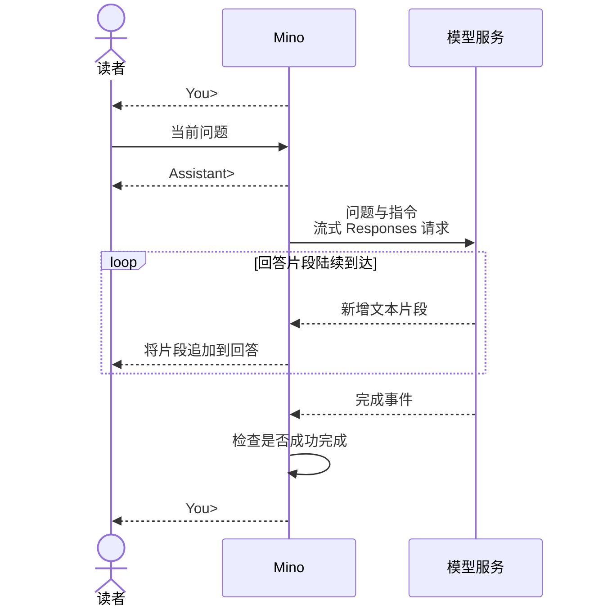

# 第 01 章：与模型对话——第一个终端程序

适用版本：**0.1.x** · 源码与发布标签：**[chapter-01](https://github.com/qshine/mino/tree/chapter-01)** · 程序版本：**0.1.0**（2026-09-26 发布）

你输入问题，希望在模型完成生成前就看到回答开始出现。Mino 需要发送你的输入、显示收到的文本，并决定何时等待下一个问题。本章沿着这次交互展开，同时解释为什么在同一个终端里继续提问，并不会让模型拥有对话记忆。

先完成[准备与安装](../getting-started.md)。接下来，你会看到自己提供了什么、模型收到什么，以及 Mino 怎样把控制权交还给你。

## 1. 观察一次问答

启动安装好的流式版本：

```bash
mino
```

**交互示意**，不是一次真实 API 调用的记录：

```text
Mino - Chapter 01: Terminal Chat
Each question is independent. Use /exit, Ctrl+D, or Ctrl+C to quit.

You> 用一句话解释 HTTP 请求。

Assistant> HTTP 请求是客户端发送给服务端的一条消息，用于获取或提交信息。

You>
```

按下回车后，Mino 打印 `Assistant>` 并发送问题。回答片段随后到达，程序收到一段就显示一段；上面的记录展示最终文本，措辞、片段大小和到达时间由服务决定。再次出现 `You>` 时，你可以提交下一个问题。如果提交空白行，程序只会重新提示输入，不发送请求。

## 2. 发送问题和指令

模型服务看不到你的终端窗口。Mino 把当前问题放入 Responses API 请求的 `input`，同时发送描述自身身份、指导回答方式的 `instructions`。配置中的 `model` 决定由哪个模型接收这些信息。

Mino [在聊天启动时读取一次指令](https://github.com/qshine/mino/blob/chapter-01/internal/soul.go)，来源是 `~/.mino/SOUL.md`。每个问题都会携带这份已加载的指令。修改文件后，需要重启 Mino 才会影响后续回答；工作目录中的 `AGENTS.md` 和 `SOUL.md` 不会作为指令发送。

为了展示一个简短的请求，假设加载的指令是“你是 Mino，请简短回答。”。这是自定义文本的示意，并非随程序附带的默认内容。前面的提问会产生下面的请求主体，其中 `your-model` 代表你配置的模型名：

```json
{
  "model": "your-model",
  "instructions": "你是 Mino，请简短回答。",
  "input": "用一句话解释 HTTP 请求。",
  "store": false,
  "stream": true
}
```

`stream: true` 请服务在生成过程中逐个发送事件，让 Mino 能在回答完成前显示文本。`store: false` 请服务不要保留可供后续查询的响应对象。这两个字段都不会为请求补上之前的问题或回答。

## 3. 从回答片段到下一个输入提示

响应包含结构化事件，回答则是 Mino 从中选取并显示的文本。有的事件携带新增文本，有的事件报告生成是否完成。区分两者，程序才能立即显示有用的内容，同时避免把尚未结束的回答当作成功完成。



图 01-1：文本在生成过程中就到达读者，下一个输入提示则等待完成检查。

小屏幕上可以横向滚动图表。

### 3.1 先显示文本，再确认完成

Mino [逐段显示新增文本，并检查最终状态](https://github.com/qshine/mino/blob/chapter-01/internal/agent/responses.go)。文本片段通过 `response.output_text.delta` 事件到达，*delta* 表示新增的文本。如果模型拒绝回答，Mino 同样逐段显示拒绝内容，并在第一个片段前加上 `Model refused: `。完成事件到达时，程序不会把拼好的回答再打印一遍。

**看到文本，不代表生成已经完成。** Mino 要求收到 `response.completed` 事件，其中的 `status` 为 `completed`、没有响应错误，并且此前至少收到一个非空白的文本或拒绝片段。满足这些条件后，程序确认回答成功完成，再回到 `You>`。连接直接关闭不足以证明成功。

### 3.2 处理错误或结束交互

如果请求失败，或流在成功完成前结束，Mino 会打印 `Error: ...`，然后回到 `You>`。已经显示的片段保留在终端，你可以看到回答停在了哪里。Mino 不会自动重试，是否再次提交问题由你决定。

等待输入或响应时，按 Ctrl+C 会取消并退出 Mino，已经显示的回答片段仍留在终端。在输入提示处，`/exit` 或空行上的 Ctrl+D 也会结束聊天。

## 4. 验证交互过程

### 4.1 验证文本先于完成事件显示

在仓库根目录运行：

```bash
go test ./internal/... -run 'TestRunStreamsBeforeResponseCompletes|TestRespond|TestTerminal'
```

这些测试使用本机模拟 HTTP 服务和模拟输入，不使用真实配置，也不调用付费模型。通过时，`internal`、`internal/agent` 和 `internal/gateway` 包都会显示 `ok`；测试进程需要能够绑定本机端口。

[流式显示检查](https://github.com/qshine/mino/blob/chapter-01/internal/streaming_test.go) 先发送第一个片段，等它到达终端输出后才发送剩余内容。因此，测试通过能证明文本在响应完成前就已显示。同一条命令还检查完成事件不会让回答重复出现、断流后保留已显示的片段，以及取消会停止交互。

### 4.2 检查下一问收到的信息

在同一次运行中依次提交这两个问题，等第一轮回答后再问第二句：

```text
用一句话解释 HTTP 请求。
我刚才让你解释什么？
```

模型的*上下文*是当前生成时实际收到的信息。第二次请求只包含第二个问题和已加载的指令。Mino 没有把第一问及其回答作为对话历史发过去，也没有通过 `previous_response_id` 或 `conversation` 关联两次请求。输入提示上方可见的文字，不会自动进入下一次请求。

模型可能猜中话题。**猜对不代表有记忆，请求内容才能说明问题。** 前面的测试命令包含[独立请求检查](https://github.com/qshine/mino/blob/chapter-01/internal/agent/responses_test.go)，它查看连续请求的主体，确认每次只携带当前问题。流式输出改变的是你看到回答的时间，下一问得到的信息仍然独立。

## 5. 本章小结与下一步

Mino 现在能把一个问题交给模型，以流式方式显示响应中的文本，并在完成或报错后把控制权交还给你。这是 Agent（智能体）的基础；它还不能利用对话历史继续任务，也不能执行模型请求的工具。

第 02 章（`chapter-02`）解决历史缺失的问题：用 JSON Lines（JSONL，每行一条 JSON 记录）文件保存问答，启动时恢复，并随下一条问题一起发送。工具执行和 Agent 循环在第 03 章展开。其余工作见[章节规划](../plan-todo-chapters.md)。
