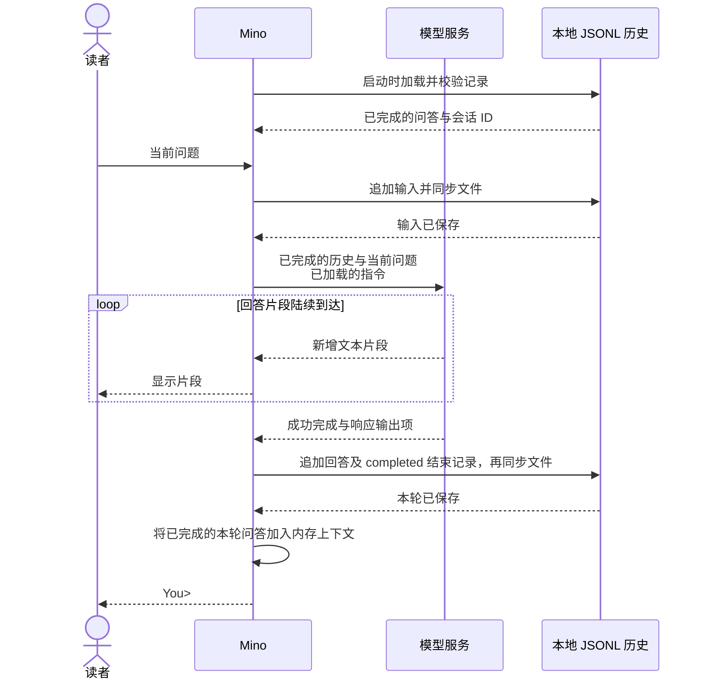

# 第 02 章：让对话连续起来——JSONL 对话历史

适用范围：**第 02 章开发版实现** · 目标版本：**v0.2.0（Unreleased，尚未发布）** · 源码核对提交：**[cecc1ca](https://github.com/qshine/mino/tree/cecc1cacbe6a21110e54143f70f0cc8feee8c032)**

你告诉 Mino 自己最喜欢的颜色，退出后，再问刚才说的是什么颜色。模型要根据之前的问答作答，就需要 Mino 把前文重新发给它。本章加入本地对话历史，让程序重启后也能恢复前文。

请使用包含第二章实现的开发版源码；前置条件及它与已发布第一章版本的区别见[准备与安装](../getting-started.md)。

## 1. 重启后继续对话

在仓库根目录启动开发版程序：

```bash
go run ./cmd/mino
```

**交互示意**，不是一次真实 API 调用的记录：

```text
Mino - Chapter 02: Conversation History
History is saved locally and restored on startup. Use /exit, Ctrl+D, or Ctrl+C to quit.

You> 我最喜欢的颜色是蓝色。

Assistant> 你最喜欢的颜色是蓝色。

You> /exit
```

再次运行同一条命令。Mino 会在接受输入前恢复对话，不会重新打印旧的聊天记录，也不会仅因重启就请求模型。输入“我刚才说最喜欢什么颜色？”后，下一次请求会包含之前的问题和回答，模型便可以利用它们作答。具体措辞仍由服务决定。

同一次运行中的连续提问也使用这套流程。**模型的记忆来自程序提供的上下文**；终端保持打开，或文件保存在你的 Mac 上，都不意味着模型会自动获得之前的消息。

## 2. 标识记录所属的会话与问答

*会话*把属于同一段对话的问答组织在一起。*一轮问答*从一次提交的输入开始，成功时以完整回答结束。Mino 当前在 `~/.mino/history.jsonl` 中保存一个会话。

JSON Lines（JSONL）每行保存一条 JSON 记录。Mino 按顺序追加记录，不会每问一次就重写整段对话。每条记录都带有相同的 `session_id`、每轮新生成的 `turn_id`、从 1 开始连续递增的 `seq`，以及格式版本 `v: 1`。两种 ID 都由程序生成，使用 32 个小写十六进制字符。会话 ID 写入记录后会在重启时沿用；启动一个新进程，不等于开始一段新对话。

对于前面的颜色问答，文件会收到三条记录：

表 02-1：完整的一轮问答既需要问题和回答，也需要结束记录。

| 记录类型 | Mino 何时保存 | 它说明什么 |
| --- | --- | --- |
| `user_message` | 发送问题之前 | 提交的输入属于这个会话和这一轮问答。 |
| `assistant_message` | 模型成功完成生成后 | 已获得回答文本，以及服务返回的响应输出项。 |
| `turn_end`，`status: completed` | 与回答记录一起保存 | 保存成功后，整轮问答可以进入下一次请求。 |

回答的 `text` 是模型说出的文本；可选的 `output` 保留继续交互所需的结构化响应项。它们与终端上的 `Assistant>` 标签不同，后者从来不是回答的一部分。

加载文件时，Mino 会检查会话 ID、序号和问答顺序。如果某条记录属于另一个会话，程序会停止加载，避免悄悄混合两段对话。第四章将在这些已有 ID 的基础上增加多会话管理。

## 3. 把已保存的历史变成模型上下文

*对话历史*是磁盘上保存的交互记录，*上下文*是当前生成时实际提供的信息。Mino 先在内存中按顺序还原已完成的问答，再追加你当前的问题，组成下一次请求的 `input`。

请求还会携带从 `~/.mino/SOUL.md` 加载的指令。这些指令与历史分开处理。Mino 继续设置 `store: false`，显式发送前面的条目，不使用 `previous_response_id` 或服务端管理的 `conversation`。



图 02-1：文本可以在保存完成前出现，下一轮则要等本轮完整保存后才能开始。

小屏幕上可以横向滚动图表。成功流程有[两次存储确认](https://github.com/qshine/mino/blob/cecc1cacbe6a21110e54143f70f0cc8feee8c032/internal/conversation.go#L90)：Mino 在请求模型前同步输入，在接受下一个问题前同步回答和结束记录。写入或同步失败都会停止这条流程。

有些响应不仅包含可见文本。Mino 保留返回的助手消息项，包括 `phase`，以及带有不透明 `encrypted_content` 的推理项。程序通过 `include: ["reasoning.encrypted_content"]` 请求后者，让服务能在下一次请求中收到自身所需的状态；Mino 不会显示或解密它。如果兼容服务在完成时没有提供输出项，Mino 则用成功完成的流式文本构造助手消息。

## 4. 不把未完成的交互放进下一次请求

文件可以保留一次尝试提交的问题，同时不让它进入后续上下文。请求失败时，Mino 写入状态为 `failed` 的 `turn_end`；取消时写入 `cancelled`。两者都不会进入下一次请求。已经显示的片段仍留在终端，但程序不会把它们保存成完整回答。普通请求错误会把控制权交还给你；Ctrl+C 则取消并退出。

成功完成的拒绝也是回答。Mino 显示固定前缀 `Model refused: `，但只保存模型的拒绝文本和返回的输出项。这个前缀不会变成下一次请求中的消息内容。

如果进程在保存结束记录前停止，下次启动时，Mino 会把未结束的一轮标记为 `interrupted`，排除在上下文之外。如果最后一行不完整或 JSON 语法损坏，程序先保存一份私有恢复副本，再移除这段尾部。文件中间的无效记录、未知字段或版本，以及错误的会话或问答顺序，会使加载停止，历史内容保持不变。恢复过程从不自动重发模型请求。

**屏幕上有回答，不代表回答已经保存。** 如果无法确认回答保存成功，Mino 会报告问题并停止聊天；否则，下一次请求就可能依赖重启后未必能恢复的历史。如果保存输入时就失败，程序会在请求模型前停止。

## 5. 不调用真实模型也能验证连续性

在包含第二章实现的仓库根目录运行：

```bash
go test ./internal -run 'TestRunRestoresConversationAndSession|TestRunFailedTurnDoesNotEnterContext|TestConversation|TestHistory|TestRunStreamsBeforeResponseCompletes'
```

这些测试使用临时用户目录和本机模拟 HTTP 服务，不读取你的真实历史，也不调用付费模型。通过时，输出会在 `github.com/qshine/mino/internal` 前显示 `ok`；测试进程需要能够绑定本机端口。

[重启检查](https://github.com/qshine/mino/blob/cecc1cacbe6a21110e54143f70f0cc8feee8c032/internal/conversation_test.go#L17)先提交颜色信息，关闭 Mino，再启动并追问颜色。测试会查看第二次请求，确认其中包含原始输入、返回的推理与回答项，以及新问题；还会检查保存的六条记录使用同一个会话 ID，序号连续。**检查请求能证明对话连续性，单凭一个合理的回答不能。**

其他检查会在示例问答的每个字节边界截断写入，模拟写入与同步失败，并尝试让第二个进程打开同一份历史。通过这些检查，能确认未完成的问答不会进入上下文、存储失败会阻止后续请求，以及同一份历史同时只能由一个进程使用。流式检查还会确认回答片段仍在完成事件之前显示。

## 6. 本章小结与下一步

Mino 能把已保存、已完成的问答作为上下文，在连续提问和重启后继续同一个会话。当前会重放全部已完成的历史；对话变长后，可能超过模型的上下文限制。上下文压缩、上下文预算，以及管理不同会话的 `/new` 和 `/clear` 仍在规划中。

Mino 还不能执行模型请求的工具。规划中的第 03 章将加入这次交接：模型请求动作，程序决定是否执行，工具结果回到模型，再由模型作答。其余工作见[章节规划](../plan-todo-chapters.md)。
