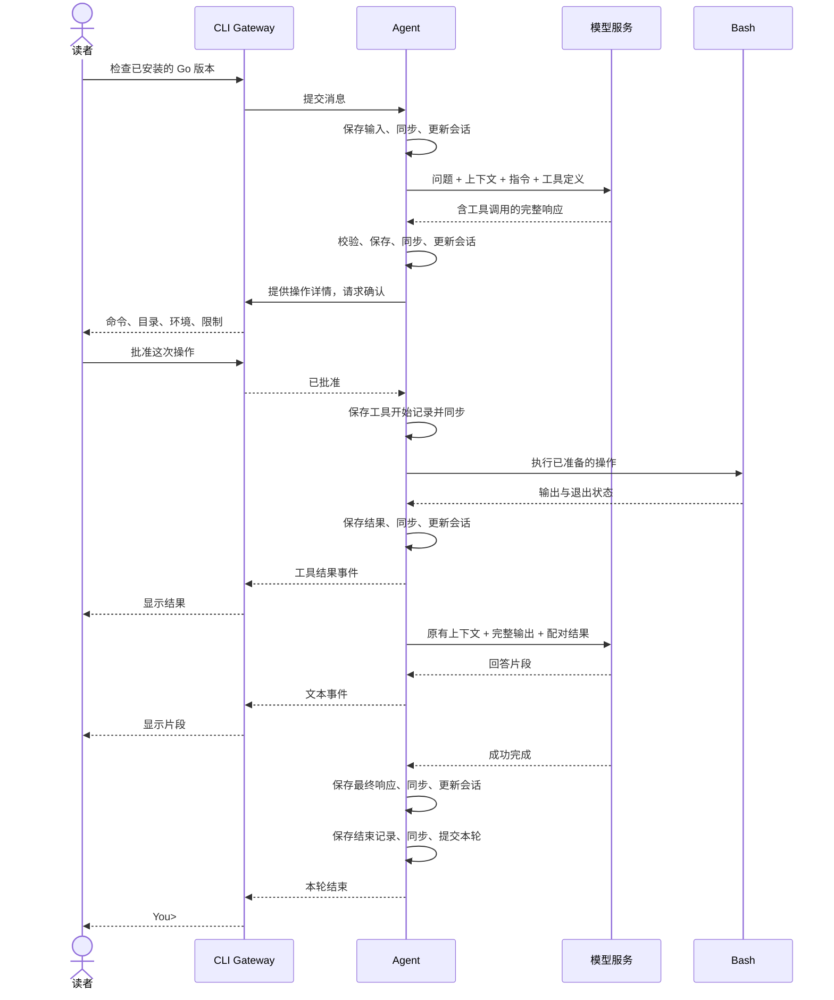

# 第 03 章：第一个 Agent 循环：工具调用与 Bash

适用版本：**0.3.x** · 源码与发布标签：**[chapter-03](https://github.com/qshine/mino/tree/chapter-03)** · 程序版本：**0.3.0**（2026-09-26 发布）

问 Mino：“这台电脑安装的 Go 是什么版本？”如果还没有检查过，对话历史也无法提供这个事实。本章让 Mino 有办法取得它：模型请求执行一条 Bash 命令，你批准操作，程序再把工具结果交回模型。

请使用 `chapter-03` 发布包或对应的源码。开始交互前，先完成[准备与安装](../getting-started.md#从源码体验第三章)。

## 1. 一个问题把决定权交回你手中

在你希望运行命令的目录启动 Mino，请它用 `go version` 检查已安装的 Go 版本。是否请求工具由模型决定；在回答里写出命令，并不会执行它。

交互示意，节选。完整批准界面还会显示解析后的工作目录、转义后的环境、超时、输出上限和账户权限提示，此处省略这些行。版本号和模型措辞均为示例，不是实测记录。

```text
You> 运行 go version，告诉我安装的 Go 是什么版本。

Assistant>
[Tool: bash]
Command: "go version"
Approve this operation? [y/N] y

[Tool result: completed; exit code 0]
go version go1.27.1 darwin/arm64

Assistant> 这台电脑安装的是面向 Apple Silicon Mac 的 Go 1.27.1。

You>
```

第一次模型响应可以只有工具调用，因此空的 `Assistant>` 是有效情况。Mino 等你决定，执行获批命令，显示工具结果，再把结果发回去。模型随后可以回答，也可以再次请求工具。这种反复交接就是 *Agent 循环*。一轮问答现在涵盖原始输入、中间的工具步骤，以及最终回答。

再问一次同样的问题，在批准提示处输入 `n`，或者直接回车。Mino 不会执行这条命令，而是提供状态为 `denied` 的工具结果，让模型说明未能完成检查。拒绝执行是程序确定的行为；模型是否解释得清楚，是另一个问题。

## 2. 从 Gateway 到配对的工具结果

Mino 面向终端的命令行界面（CLI）接入层称为 *CLI Gateway*，负责接收输入、显示事件和询问确认。它把你的消息交给 Agent，由 Agent 发送模型请求、处理响应流并运行工具循环。Agent 通过事件把文本、结果和提示交回来。Gateway 不打开会话文件，也不执行 Bash。

Mino 在构造 Agent 时，把会话和可用工具传给它。这就是*构造函数注入*：依赖由外部提供，而不是在循环内部创建。这样，更换工具或交互入口时可以复用同一套循环。当前应用仍然只有 CLI、一个会话和 Bash。接口采用同步方式：CLI 等整轮问答结束，包括中途的批准，再接收下一个问题。如果另一个调用同时使用该会话，程序会在写入输入前返回忙碌错误，避免两轮交错。

每次请求都提供当前问题、可重放的历史、已加载的指令，以及 `tools` 中的 `bash` 定义。它的参数结构只有一个必填字符串 `command`，不接受额外字段。开头问题可以产生 `{"command":"go version"}`。Bash 还会在本地校验，拒绝空命令、重复或未知字段、无效文本、NUL 字符，以及超过 16 KiB 的命令。

工具分三步参与交互：描述可用操作（`Definition`），校验并准备参数及展示字段而不执行（`Prepare`），再执行已准备的操作（`Execute`）。Agent 按注册名称找到工具，并在执行前取得批准。Gateway 收到展示数据，Agent 保留已准备的参数。这让展示和执行各自负责一部分，同时保持获批操作不变。

文本片段仍到达即显示，但不会改变会话的重放状态。成功的 `response.completed` 事件到达后，Agent 校验完整输出，保存并同步，再更新该状态。包含工具调用的中间响应也遵守这个顺序。参数片段或单个输出项结束，都不能启动 Bash；断开的流不会留下一个可供执行的完整响应。

工具调用带有 `call_id`。Agent 用同一个 ID 返回 `function_call_output`，其中以 JSON 表达状态、输出，以及可选的退出码或截断标记。缺失或重复 ID 会使整个响应无效；同一轮内再次使用已有 ID，也会在执行本次响应中的任何调用前停止。这个 ID 把每个结果与请求它的操作配对。



图 03-1：Gateway 负责与你交互，Agent 取得必要的批准和保存确认后，才推进执行。

窄屏上可以横向滚动图表。后续请求按原顺序保留完整输出项，包括存在时的 assistant `phase` 和不透明的加密推理内容。Mino 保持 `store: false` 并请求 `reasoning.encrypted_content`，由 Agent 自己提供上下文，而不通过 `previous_response_id` 连接请求。模型服务不会执行本地命令。

## 3. 一次批准对应一次受限执行

询问 `Approve this operation? [y/N]` 之前，Gateway 会显示已准备的完整命令、解析后的启动目录，以及环境，特殊字符经过转义。你批准的是这些字段所描述的操作。只有 `y` 或 `yes` 表示同意，大小写和首尾空白不影响判断。每个调用都要单独决定，管道输入不能批准命令。聊天和批准共用一条输入流，因此确认内容会被当作决定，不会成为下一个问题。

Mino 用 `/bin/bash --noprofile --norc -c` 运行获批命令。每次调用都从已确定的目录和最小环境开始，因此某条命令中的 `cd` 不会改变下一次调用的起始目录。Shell 配置文件和继承的启动变量不会参与启动，模型配置中的 API Key 也不会被放进子进程环境。具体环境见[源码准备说明](../getting-started.md#从源码体验第三章)。

标准输出和标准错误共用 64 KiB 的采集上限。执行停止后，Mino 显示采集结果，再交给模型。非零退出码会成为失败的工具结果，让模型有机会解释失败。超过 30 秒或输出超限时，程序终止进程组；输出超限还会标记截断。Ctrl+C 取消并退出，同时停止活动进程组。已经发生的文件或网络变更不会被撤销。

Mino 请求 `parallel_tool_calls: false`，如果仍收到一批调用，也按顺序处理。一轮问答最多允许 8 次模型请求、16 次工具调用。如果第八次响应还要求调用工具，或新一批调用将突破工具数量限制，Mino 会把尚未启动的调用记为 `not_executed` 并结束本轮。没有空间继续请求模型时，程序不会先执行这批命令。

这些限制约束了执行过程，但 Bash 仍使用你的账户权限，可以读取账户可访问的文件、联系可访问的服务，也可以通过命令自行切换目录或设置环境。清理覆盖的是进程组，主动脱离进程组的后代进程可能逃出这一范围。Mino 将继承输出管道的等待限制为 250 ms，不提供后台任务管理或操作系统沙箱。指令要求模型把工具输出当作不可信数据，但这条指引不能强制约束文件或网络访问。

## 4. 为行动留下能够如实恢复的记录

执行命令带来了纯文本历史没有的问题：中断的一轮问答可能已经产生实际影响。假设命令创建了文件，Mino 却在保存结果前崩溃，再次执行可能重复产生影响；丢弃整轮又会隐藏它可能已经发生的事实。

Agent 先保存你的输入并同步，再进入模型循环。它使用一个 `Session`，保存重放状态和正在进行的一轮问答，由 `history.jsonl` 提供持久存储。每个经过校验的完整 `model_response`，都先保存并同步，再由 Session 提交到内存状态中，包含工具调用的中间响应也一样。流式片段是用于显示的事件，不是已提交的对话状态。

取得批准后，Agent 在执行前保存 `tool_start` 并同步，在再次请求模型前保存 `tool_result` 并同步。最终响应没有工具调用时，才可以记录已完成的 `turn_end`。这些记录共用本轮的 `turn_id`，每个工具的开始与结果还携带对应的 `call_id`。写入或同步失败时，先前已提交的内存状态保持不变，交互停止。

只在执行后保存可以减少写入，但一旦中断，就可能没有可靠记录说明命令曾经开始。Mino 选择增加这些保存边界，并在写入或同步失败时停止聊天。代价是命令本来还能运行，交互却必须中断；收益是恢复时有据可查，而不是让文件存储和 Bash 组成一个事务：保存了开始记录，不证明进程已创建；结果写入失败，也不证明命令失败。

重启时，Mino 恢复记录，不执行工具，也不自动请求模型。对于尚未结束的工具问答，程序根据已有证据，为每个未解决的调用补上结果。

表 03-1：恢复依据已保存的记录报告状态，不猜测执行结果。

| 已保存的证据 | 恢复结果 | 你能据此判断什么 |
| --- | --- | --- |
| 有调用，没有开始记录 | `not_executed` | Mino 未到达已记录的执行边界。 |
| 有开始记录，没有结果 | `unknown` | 操作可能已经发生，但结果不可知。 |
| 调用已有结果 | 保留该结果 | 已记录的结果可以进入后续上下文，无需再次执行。 |

遇到 `unknown`，Agent 会在启动时要求确认恢复状态。Gateway 先问 `Do you understand that these commands may already have run? [y/N]`，然后才能接收新问题。继续之前，应检查可能发生的影响。确认以 `recovery_ack` 保存；在保存之前，重启也不会跳过这道确认。它允许你继续对话，不会重新执行命令，也不会验证操作的影响。

失败、取消或中断的工具问答会把已配对的调用和结果保留在后续上下文中，再附上明确的 Mino 运行时提示。未完成的纯文本问答仍被排除。这一区别让模型看见可能已经发生的影响，同时不会把未完成的流式片段当作最终回答。写入和同步仍可能部分失败，停止 Mino 不能撤销外部影响，也不能保证究竟哪些字节已经落盘。

## 5. 分开检查执行与重放

模型回答“Go 1.27.1”，不能证明 Bash 运行过。在 `chapter-03` 的仓库根目录检查执行与重放边界：

```bash
go test ./internal/agent ./internal/gateway ./internal/tools
```

测试使用临时用户目录、工作目录和本机模拟 HTTP 服务，不需要真实 API Key，也不调用付费模型。通过时，三个包路径前都会显示 `ok`；模拟服务需要能够绑定本机端口。

一个契约测试注入仅用于测试的 `echo` 工具，无需修改 Agent 循环。它在每次交接处检查磁盘记录：首次模型请求前已有输入，确认前已有完整响应，执行前已有开始记录，下次请求前已有工具结果。它的成功结果没有进程退出码，说明共用的结果格式不要求每个工具都启动进程。Bash 仍会在能够取得退出码时记录它；运行中的应用没有提供 `echo` 工具。

独立测试会注入同步失败，检查 Session 的内存状态没有推进；还会并发提交另一个问题，检查程序在写入前拒绝忙碌期间的新一轮问答。批准测试检查默认拒绝和共享输入，协议测试检查配对 ID 与保留的响应项，不完整响应和无效调用都不得执行。

Bash 集成用例在临时目录中写入、读取已知标记，检查交回模型的结果，再重新打开历史，确认追问不会执行旧命令。恢复用例检查未知结果和确认是否跨重启保留。Bash 测试覆盖失败退出码、环境隔离、超时、输出超限、取消和普通后台子进程清理。

这些检查验证的是测试覆盖的控制流程与重放内容，不证明真实回答的质量，也不保证所有 Responses 端点都兼容，更不证明能够约束脱离进程组的进程。开头的 Go 版本交互仍取决于所用服务，模拟测试则提供可重复验证的证据。

## 6. 本章小结与下一步

Go 版本问题现在有了取得证据的路径：完整工具调用、你的批准、受限的 Bash 执行，以及交给模型的配对结果。Mino 可以在同一轮问答中继续推进，并留下足够记录，区分未启动的命令和结果未知的操作。

这些内容仍属于 `history.jsonl` 中的同一段对话。[第 04 章](../plan-todo-chapters.md)随 `chapter-04` 发布，让每个会话使用独立的 JSONL 文件，让新任务从自己的历史开始，同时保留旧任务以便继续。
