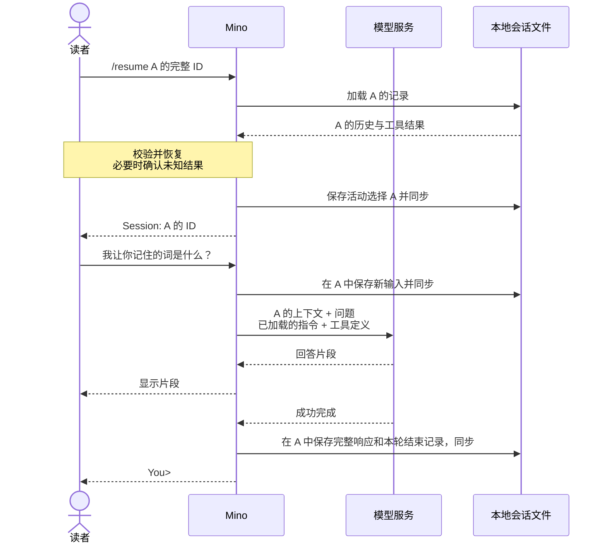

# 第 04 章：用 JSONL 会话管理多段对话

适用版本：**0.4.x** · 源码与发布标签：**[chapter-04](https://github.com/qshine/mino/tree/chapter-04)** · 程序版本：**0.4.0**（2026-09-26 发布）

先让 Mino 记住“松树”，再开始一项无关的任务。你需要暂时离开这段对话而不删除它，等到需要之前的上下文时再回来。本章为每段对话建立独立会话，让你选择下一次提问携带哪份历史。

请按[第四章源码准备说明](../getting-started.md#从源码体验第四章)开始。下面的示例用于说明交互，模型回答不是实测记录。

## 1. 在两个会话中问同一个问题

在 `You>` 后输入 `/new`，为记词任务新建会话，并记下 Mino 显示的 ID。完成一次问答后，再用 `/new` 新建另一个会话，然后通过 `/resume` 返回第一个。

交互示意，节选。重复的 `a`、`b` 代表程序生成的 ID；实际操作时，请使用你的 Mino 显示的完整 ID。

```text
You> /new
Session: aaaaaaaaaaaaaaaaaaaaaaaaaaaaaaaa

You> 请记住“松树”这个词。
Assistant> 这个词是“松树”。

You> /new
Session: bbbbbbbbbbbbbbbbbbbbbbbbbbbbbbbb

You> 我让你记住的词是什么？
Assistant> 你还没有在这段对话中给我一个词。

You> /resume aaaaaaaaaaaaaaaaaaaaaaaaaaaaaaaa
Session: aaaaaaaaaaaaaaaaaaaaaaaaaaaaaaaa

You> 我让你记住的词是什么？
Assistant> 你让我记住的是“松树”。
```

把第一个会话称为 A，第二个称为 B。B 的请求里没有 A 的记词问答；恢复 A 后，模型又能收到那段问答。请求包含哪些内容由程序确定，模型的措辞则不确定，包括它在 B 中是否承认缺少信息。

用 `/sessions` 可以找回之前的 ID。Mino 按文件更新时间从近到远列出会话 ID，时间使用协调世界时（UTC），当前会话前标记 `*`，不会根据消息自动生成标题。`/resume` 只接受由 32 个小写十六进制字符组成、对应已有会话的完整 ID，缩写和路径都会被拒绝。`/help` 可以查看命令列表。

这些命令由 [Mino 处理输入时识别](https://github.com/qshine/mino/blob/chapter-04/internal/agent/session_commands.go)，不会作为用户消息保存，也不会发送给模型。未知斜杠命令会得到错误提示，不会变成模型问题。请在下一个 `You>` 提示处输入命令：Mino 会先完成当前一轮问答，包括工具批准，再处理下一行。模型回答或工具结果里的 `/new` 等文本，只是文本。

## 2. 先选择历史，再发送问题

现在，每个会话保存在 `~/.mino/sessions/<session_id>.jsonl`。文件名标识这段对话，因此每条记录仍不含 `session_id` 字段。各文件有独立且连续的 `seq` 序号，通过 `turn_id` 关联一轮问答；工具调用与结果保留原有的 `call_id`。哪些记录可以重放为上下文，仍由已有规则决定。

一种方案是把所有对话放在共用日志中，再按会话 ID 筛选记录。Mino 选择每个会话一个文件：选中 A 就加载 A 的历史，新文件则没有此前的问答。这个设计也增加了一项责任：程序必须可靠地记住你选择了哪个文件。Mino [将选择单独保存](https://github.com/qshine/mino/blob/chapter-04/internal/agent/sessions.go)在 `active-session.json`，保存成功后才显示新选中的会话。

下一次提问使用选中会话中可重放的历史、新输入、已加载的指令，以及可用工具定义。仅仅新建或恢复会话，不会发送模型请求。Mino 继续使用 `store: false`，在每次请求中明确提供上下文，不会要求服务记住当前选中了哪个本地会话。



图 04-1：选择发生在本地，A 的历史随下一次提问才会到达模型。图中展示的是没有发起新工具调用的响应。

窄屏上可以横向滚动图表。**会话隔离针对的是对话上下文**，不会创建独立的文件系统或执行环境。`/new` 和 `/resume` 继续使用本次启动加载的 SOUL，以及本次启动时确定的 Bash 工作目录。从另一个目录恢复会话，不会还原它以前的工作目录；每次工具批准都会显示实际目录。

## 3. 恢复选择，不重复行动

首次使用时，Mino 创建空会话。以后启动时，程序加载上次选中的会话并显示 ID，不会重新打印旧对话。已有会话却没有可用的活动选择时，Mino 会报告问题，等待你先用 `/sessions` 查看，再用 `/resume <id>` 选择，或者用 `/new` 新建。选中会话之前，普通问题会被拒绝。Mino 不会悄悄用空白对话替代缺失或损坏的选择。

恢复会话也遵守第三章的恢复规则，Mino 绝不执行历史命令。有调用却没有开始记录，结果补为 `not_executed`；有开始记录却没有结果，补为 `unknown`。在激活含有尚未确认的未知结果的会话前，Mino 会询问你是否理解命令可能已经运行，并保存你的确认。拒绝确认会保留原有选择，并退出 CLI。即使拒绝，目标日志也可能已经追加了恢复记录；选择不变不等于目标文件未被修改。

首次从单个 `history.jsonl` 升级时，Mino 可以把这段对话导入为一个会话。导入期间程序持有旧历史锁，将旧文件保留为迁移留档，并保留 ID 和配对的工具结果。原有校验与尾部修复规则仍然适用，因此旧文件可能增加恢复记录，或留下单独的修复前备份。[迁移说明](../getting-started.md#第四章的存储与迁移)介绍了重试行为，以及如何在不覆盖历史的情况下恢复选择。

Mino 为整个会话库持有一把锁，直到退出才释放。这避免多个 Mino 进程的创建、切换、清空和迁移互相竞争，代价是两个进程也不能同时使用不同会话。一个格式有效却无法加载的 ID，不会替换当前选择。保存变更时发生存储故障，程序会停止聊天：如果重命名成功后目录同步失败，磁盘上的结果可能不确定，继续沿用旧内存状态就不可靠了。

## 4. 清空 A，保留它的身份

有时你想丢弃会话上下文，却不想换一个 ID。`/clear` 会要求你在交互式终端中输入当前会话的完整 ID。空白回答、`yes` 或其他 ID 都表示拒绝；首尾空白会被忽略，但 ID 大小写必须匹配。管道输入不能批准清空。

交互示意，已经返回 A：

```text
You> /clear

Session: aaaaaaaaaaaaaaaaaaaaaaaaaaaaaaaa
Clear this session's saved history? This does not undo executed commands or delete migration archives, recovery copies, or manual backups.
Type the complete session ID to clear it: yes
Session was not cleared.
```

拒绝后，A 的历史仍然可用。再次执行 `/clear` 并准确输入 A 的 ID，Mino 才会确认 `Cleared session: aaaaaaaaaaaaaaaaaaaaaaaaaaaaaaaa`。程序用空文件替换 A 的日志，再重置内存历史。ID 不变，B 不受影响，下一次提问也不再包含 A 之前的问答。本章尚未实现上下文压缩和摘要。

Mino 先准备空文件并同步，再替换旧日志，目录同步成功后才报告完成。失败时停止聊天，不会声称已经清空。这是持久化的边界，不是安全擦除的承诺：`/clear` 不会撤销 Bash 的影响，也不会删除迁移留档、恢复副本或你的备份。

## 5. 检查请求、选择和失败边界

要在不调用真实模型的情况下检查 A → B → A，请在`chapter-04` 的仓库根目录运行：

```bash
go test ./internal/agent ./internal/gateway -run 'TestSession|TestMigration|TestResume|TestClear'
```

测试使用临时目录和本机模拟 HTTP 服务，不读取你的真实配置或历史，也不调用付费模型。通过时，两个包路径前都会显示 `ok`；模拟服务需要能够绑定本机端口。

[请求测试](https://github.com/qshine/mino/blob/chapter-04/internal/agent/session_commands_test.go)先在 A 中提交“记住松树”，新建 B，再问“是什么词”。它检查 B 的首次请求只包含这个问题；恢复 A 后，同一句追问前面有 A 之前的问答。列表、帮助和选择命令不会增加模型请求。拒绝清空会保留历史，批准清空后，下一次请求只剩新输入，其他会话不受影响。测试源码使用对应的英文句子 `Remember pine.` 和 `What word?`。

其他用例检查重启后的选择、无效 ID、不安全文件、第二个进程争用会话库锁，以及迁移重试不会重复导入或覆盖目标。恢复的工具调用保留配对结果，结果未知时要求确认，恢复过程中执行次数为零。模拟重命名和目录同步失败后，程序必须阻止继续聊天。

这些检查验证的是所覆盖的请求内容和控制流程，不证明真实模型一定回答“松树”，也不覆盖所有磁盘故障，更不能说明清空会删除私人数据的所有副本。如果亲自尝试开头的交互，可以用显示的 ID 跟踪当前选择；判断隔离是否成立，要看实际提供的上下文，不能只看一个合理的回答。

## 6. 本章小结与下一步

你现在可以离开记词任务，另开一段对话，再带着之前的历史回来。Mino 会保存当前选择，恢复配对工具结果而不重跑命令，并在明确确认后清空单个会话。

每个选中的会话仍会提供全部可重放历史。即使不同会话已经隔离，一段长对话仍可能超过模型的上下文限制。[第五章](./05-context-compaction.md)随 `chapter-05`（版本 `0.5.0`）发布，实现手动 `/compact` 与自动预算检查，将较早交互整理为摘要、保留近期细节，上下文窗口默认采用 128,000 tokens，并支持配置覆盖。
