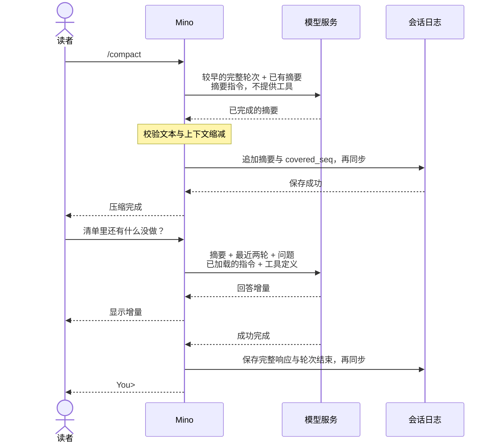

# 第 05 章：上下文压缩：手动命令与自动触发

适用版本：**0.5.x** · 源码与发布标签：**[chapter-05](https://github.com/qshine/mino/tree/chapter-05)** · 程序版本：**0.5.0**（2026-09-26 发布）

一份发布检查清单，可能在同一个会话里讨论很久：确认要求、检查文件、核对结果，再问还有什么没做。慢慢地，旧讨论占的空间远多于下一个问题。本章加入上下文压缩：Mino 请模型整理较早的交互，再把摘要与近期细节一起提供给后续请求。

请使用[第五章源码准备说明](../getting-started.md#从源码体验第五章)。手动 `/compact` 与自动预算检查共用同一套摘要流程。**保存的对话历史保持完整，后续请求携带的上下文变短。**

## 1. 压缩后继续当前任务

围绕发布清单进行几轮内容较多的问答后，在 `You>` 输入 `/compact`。Mino 完整保留最近两轮可重放的问答，将更早的部分整理为摘要。一轮问答包括输入、模型响应，以及中间的工具调用和结果，不只是单条消息。

交互示意。下面的估算值与回答用于展示一次成功流程，实际大小和模型措辞会变化。

```text
You> /compact
Compacting earlier turns; keeping the latest two turns in full...
Context compacted: estimated input 8320 -> 3960 tokens. Original history retained.

You> 发布清单里还有什么没做？
Assistant> 文档审核还没有完成。
```

`/compact` 是本地命令，不会作为新的用户消息写入日志。它可能向配置的模型发送一次请求，因此可能产生模型服务费用。Mino 显示进度和大小估算，不把生成的摘要作为回答展示。没有更早的轮次可供整理时，程序显示 `Nothing to compact; the latest two turns are kept in full.`，不发送请求。

对于这份清单，有用的摘要可能保留“仅支持 macOS；检查已完成；文档审核待办”，但丢失一个被放弃的措辞建议，或旧日志中的时间戳。摘要指令要求保留目标、约束、决策、已完成和待办事项，以及相关工具结果。这些指令用于引导模型，不能证明每个重要事实都已保留。如果某个精确细节再次变得重要，请明确补充它。

## 2. 划清摘要与近期细节的边界

发送完整对话可以保留细节，但最终会耗尽窗口。直接丢掉最早的消息更省事，却可能漏掉要求，或拆散工具调用与结果。Mino 选择按**较早的完整轮次**生成摘要，同时完整保留最近两轮可重放的问答和正在进行的一轮。这个选择保留了近期协议细节，代价是多一次模型请求，以及对较早内容的有损表达。

[摘要请求](https://github.com/qshine/mino/blob/chapter-05/internal/agent/compact.go)接收较早的轮次和已有摘要，使用专门的摘要指令。它不提供可用工具，并设置 `tool_choice: none`；模型若返回工具调用，Mino 会拒绝这个结果。提交的历史材料仍保持工具调用与结果配对，但压缩过程不执行任何工具。



图 05-1：摘要保存成功后才进入后续上下文。图中的最终响应没有工具调用，常规响应仍按既有规则持久化。

窄屏下可以横向滚动图表。自动压缩在继续待发送的常规请求前，执行图中相同的摘要与保存步骤；正在进行的一轮已经包含工具结果时也一样。

下一个常规请求把摘要作为带标签的 **assistant 上下文项**，与启动时加载的 SOUL 指令分开。标签与摘要指令要求区分用户要求、助手推测和不可信的文件或工具内容，并保留被拒绝、失败和未知的执行结果。这是对内容含义的引导，不能保证摘要不会产生误导：实际的工具批准和未知结果确认，仍由程序强制执行。摘要不能授予权限，也不能把未知结果变成确认成功。

## 3. 每次请求前检查预算

Mino 默认使用 **128,000 tokens** 的本地上下文窗口。你可以通过 `context_window` 覆盖它；启动时会显示生效数值，以及它来自默认值还是配置。Mino 不查询模型元数据。字段和服务要求见[上下文窗口配置](../getting-started.md#配置上下文窗口)。

每次常规模型请求前，Mino 估算序列化后的指令、输入项和工具定义。输入包含摘要、保留轮次、当前问题和当前轮次中的工具结果。估算方法是每个 UTF-8 字节计一个 token，再加 128 的封装余量和每个输入项 16 的余量。它通常会高估普通文本，省去了特定模型的分词器，但既不是精确 token 数，也不保证适用于所有兼容服务。

Mino 为输出预留窗口的八分之一，最多 8,192 tokens，最少一个；剩余部分作为输入预算。默认窗口因此留下 119,808 个估算输入 token。输入超过预算的 80%（向上取整）且存在较早轮次时，Mino 尝试压缩。常规请求与摘要请求都会把 `max_output_tokens` 设为该预留值，并关闭服务端截断。

工具返回后再检查一次很有必要：一条命令的结果可能让原本很小的请求超过阈值。Mino 可以先压缩较早轮次，再把工具结果交给模型；当前问题、调用和结果保持完整。压缩不会重跑命令。

每轮问答最多自动尝试一次压缩，摘要请求计入既有的八次模型请求上限，16 次工具调用上限保持不变。缩短后的上下文仍可能高于自动触发阈值；只要不超过输入预算硬上限，就可以继续。Mino 不会在同一轮里反复生成摘要，直到降到阈值以下。

如果近期轮次与当前输入本身已经过大，或者较早材料无法放进一次摘要请求，Mino 会报错，不会拆批处理或静默截断。摘要请求失败、被取消、被拒绝，或返回空白、过大、不能缩短上下文的摘要时，旧上下文保持不变；摘要最多为 8 KiB UTF-8 文本。压缩后仍超出预算硬上限的结果也会被拒绝。你可以缩短新输入、用 `/new` 开始独立会话，或修正窗口配置后重启。只有服务实际支持相应容量时，提高配置值才有意义。

## 4. 重启后恢复同一份上下文

压缩成功时，Mino 追加一条 `context_compaction` 记录，保存摘要与 `covered_seq`，后者指向较早的可重放 `turn_end` 序号。程序校验覆盖范围结束于完整轮次边界，并且比上次摘要覆盖得更远。记录写入并同步成功后，才改变内存中的上下文。写入或同步失败会停止聊天；旧内存状态保留，但磁盘结果可能不确定，需要在重启时核对。

原始消息、调用与结果仍留在 JSONL 文件中。重启或恢复会话时，Mino 重建摘要与未覆盖轮次，不重新生成摘要，也不执行历史命令。后续再次压缩，会把已有摘要与新进入压缩范围的旧轮次合并，不重复加入已经被覆盖的消息。`/new` 不继承这份摘要；确认执行 `/clear` 后，它会与该会话的历史一起清空。

新记录采用 `v: 3`，程序继续读取版本 1–3。旧章节发布版无法读取版本 3 记录，在已有会话上运行本章版本前，请查看[升级与回退说明](../getting-started.md#第五章的历史兼容性)。压缩减少的是模型输入，不是磁盘占用，既有日志大小限制仍然适用。

## 5. 不调用真实模型也能观察上下文

在 `chapter-05` 的仓库根目录运行：

```bash
go test ./internal/agent -run 'TestCompact|TestAutomaticCompaction|TestOversizedInput'
go test ./internal -run TestContextWindow
```

测试使用临时会话文件和本机模拟模型服务，不需要真实 API Key 或付费请求。通过时，每个包会显示 `ok`；模拟服务需要绑定本地端口的权限。

[手动压缩测试](https://github.com/qshine/mino/blob/chapter-05/internal/agent/compact_test.go)预先放入四轮内容较多的问答，返回固定摘要，再提交“继续”。它检查下一次请求包含一个 assistant 摘要项、最近两轮和新问题，同时保留独立的原始 SOUL 指令，并确认原日志字节仍完整位于文件开头。这能确认提供了哪些上下文，不能衡量真实模型的摘要质量。

自动压缩测试用较小的配置预算，分别在请求前和工具返回后触发压缩，检查当前工具配对仍在、命令只执行一次、摘要计入八次请求上限。其他用例验证摘要失败、输入过大、无效覆盖范围、中断恢复、重复压缩、重启和会话隔离、清空，以及写入失败。配置测试核对字段省略、零值、覆盖值、无效值和启动时不查询模型元数据。

如果你用自己的服务尝试开头的清单交互，可以在压缩后分别追问一项必要事实和一个较早的小细节。回答可能显露信息丢失，但看似合理的回答不能单独证明程序使用了摘要。模拟请求检查直接验证了这个转换。

## 6. 本章小结与下一步

你现在可以通过手动命令或预算检查，以明确缩短的上下文继续处理清单。近期交互保持完整，较早工作由持久化摘要表达，原始历史仍留在本地。摘要依然会消耗一次请求，也可能丢失细节；它无法把任意大的当前轮次塞进有限窗口。

下一个问题，是怎样提供对话里从未出现过的任务知识。规划中的[第 06 章：Skills](../plan-todo-chapters.md)将发现可用技能，在需要时加载正文，避免每次请求都携带全部指令文档。
