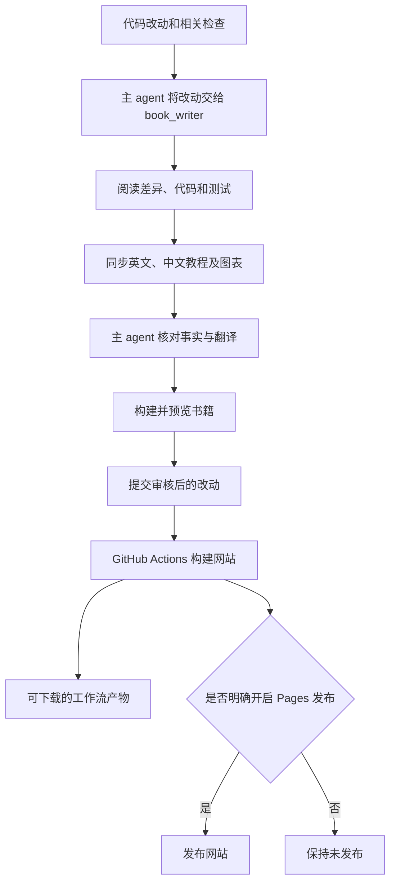

# 写作与更新流程

所有书籍页面统一放在 `docs/books/`：英文放在 `en/`，完整的简体中文版本放在 `zh/`，使用相同的相对路径。例如，`docs/books/en/chapters/01-terminal-chat.md` 对应 `docs/books/zh/chapters/01-terminal-chat.md`。不要直接在 `docs/` 下新增书籍页面。

网站默认语言仍为英文。VitePress 以 `docs/books` 为内容源目录，将 `en/` 重写到站点根路径，中文网址则保留 `zh/`。因此本地入口仍是 `/mino/` 和 `/mino/zh/`。网站配置保留在 `docs/.vitepress/`，Mermaid 图表源码保留在 Markdown 页面内。

## 专门负责写作的 subagent

项目在 [`.codex/agents/book_writer.toml`](https://github.com/qshine/mino/blob/main/.codex/agents/book_writer.toml) 中定义了名为 **`book_writer`** 的 Codex 专用 agent。支持此功能的 Codex 客户端会在受信任项目中发现这份独立定义，无需再在 `.codex/config.toml` 中显式注册。它沿用主任务的模型和权限。在 Codex 中打开并信任这个项目；已有任务若尚未发现该定义，开启一个新任务即可重新加载。

[仓库规则](https://github.com/qshine/mino/blob/main/AGENTS.md) 要求主编码 agent 在完成代码改动及相关检查后、最终交付和提交完整改动前，主动调用写作 agent。每次代码改动都要检查文档影响，包括新增功能、修改已有功能、修复问题和重构，无需另行提出更新文档的请求。写作 agent 阅读差异和实际实现，在同一次改动中同步受影响的中英文章节、示例、图表、安装配置说明及章节规划，然后交回主任务审核。

这是 **Codex 开发流程中的一个步骤**。它不是独立后台服务，也不会在每次手工 Git push 时自行运行。GitHub Actions 负责构建已经写好的页面，不调用模型生成文章。不需要额外配置云端 AI 密钥或定时任务。

较宽的图可以左右滚动，保持图中文字清晰可读。



主 agent 负责最终的事实审核。网站构建成功可以证明页面能够编译、内部链接可以找到，但不能代替对“原理是否符合代码”的检查。

## 章节统一写作规范

所有编号教程章节遵循同一套约定。完整写作要求见[写作 agent 定义](https://github.com/qshine/mino/blob/main/.codex/agents/book_writer.toml)，[第 01 章](./chapters/01-terminal-chat.md)是实际样例。安装、发布和维护等辅助页面可以使用不编号的标题。

按下面的层级组织标题，具体知识点名称应贴合本章内容：

```markdown
# 第 01 章：标题
## 1. 第一个知识点
### 1.1 第一个小知识点
### 1.2 第二个小知识点
## 2. 第二个知识点
### 2.1 第一个小知识点
## 3. 可观察的小实验
## 4. 本章小结与下一步
```

每章只有一个 H1，章号使用两位数字。所有 H2、H3 都连续编号，实验和结尾也不例外；每个大知识点下的小节从 1 重新开始。独立知识点另起 H2，不跳级、不混用编号格式。确实需要第三层时才使用 `2.1.1` 形式的 H4，不再向下细分。英文标题只将首词及专有名词首字母大写，标题末尾不加标点。普通有序列表用于操作步骤，不代替标题层级。

- **展开顺序**：标题后保留适用版本和源码版本行，再用一两段说明问题与成果。前置条件只链接一次，随后展示交互、解释交换了什么信息及下一步由谁行动，再验证可观察的结果。结尾统一为一个有编号的“本章小结与下一步”，不反复罗列目标和总结。
- **交互优先**：源码用于核对行为，不作为章节提纲。省略仓库导览、程序入口讲解、文件或函数调用链、SDK 构造与辅助方法说明、依赖版本清单。解释读者能观察到的变化：提交问题后，程序发送当前输入和指令；收到的片段成为回答；完成或报错后，控制权回到读者。逐段检查它说明了什么输入、提供了什么上下文、如何处理响应，或下一步由谁行动；不解释其中任何一项的段落应删除。不要把读者不需要的代码导览搬到附录。
- **语气与密度**：称读者为“你”，用“Mino”“程序”“模型”明确动作主体。每段围绕一个意思，使用简短主动句；先说明原因，再解释做法，首次出现的术语和缩写要定义。避免闲话、宣传语、未经解释的行话和大段加粗。
- **术语**：遵循写作要求中的统一词汇表。“响应”指服务返回的结构化数据，“回答”指显示的文本；“一轮问答”从一次用户输入持续到最终回答，后续章节可包含中间的工具步骤。上下文、对话历史和持久化会话须区分。中文首次使用 Agent（智能体），之后写 Agent；标识符、字段、命令和文件名保持原样。区分 Mino 的运行能力与 Codex 的开发流程。
- **示例**：围绕一个小场景展开，只选择有助于说明它的交互记录、请求示例或图表。代码片段不是必需内容；只有理解交互确实需要时才加入，并说明它带来的行为，而不是讲解语法。虚构输出在代码块前标明“交互示意” / “Illustrative output”，只有证据支持时才声称实际观察。代码块标注语言，可复制命令使用 `bash` 且不带提示符，交互记录使用 `text`；JSON 必须有效，占位符需说明。必要时交代工作目录，伪代码和不完整片段须明确标注，不放入密钥或私人日志。
- **图表**：优先使用聚焦的图，通常按“读者 → Mino → 模型服务”排列角色。保留 Mermaid 无障碍信息和可读标签。图下紧接 `图 01-1：说明` / `Figure 01-1. Caption`，表格上方放 `表 01-1：说明` / `Table 01-1. Caption`；图和表分别在每章内编号，说明读者应观察什么。辅助页面无需使用章节式图注。表格用于对比，有序列表用于步骤，无序列表用于并列要点。
- **实验与边界**：说明操作、可观察结果和它证明的结论。区分确定的程序行为、由模型决定的措辞和未来计划；错误、取消或授权影响当前交互时再展开。猜中答案不证明有记忆，终端输入循环也不意味着能执行工具。
- **双语检查**：标题层级与编号、图表编号、示例含义、适用版本和能力状态必须对应。示例问题、指令和回答使用自然译文，固定程序提示和 API 字段保持不变。站内链接指向对应语言的相对路径。保留少量不可变的源码链接作为证据，链接文字说明它支持的行为，不为提供链接而引入符号或单设小节；标题变化后检查指向它的锚点链接。

安装、API Key 设置、环境与配置细节、打包和较长的排错清单，集中放在[准备与安装](./getting-started.md)、[发布说明](./releases.md)或本指南。安全或操作细节直接影响当前交互的理解时，再放进章节。

同章的小修复更新原章节，新能力按章节规划归入对应章节。写作 agent 只修改 `docs/books/` 下的书籍正文与示意资源；应用代码、网站配置、工作流、agent 设置、README 和更新记录由主 agent 负责。若某项改动不影响读者，写作 agent 应说明无需更新正文的原因。

## 本地预览与检查

网站工具与 Go 程序互相独立。使用 `.node-version` 中记录的 Node.js 24。要审阅当前检出的书籍内容，在仓库根目录运行一条命令：

```bash
./book_review.sh
```

如果本地缺少可执行的 VitePress 或 Vite，脚本会通过 `npm ci --ignore-scripts` 安装网站依赖。每次运行都会重新构建书籍，然后用系统默认浏览器打开中文第 01 章；可以通过语言菜单切换到英文。预览只监听 `127.0.0.1`，从端口 `4173` 开始，遇到占用时依次选择可用端口；实际地址会显示在终端中。

审阅时保持终端打开，在该终端按 Ctrl+C 即可停止预览。预览显示的是构建后的页面，因此修改书籍后，需要先停止预览，再运行 `./book_review.sh` 才能看到改动。

写作时如果希望修改后实时更新页面，可以使用开发服务器：

```bash
npm ci --ignore-scripts
npm run book:dev
```

打开 VitePress 输出的本地地址，通常为 `http://127.0.0.1:5173/mino/`。默认显示英文，可以通过语言菜单切换到简体中文。

提交前运行：

```bash
npm audit --audit-level=moderate
npm run book:build
npm run book:preview
```

检查两种语言、章节页语言切换、站内搜索、浅色与深色图表、小屏阅读和内部链接。构建产物及依赖目录由 Git 忽略。

锁文件固定网站依赖版本。VitePress 1.6.4 默认依赖的 Vite 存在已知安全公告，因此项目覆盖使用已修补的 Vite 6.4.3，与当前 Vue 插件兼容。升级工具时需重新检查这个覆盖、依赖审计、正式构建和浏览器表现，不能为消除报错而取消检查。

当前书籍配置还在 `vite.optimizeDeps.include` 中显式包含 `mermaid`。开发服务器会预构建插件注入的 Mermaid 导入，将 `fastdom` 等 CommonJS 依赖转换为浏览器可用的格式。没有这一步，当前锁定的 Mermaid 11.17.2 依赖可能让本地预览显示空白页，并报告缺少默认导出。升级依赖后，除了运行正式构建，还要在浏览器中检查 `npm run book:dev` 的效果。

每张图由 VitePress 组件负责渲染。为避免 Mermaid 的页面加载处理器再次扫描 `.mermaid` 元素，`docs/.vitepress/theme/index.ts` 在 Vue 挂载前以 `startOnLoad: false` 初始化 Mermaid；`docs/.vitepress/config.mts` 保留同一选项，供插件之后初始化时使用。插件异步读取配置，仅在插件配置中设置可能来不及阻止自动扫描，导致图表偶发显示 `Syntax error`。修改后，分别强制刷新一个英文和中文图表页面，再通过菜单切换语言；确认图表正常显示，没有 `Syntax error` 文本。

## 发布教程网站

教程已发布到 GitHub Pages：[英文版](https://qshine.github.io/mino/)和[简体中文版](https://qshine.github.io/mino/zh/)。项目路径为 `/mino/`，不需要另设域名或服务器。

所有者已开启发布。[Tutorial book 工作流](https://github.com/qshine/mino/blob/main/.github/workflows/book.yml) 会构建两种语言、检查站内链接，并保存可下载的工作流产物。当仓库 Actions 变量 `BOOK_PUBLISH_ENABLED` 为 `true` 时，`main` 上成功的构建会发布网站。PR 只构建和检查书籍。

仓库的 Pages 来源已设为 **GitHub Actions**。更新网站时，向 `main` 推送书籍改动，或者在 `main` 上手动运行 **Tutorial book**。保持 `BOOK_PUBLISH_ENABLED` 为 `true`，即可自动发布。

删除该变量会停止之后的部署，但**不会下线已经发布的网站**。如果需要下线，请在仓库的 Pages 设置中取消发布。
