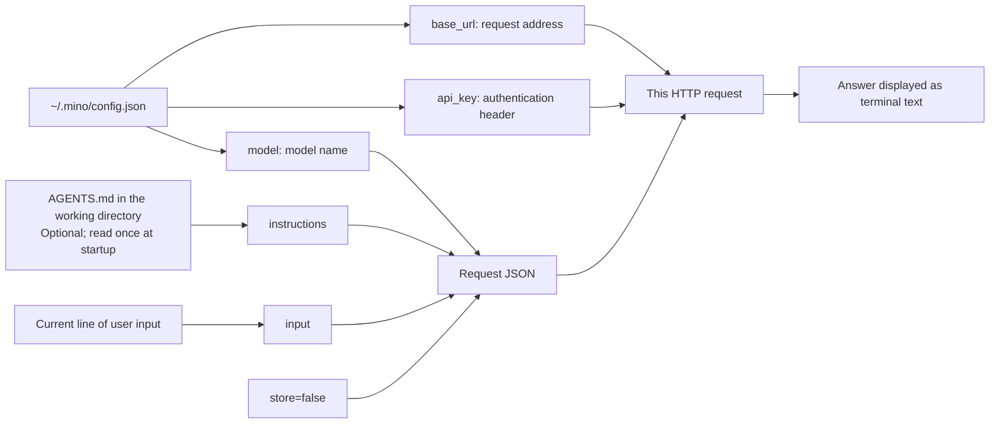
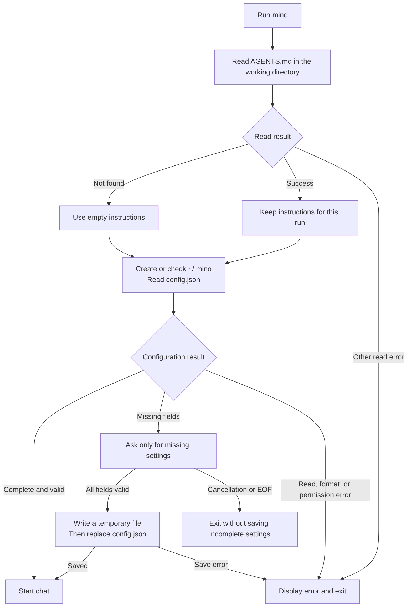
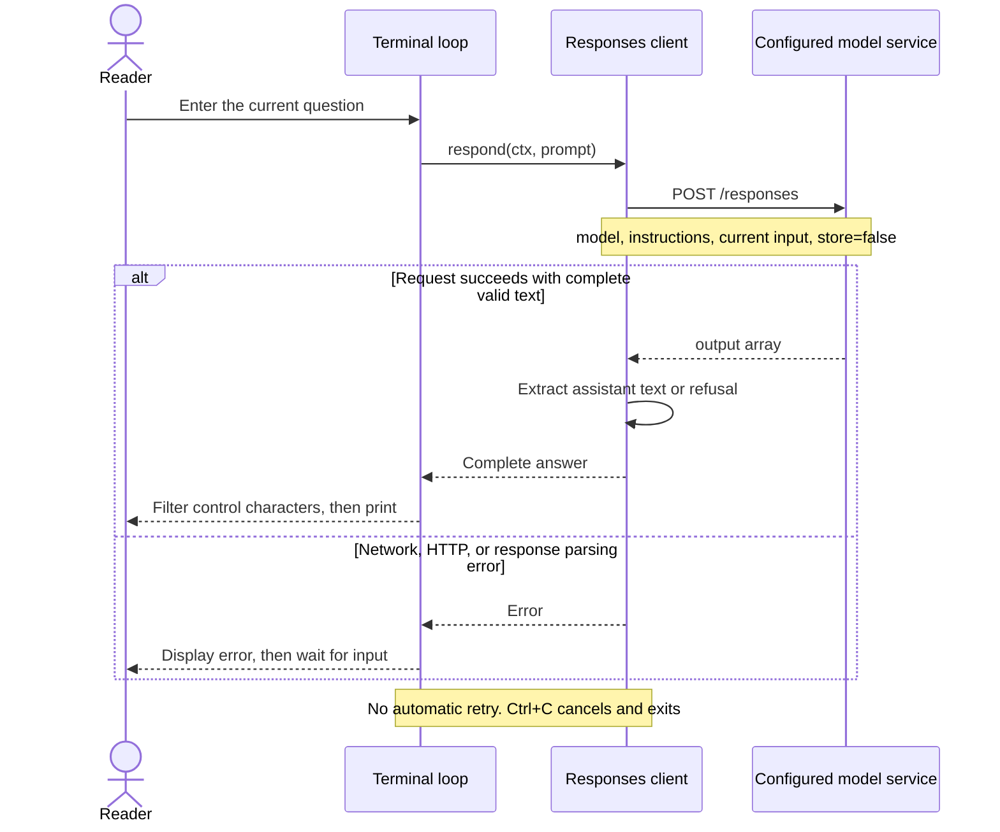

# Chapter 01: Your First Terminal Conversation

Applies to **0.1.x** · Source checked against **[v0.1.1](https://github.com/qshine/mino/tree/v0.1.1)**

## The problem this chapter solves

You type a sentence into a terminal. How does the model receive it? How does its answer reach your screen? A model service cannot read your keyboard directly. A program has to connect terminal input, network requests, and output.

This chapter builds that connection in Go: **read one question, send one request, parse and display the answer, then wait for another line.** Understanding one complete exchange gives us a foundation for conversation history, tool calls, and an agent loop.

By the end, you can:

- Run Mino in a macOS terminal, enter missing settings once, and reuse them on later starts.
- Follow a question through the program and distinguish settings, model instructions, and user input.
- Explain why a second question in the same terminal can still lack the previous exchange.
- Verify behavior with a local mock service and automated tests, without depending on a real model's choice of words.

This version provides independent questions and answers. **It has no conversation history, session database, streaming output, or tools that the model can call.** Installation, version reporting, and updates are already available. See [Getting started](../getting-started.md) for installation and [Releasing Mino](../releases.md) for the release process.

## 1. Run it and observe an exchange

This chapter targets macOS 13 or later on Apple Silicon and Intel Macs. The release package does not require Go. If you have installed Mino, run it from any directory:

```bash
mino
```

To learn while editing the source, run this from the repository root instead:

```bash
go run .
```

The source uses Go 1.27.1 and the standard library, with no third-party Go dependencies. The required version is recorded in [go.mod](https://github.com/qshine/mino/blob/v0.1.1/go.mod). Source commands need the project directory; **the installed program does not need to start from the repository**.

### First startup

When the configuration is incomplete, the program asks for the missing settings:

```text
Complete the missing settings. Press Enter to accept a value in brackets, or Ctrl+C to cancel. Settings will be saved to ~/.mino/config.json.
API URL [https://api.openai.com/v1]:
Model: your-model
API Key (input hidden):
Settings saved. Next time, chat will start immediately.
```

Here, `your-model` represents a model name you type. It is a placeholder, not a default.

| Field | What to enter |
| --- | --- |
| `base_url` | Press Enter to accept `https://api.openai.com/v1`, or enter the API prefix of a service that supports Responses |
| `model` | Enter a model supported by the service and available to your account; an empty answer repeats the prompt |
| `api_key` | Enter a key; typing is hidden, and an empty answer repeats the prompt |

The settings are saved in `~/.mino/config.json`. With a complete configuration, the next start goes straight to chat. If just one field is missing, only that field is requested. Valid local fields do not prove that the service accepts the key or model: the server checks those when a request is made.

### Ask a question, then exit

The following is an **illustration of the interaction**, not a transcript from a live model call. The actual answer depends on the model you choose.

```text
Mino - Chapter 01: Terminal Chat
Each question is independent. Use /exit, Ctrl+D, or Ctrl+C to quit.

You> Explain an HTTP request in one sentence.

Assistant> An HTTP request is a message a client sends to a server to retrieve or submit information.

You> /exit
Goodbye.
```

After you press Enter, the program waits for the complete answer and prints it at once. This chapter does not stream words as they are generated. Blank lines do not call the model. Use `/exit`, Ctrl+D on an empty input line, or Ctrl+C to quit. Sending a question calls your configured service and is subject to that service's charges.

## 2. What the program does, and what the model does

A common source of confusion is assuming that repeated input in the same terminal gives the model access to everything shown there. The model receives the information the program includes in this particular request.

Mino reads local files, collects input, builds HTTP requests, checks responses, and displays text. The model service receives a request and generates an answer. Starting the program inside a project does not automatically tell the model what is in that project's files.

This diagram shows **where the information in one request comes from**:

Wide diagrams can be scrolled horizontally to keep their labels readable.



The API key goes into an authentication header; the current question goes into `input`. The program does not send the whole configuration file as chat content, and it does not append the previous exchange to the current question. Follow the implementation in [responsesClient.respond](https://github.com/qshine/mino/blob/v0.1.1/responses.go#L36).

Model output is only displayed as text in this chapter. The program does save configuration, invoke fixed terminal settings commands, and run an installer when the user selects `mino update`. Those application features do not give the model a Bash tool or permission to edit files. Model tool calls arrive in Chapter 03.

## 3. Prepare instructions and settings at startup

The [main entry point](https://github.com/qshine/mino/blob/v0.1.1/main.go#L13) creates a cancellation signal and delegates command selection to [runCLI](https://github.com/qshine/mino/blob/v0.1.1/cli.go#L19). Running without arguments starts chat. `mino version`, `mino help`, and `mino update` take separate paths and do not require model configuration first.

The [run function](https://github.com/qshine/mino/blob/v0.1.1/main.go#L23) coordinates chat startup:



Going straight to chat depends on a complete local configuration. Startup does not make an extra model request to validate the account. The diagram also helps explain why an upgrade can keep your settings: the executable and user configuration are stored separately.

### User settings follow the user

If settings lived in the project directory, starting elsewhere could mean entering them again. Mino uses [configPath](https://github.com/qshine/mino/blob/v0.1.1/config.go#L121) and `os.UserHomeDir()` to locate `~/.mino/config.json`, independently of the working directory.

[loadConfig](https://github.com/qshine/mino/blob/v0.1.1/config.go#L22) keeps existing fields and fills only the gaps. [saveConfig](https://github.com/qshine/mino/blob/v0.1.1/config.go#L160) writes a temporary file in the same directory, then renames it to `config.json`. This avoids leaving half-written JSON by overwriting the old file directly. Cancelling setup does not save incomplete settings; a newly created `.mino` directory remains. Invalid JSON produces an error instead of automatically replacing the original file.

The key is stored as plaintext in a local file. The program restricts the `.mino` directory to permissions `0700` and the configuration file to `0600`, and refuses symbolic links at these configuration locations. Keep the configuration file out of the repository.

For hidden key entry, [promptConfigValue](https://github.com/qshine/mino/blob/v0.1.1/config_prompt.go#L13) uses macOS's `/bin/stty` to disable echo temporarily. A `defer` restores the terminal on success, EOF, and Ctrl+C. Setup and chat share an input buffer, so a first question already buffered during setup is not lost.

The program does not read project-local `config.json`, the old `miniagent.json`, `.env`, or `OPENAI_*` environment variables. To change a service, model, or key, edit the file in your home directory and restart. Setting a field to the empty string `""` makes the program ask for it again.

### Project instructions follow the working directory

[loadInstructions](https://github.com/qshine/mino/blob/v0.1.1/config.go#L189) reads `AGENTS.md` only from the **current working directory**. It does not search parent directories. A missing file means empty instructions, and the program can still start. Other read failures produce an error.

The contents are read once at startup and sent as `instructions` with every request. Restart after editing the file. This file tells the model how it should respond; it is not a script that automatically executes commands. Its contents go to your configured model service, so do not put credentials in it.

## 4. From one question to one answer

All Go files still belong to the same `main` package, separated by responsibility. Using the standard library's `net/http` and `encoding/json` makes the protocol visible without placing the key steps behind an SDK.

A normal exchange follows this sequence:



One exchange handles only the current question. Returning to the input prompt after a failure does not automatically resend the failed request.

### What the request contains

The destination is `{base_url}/responses`. Headers include `Authorization: Bearer ...` and `Content-Type: application/json`. If the working directory's `AGENTS.md` says "Answer in English and keep it brief.", the request body can look like this:

```json
{
  "model": "your-model",
  "instructions": "Answer in English and keep it brief.",
  "input": "Explain an HTTP request in one sentence.",
  "store": false
}
```

`model` comes from configuration. `instructions` supplies guidance and is an empty string when there is no `AGENTS.md`. `input` is the current question. The code does not set historical messages, `previous_response_id`, or `conversation`.

`store: false` asks the service not to retain a response object for later retrieval. It is not a promise that the service keeps no logs or other data. It is also not the sole reason this program has no history: the request itself does not include previous exchanges. See the [Responses creation reference](https://developers.openai.com/api/reference/python/resources/responses/methods/create) for the protocol fields.

A custom endpoint must support the Responses API. Enter an API prefix such as `https://gateway.example.com/v1`, not a complete `/responses` or `/chat/completions` address. Remote connections require HTTPS; local testing may use `http://127.0.0.1:PORT/v1`. The client does not follow redirects, so it does not forward a request containing the key and question to a redirected destination.

### The answer is not necessarily the first array item

The raw HTTP response's `output` is an array. It may contain reasoning entries as well as messages. The program cannot assume the first item is the final answer or directly use a top-level `output_text` convenience property exposed by some SDKs.

The [response parser](https://github.com/qshine/mino/blob/v0.1.1/responses.go#L68) checks JSON, errors, and completion status first. It then visits entries with `type == "message"` and `role == "assistant"`, joining `output_text` parts inside `content`. A `refusal` is displayed as refusal text. Missing text, failed generation, and incomplete status all return errors. Compare the structure with the [official text generation guide](https://developers.openai.com/api/docs/guides/text).

### Keeping the terminal responsive

[runTerminal](https://github.com/qshine/mino/blob/v0.1.1/terminal.go#L12) skips blank lines, recognizes `/exit`, and sends other input to `respond`. A request failure is written to standard error before the program waits for the next line.

[scanLines](https://github.com/qshine/mino/blob/v0.1.1/terminal.go#L64) reads lines in a goroutine while the main loop uses `select` to wait for input or cancellation. Ctrl+C reaches the HTTP request through `signal.NotifyContext`, so the program can exit while waiting for either keyboard input or the network. A blocked standard-input read ends when the process exits; callers reusing this function with another stream must close that stream themselves.

There are already specific limits: an input line must be smaller than 1 MiB, the response body is limited to 8 MiB, and each HTTP request has a two-minute timeout. Server error bodies are not printed verbatim, since they could echo sensitive input. Terminal control characters are filtered from model output, while newlines and tabs are kept. The program does not automatically retry requests that may incur charges.

## 5. Why the next question has no memory

Try entering these two questions:

```text
My favorite color is blue.
What did I just say my favorite color was?
```

The second request's `input` contains only "What did I just say my favorite color was?" Neither the first statement nor the first answer is sent again. Text remaining in the terminal window does not mean the program has given that text to the model.

| Exchange | Request `input` | Includes the previous exchange? |
| --- | --- | --- |
| First | `My favorite color is blue.` | No |
| Second | `What did I just say my favorite color was?` | No |

The model may guess "blue" or say that it does not know. **To establish whether context is present, inspect the request instead of relying on an answer that could be a lucky guess.** [TestRespondSendsIndependentRequests](https://github.com/qshine/mino/blob/v0.1.1/responses_test.go#L16) checks that each request contains only its current question and has no history association fields or tool definitions.

That gives the next chapter a concrete task: save earlier exchanges in the program and deliberately include them in the next request.

## 6. Three small experiments

### Experiment 1: Separate settings from project instructions

Run `mino` in a newly created practice directory, then enter `/exit`. It starts without `AGENTS.md` and still uses your saved model settings.

Next, create an `AGENTS.md` file only in that practice directory containing:

```text
Answer in English. Use at most two sentences per answer.
```

Restart and ask a question. The effect on wording depends on model behavior; what the program guarantees is that the file's contents become `instructions`. Start again from a directory without that file: your configuration stays the same, while project instructions are empty.

### Experiment 2: Fill just one missing field

Back up `~/.mino/config.json`, then change its `model` value to `""`, keeping valid JSON. Run `mino` again. It should ask only for a model, leaving the existing API address and key alone. Supply the model, exit, and restart: chat should open immediately.

This experiment tests filling missing values. A missing value and malformed JSON are different conditions: the first can be completed interactively; the second needs to be repaired first.

### Experiment 3: Read from a pipe

Complete configuration in an interactive terminal first, then run:

```bash
printf 'Explain an agent in one sentence.\n/exit\n' | mino
```

When using the source, replace `mino` with `go run .` and run from the repository root. With complete settings, each line is still one input. Without complete settings, the program asks you to use an interactive terminal for setup, rather than treating piped questions as a model name or key.

## 7. Verify behavior and troubleshoot symptoms

Run the shared checks from the repository root:

```bash
bash scripts/check.sh
```

The script checks formatting and Shell syntax, runs `go vet`, automated tests, and the race detector, then builds `bin/mino`. You can also run only tests for the core behaviors discussed here:

```bash
go test -run 'TestRespondSendsIndependentRequests|TestTerminalContinuesAfterRequestError|TestRunWithoutProjectInstructions' .
```

The tests use isolated temporary home directories, fake keys, and local HTTP services provided by `httptest`. They do not read or write your real Mino settings or call a paid model. The environment must allow the process to bind a temporary local port.

| Behavior to check | Where to read |
| --- | --- |
| Requests do not carry previous exchanges | [responses_test.go](https://github.com/qshine/mino/blob/v0.1.1/responses_test.go#L16) |
| Input continues after an HTTP request fails | [terminal_test.go](https://github.com/qshine/mino/blob/v0.1.1/terminal_test.go#L36) |
| Startup works without `AGENTS.md` | [main_test.go](https://github.com/qshine/mino/blob/v0.1.1/main_test.go#L67) |
| Configuration location, permissions, and symbolic links | [config_home_test.go](https://github.com/qshine/mino/blob/v0.1.1/config_home_test.go) |
| Hidden input, cancellation, and terminal restoration | [config_prompt_test.go](https://github.com/qshine/mino/blob/v0.1.1/config_prompt_test.go) |
| Failed installation or update preserves the executable | [install_test.go](https://github.com/qshine/mino/blob/v0.1.1/install_test.go) |

Existing verification records cover builds, automated tests, race detection, and terminal interaction against local mock services using Go 1.27.1 on Apple Silicon macOS. Intel packages are cross-compiled; they have not been verified on a physical Intel Mac. This lesson does not add a live model validation claim, and the answers shown above remain illustrative.

| Symptom | What to check |
| --- | --- |
| Setup requires an interactive terminal | Run `mino` directly to complete settings before piping input |
| Configuration JSON is invalid | Check quotes, commas, and field types; the original file is not replaced automatically |
| Reading `AGENTS.md` fails | Check readability and whether it was created as a directory; a missing file is allowed |
| HTTP 401 / 403 | Check the key, model access, and whether the key belongs to this service |
| HTTP 404 | Check the API prefix, model name, and Responses API support |
| HTTP 429 | Check quota or rate limits, then retry manually later |
| HTTP 3xx | Use the service's final address; the program does not follow redirects |
| Incomplete response or no text | Check the compatible service's response format, or retry with a shorter question |
| Network error or timeout | Check the service address, network, and local proxy settings |
| Go toolchain is unavailable | Install Go 1.27.1 or later as required by the project, then rerun source checks |

## What this chapter delivered

We now have a complete, observable terminal conversation path. Settings load from the user's home directory, the working directory can supply project instructions, one question becomes one Responses request, and a complete answer returns to the terminal. Failures display an error, cancellation stops current work, and installation updates can retain existing settings.

The model still does not receive earlier exchanges. Chapter 02 will keep a history in memory and include it in later requests. Restoring conversations after the program exits is a separate problem for Chapter 04's persistence work. See the [chapter roadmap](../plan-todo-chapters.md) for the capabilities and completion status of each chapter.
