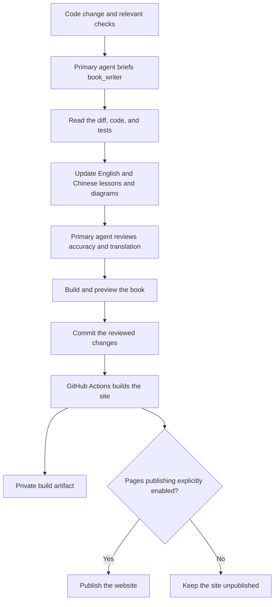

# Writing and updating the book

The book lives beside the application in this repository. English is the default language; complete Simplified Chinese pages live under `docs/zh/`. The website uses VitePress, and diagrams are written as Mermaid blocks in Markdown.

## The dedicated writer

The project defines a Codex custom agent named **`book_writer`** in [`.codex/agents/book_writer.toml`](https://github.com/qshine/mino/blob/main/.codex/agents/book_writer.toml). It inherits the parent task's model and permissions. Open this repository as a trusted Codex project; start a new task if an existing session has not discovered the new agent definition.

The [repository instructions](https://github.com/qshine/mino/blob/main/AGENTS.md) ask the primary coding agent to ask this writer to review documentation impact after every code change. The writer reads the change and actual implementation, updates both languages and their diagrams, and returns its work for the primary agent to review.

This is part of the **Codex development workflow**. It does not run as an independent background service or on every manual Git push. GitHub Actions builds the written pages; it does not call a model or generate prose. No additional cloud AI key or scheduled task is required.

Wide diagrams can be scrolled horizontally to keep their labels readable.



The primary agent is responsible for the final factual review. A successful website build proves that pages compile and internal links resolve; it does not prove that the explanation matches the code.

## What the writer updates

- The chapter's motivating problem, expected outcomes, principles, implementation path, experiments, and completed capabilities.
- Sequence diagrams when interactions change, flowcharts when decisions change, and concept diagrams when relationships change.
- Version labels, source links, install instructions, and the roadmap when relevant.
- Both language versions in the same change, including diagram labels and captions.

The writer must distinguish implemented behavior from planned work. Examples of model output are marked as illustrative unless they were actually observed. Source links refer to the version being explained, and no real API keys, private configuration, or conversation logs belong in the book.

A small fix updates its existing chapter. A new capability can begin the next chapter. If a change has no impact on readers, the writer reports why no content change is needed.

## Preview and check locally

Website tooling is separate from the Go application. Use Node.js 24 (recorded in `.node-version`), then run from the repository root:

```bash
npm ci --ignore-scripts
npm run book:dev
```

Open the local address printed by VitePress, normally `http://127.0.0.1:5173/mino/`. English opens by default; use the language menu for Simplified Chinese.

Before committing:

```bash
npm audit --audit-level=moderate
npm run book:build
npm run book:preview
```

Check both languages, language switching on a chapter, local search, light/dark diagrams, narrow-screen reading, and internal links. Build output and dependencies are ignored by Git.

The lockfile pins the website dependencies. VitePress 1.6.4's default Vite dependency has known advisories, so this project overrides it with patched Vite 6.4.3, which is compatible with the installed Vue plugin. Recheck the override, audit, production build, and browser behavior when upgrading these tools; do not remove checks to silence a failure.

## Publishing later

The [Tutorial book workflow](https://github.com/qshine/mino/blob/main/.github/workflows/book.yml) builds on relevant pushes and pull requests. It stores a downloadable build artifact in the private repository. **Public deployment is disabled by default.**

GitHub Pages can host a static book without a separate server. Pages from private repositories requires an eligible paid GitHub plan. A personal private repository does not make its Pages website private; restricted private Pages requires an organization using GitHub Enterprise Cloud. See [GitHub Pages availability](https://docs.github.com/en/pages/getting-started-with-github-pages/what-is-github-pages) and [site visibility](https://docs.github.com/en/enterprise-cloud@latest/pages/getting-started-with-github-pages/changing-the-visibility-of-your-github-pages-site).

When the owner explicitly decides to publish and the plan supports it:

1. Set the repository's Pages source to **GitHub Actions**.
2. Set the repository Actions variable `BOOK_PUBLISH_ENABLED` to `true`.
3. Run **Tutorial book**, or push a documentation update to `main`.

The configured project path is `/mino/`. A public deployment would normally be served at `https://qshine.github.io/mino/`; this is a target address, not an already published site. A separate domain is optional.

Removing the variable prevents future deployments; it does **not** remove an already published website. To take a published site offline, unpublish it in the repository's Pages settings.
