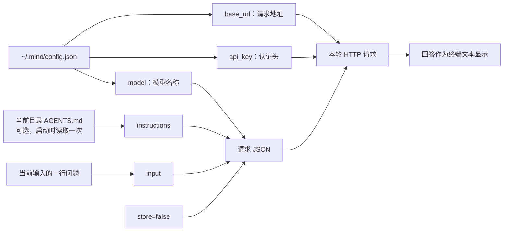
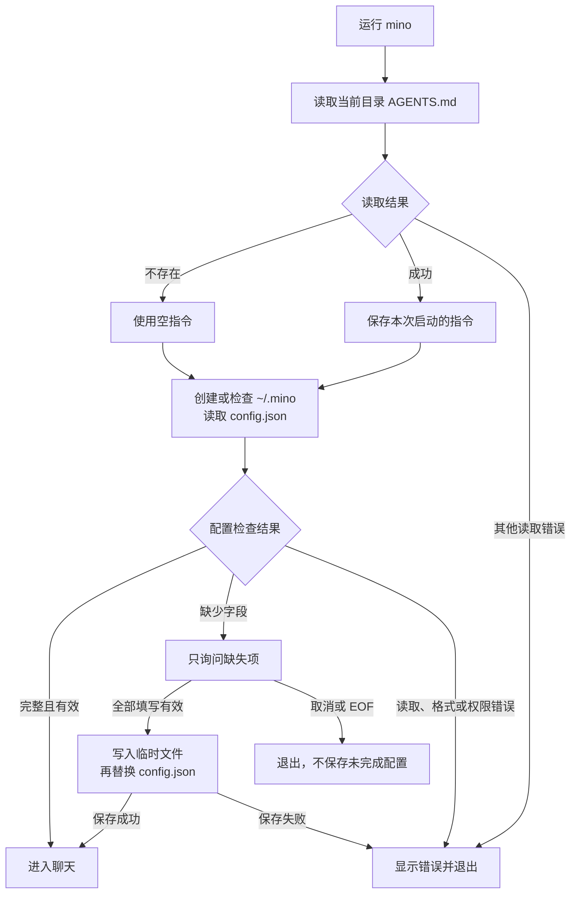
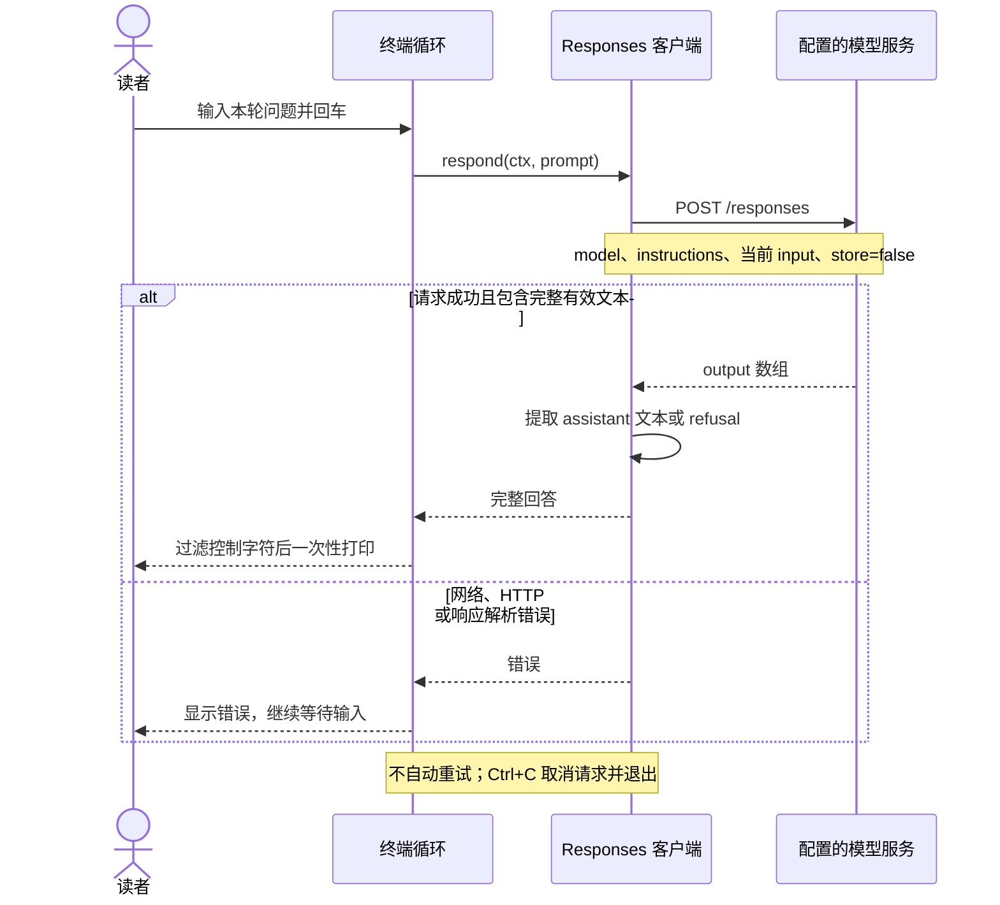

# 第 01 章：与模型对话——第一个终端程序

适用版本：**0.1.x** · 源码核对版本：**[v0.1.1](https://github.com/qshine/mino/tree/v0.1.1)**

## 这一章解决什么问题

你在终端敲下一句话，模型怎样收到它？模型生成的回答，又怎样回到屏幕上？模型服务不会直接读取你的键盘，这中间需要一个程序连接输入、网络请求和输出。

这一章用 Go 搭通这条路径：**读入一行问题，发送一个请求，解析并显示回答，然后等待下一行。** 先看清一次问答怎样发生，后面才能理解对话历史、工具调用和 Agent 循环。

完成本章后，你可以：

- 在 macOS 终端运行 Mino，首次填写模型配置，以后启动直接使用。
- 找到一条问题在程序中的完整路径，区分配置、模型指令与用户输入。
- 解释为什么同一个终端窗口中的第二个问题，仍然可能没有上一轮的上下文。
- 通过本地模拟服务和自动化测试验证行为，不依赖真实模型的回答措辞。

这一版提供独立的一问一答。**没有聊天历史、会话数据库、流式输出，也没有供模型调用的工具。** 安装、版本查看和升级已经可用；对应操作见[安装与开始使用](../getting-started.md)，发布原理见[发布说明](../releases.md)。

## 1. 先运行，观察一次问答

本章面向 macOS 13 及以上版本，支持 Apple Silicon 和 Intel Mac。使用安装包不需要 Go；如果已经安装 Mino，在任意目录运行：

```bash
mino
```

如果你希望边改源码边学习，在仓库根目录运行：

```bash
go run .
```

源码使用 Go 1.27.1 和标准库，没有第三方 Go 依赖。所需版本写在 [go.mod](https://github.com/qshine/mino/blob/v0.1.1/go.mod) 中。源码构建需要进入项目目录；**安装后的程序不要求从仓库目录启动**。

### 第一次启动

没有完整配置时，程序会用英文询问缺失项：

```text
Complete the missing settings. Press Enter to accept a value in brackets, or Ctrl+C to cancel. Settings will be saved to ~/.mino/config.json.
API URL [https://api.openai.com/v1]:
Model: your-model
API Key (input hidden):
Settings saved. Next time, chat will start immediately.
```

`your-model` 表示你输入的实际模型名称，是示例占位符，不是默认值。填写规则如下：

| 字段 | 如何填写 |
| --- | --- |
| `base_url` | 回车接受 `https://api.openai.com/v1`，也可以填写支持 Responses API 的服务前缀 |
| `model` | 必须明确填写服务支持且账户有权使用的模型名称；留空会继续询问 |
| `api_key` | 必须填写，输入不回显；留空会继续询问 |

配置保存到 `~/.mino/config.json`。下次启动，配置齐全就直接进入聊天；只缺一个字段，就只询问那个字段。字段有效不代表服务已经接受密钥或模型名称，这些还需要服务端在请求时检查。

### 输入问题，再退出

下面是**交互形式示意**，不是一次真实模型调用的记录；实际回答由所选模型决定。

```text
Mino - Chapter 01: Terminal Chat
Each question is independent. Use /exit, Ctrl+D, or Ctrl+C to quit.

You> 用一句话解释什么是 HTTP 请求。

Assistant> HTTP 请求是客户端向服务端发送的一条消息，用来获取或提交信息。

You> /exit
Goodbye.
```

输入问题并回车后，程序等待完整回答，再一次性打印。本章没有逐字显示的流式效果。空白行不会调用模型；`/exit`、空行上的 Ctrl+D 或 Ctrl+C 可以退出。发送问题会访问你配置的服务，调用费用按该服务规则计算。

## 2. 程序和模型分别负责什么

这里容易产生一个误解：终端里能连续输入很多次，就说明模型拥有了整个终端的记忆。实际上，模型收到哪些信息，取决于程序本次发送了什么。

Mino 负责读取本地文件、收集输入、构造 HTTP 请求、检查响应和显示文本。模型服务接收请求并生成回答。模型不会因为运行在某个项目目录，就自动知道该目录的文件内容。

下面这张图说明**一轮请求的信息来源**：

较宽的图可以左右滚动，保持图中文字清晰可读。



图中，API Key 进入认证头，当前问题进入 `input`。程序没有把整个配置文件当作聊天内容发送，也没有把上一轮问答接到本轮输入后面。对应实现是 [responsesClient.respond](https://github.com/qshine/mino/blob/v0.1.1/responses.go#L36)。

本章模型的输出只会作为文本显示。程序确实会保存配置、调用固定的终端设置命令，并在用户执行 `mino update` 时运行安装脚本；这些程序功能并不意味着模型已经能调用 Bash 或修改文件。模型工具调用将在第 03 章加入。

## 3. 启动时，先准备指令和配置

程序入口 [main](https://github.com/qshine/mino/blob/v0.1.1/main.go#L13) 建立取消信号，然后交给 [runCLI](https://github.com/qshine/mino/blob/v0.1.1/cli.go#L19) 分派命令。没有参数才进入聊天；`mino version`、`mino help` 和 `mino update` 是单独的分支，不需要先完成模型配置。

聊天启动过程由 [run](https://github.com/qshine/mino/blob/v0.1.1/main.go#L23) 组织：



图中的“直接进入聊天”依赖本地配置完整，不会在启动时额外发一个模型请求来检查账户。它也说明了为什么程序升级可以保留配置：可执行文件和用户设置是分别保存的。

### 用户设置跟着用户走

如果配置放在项目目录，换一个目录启动可能又得填写一遍。Mino 用 [configPath](https://github.com/qshine/mino/blob/v0.1.1/config.go#L121) 根据 `os.UserHomeDir()` 定位 `~/.mino/config.json`，因此配置不依赖工作目录。

[loadConfig](https://github.com/qshine/mino/blob/v0.1.1/config.go#L22) 读取已有字段，只补缺失项；[saveConfig](https://github.com/qshine/mino/blob/v0.1.1/config.go#L160) 先写同目录临时文件，成功后重命名为 `config.json`。这样可以避免直接覆盖旧文件时留下半份 JSON。取消设置不会保存尚未填完的内容；首次创建的 `.mino` 目录会保留。损坏的配置 JSON 会报错，原文件不会被自动覆盖。

密钥以明文存放在本机文件中。程序将 `.mino` 目录权限收紧为 `0700`，配置文件为 `0600`，并拒绝把这些配置位置当作符号链接使用。不要把配置文件提交到仓库。

密钥输入由 [promptConfigValue](https://github.com/qshine/mino/blob/v0.1.1/config_prompt.go#L13) 调用 macOS 的 `/bin/stty` 暂时关闭回显，并用 `defer` 在成功、EOF 和 Ctrl+C 后恢复终端状态。配置和聊天共用输入缓冲区，避免配置阶段预读的第一条问题丢失。

程序不读取项目内的 `config.json`、旧版 `miniagent.json`、`.env` 或 `OPENAI_*` 环境变量。修改服务、模型或密钥时，编辑用户目录中的配置后重启即可；把某字段改为空字符串 `""`，可以让它重新询问该项。

### 项目指令跟着工作目录走

[loadInstructions](https://github.com/qshine/mino/blob/v0.1.1/config.go#L189) 只读取**当前工作目录**的 `AGENTS.md`，不向父目录搜索。文件不存在时使用空指令，程序仍然可以启动；存在但无法读取时会明确报错。

文件内容在启动时读取一次，每次请求通过 `instructions` 发送。修改后要重启才会生效。这个文件提供模型应如何回答的说明，并不是自动执行命令的脚本。它的内容会发给配置的模型服务，因此不要把密钥放进去。

## 4. 一条问题如何变成请求和回答

所有 Go 文件仍属于同一个 `main` 包，只按职责拆分文件。这里使用标准库 `net/http` 和 `encoding/json`，便于直接观察协议内容，而不把关键步骤藏进 SDK。

一次普通问答的时序如下：



图里的“一轮”只处理当前问题。失败后回到输入提示，不等于程序会自动重发刚才的请求。

### 请求里装了什么

请求地址是 `{base_url}/responses`，头部带有 `Authorization: Bearer ...` 和 `Content-Type: application/json`。如果当前目录的 `AGENTS.md` 内容为“请用中文回答，尽量简洁。”，请求主体可以是：

```json
{
  "model": "your-model",
  "instructions": "请用中文回答，尽量简洁。",
  "input": "用一句话解释什么是 HTTP 请求。",
  "store": false
}
```

`model` 来自用户配置；`instructions` 提供指令，没有 `AGENTS.md` 时为空字符串；`input` 是本次输入。代码没有设置历史消息、`previous_response_id` 或 `conversation`。

`store: false` 请求服务不要保存可供后续查询的响应对象，不等于承诺服务端完全没有日志或其他数据保留。它也不是实现“无历史”的唯一原因：本章的每个请求本身就不附带前文。协议字段可对照 [Responses 创建接口](https://developers.openai.com/api/reference/python/resources/responses/methods/create)。

自定义地址必须支持 Responses API。填写 API 前缀，例如 `https://gateway.example.com/v1`，不要填写完整的 `/responses` 或 `/chat/completions` 地址。远程连接要求 HTTPS；本机调试可使用 `http://127.0.0.1:端口/v1`。客户端不跟随重定向，避免把包含密钥和问题的请求转发到其他地址。

### 回答不一定在数组第一项

原始 HTTP 响应里的 `output` 是数组，里面可能同时包含推理条目和消息条目。程序不能假定第一项就是最终回答，也不能直接套用某些 SDK 提供的顶层 `output_text` 便捷属性。

[respond 的解析逻辑](https://github.com/qshine/mino/blob/v0.1.1/responses.go#L68) 先检查 JSON、错误和完成状态，再遍历 `type == "message"` 且 `role == "assistant"` 的条目，连接 `content` 中的 `output_text`；遇到 `refusal` 则显示拒绝内容。没有有效文本、生成失败或状态未完成，都会返回错误。响应结构可对照[官方文本生成说明](https://developers.openai.com/api/docs/guides/text)。

### 终端怎样保持可控

[runTerminal](https://github.com/qshine/mino/blob/v0.1.1/terminal.go#L12) 跳过空白行，识别 `/exit`，其他输入交给 `respond`。请求失败时，它把提示写入标准错误输出，然后继续等待下一行。

[scanLines](https://github.com/qshine/mino/blob/v0.1.1/terminal.go#L64) 在 goroutine 中按行读取，主循环通过 `select` 等待输入或取消信号。Ctrl+C 经 `signal.NotifyContext` 传到 HTTP 请求，因此等待键盘或网络时都能退出。标准输入上的阻塞读取随进程退出结束；将这段函数复用于其他流时，调用者需要负责关闭输入流。

本章已经设置了一些具体边界：单行输入小于 1 MiB，响应正文最多 8 MiB，每个 HTTP 请求最多等待两分钟。服务端错误正文不会原样打印，避免其回显敏感输入；模型输出中的终端控制字符会被过滤，保留换行和制表符。程序不会自动重试可能产生费用的请求。

## 5. 为什么下一句还不记得上一句

试着依次输入：

```text
我最喜欢的颜色是蓝色。
我刚才说最喜欢什么颜色？
```

第二个请求的 `input` 只有“我刚才说最喜欢什么颜色？”。第一句和第一轮回答都没有再次发送。终端窗口保留了文字，并不代表程序把这些文字提供给了模型。

| 本轮 | 请求中的 `input` | 是否附带前一轮问答 |
| --- | --- | --- |
| 第一次 | `我最喜欢的颜色是蓝色。` | 否 |
| 第二次 | `我刚才说最喜欢什么颜色？` | 否 |

模型可能猜中“蓝色”，也可能说明自己不知道。**是否有上下文，要看请求内容，而不能只看答案是否碰巧正确。** [TestRespondSendsIndependentRequests](https://github.com/qshine/mino/blob/v0.1.1/responses_test.go#L16) 检查了两轮请求只含各自的问题，并确认没有历史关联字段或工具定义。

这也给下一章提出了明确任务：由程序保存前面的问答，并在下一次请求时主动提供给模型。

## 6. 三个小实验

### 实验一：区分配置和项目指令

在一个新建的练习目录里运行 `mino`，先输入 `/exit`。没有 `AGENTS.md` 也能启动，而且仍然使用已经保存的模型配置。

然后只在这个练习目录里创建 `AGENTS.md`，内容为：

```text
请使用中文回答，每次最多两句话。
```

重新启动并提问，观察回答形式。指令是否生效会受模型行为影响；从程序角度，可以确定的是文件内容将进入 `instructions`。再切换到没有该文件的目录启动，配置仍然相同，项目指令则为空。

### 实验二：只补一个缺失字段

先备份 `~/.mino/config.json`，然后把其中的 `model` 值改为 `""`，保留合法 JSON。重新运行 `mino`，应当只询问模型名称，不再询问已有的 API 地址和密钥。填写后退出，再启动一次，应直接进入聊天。

这个实验验证的重点是“缺什么补什么”。不要把空字段和损坏 JSON 混为一谈：缺少值可以补全，无法解析的文件需要先修复。

### 实验三：让输入来自管道

先在交互终端完成配置，再运行：

```bash
printf '用一句话解释 Agent。\n/exit\n' | mino
```

如果使用源码，则在仓库根目录将命令中的 `mino` 换成 `go run .`。完整配置下，每行仍是一条输入；配置不完整时，程序会要求先在交互终端设置，避免把管道里的问题当成模型名称或密钥。

## 7. 用测试验证，再按现象排错

从仓库根目录运行统一检查：

```bash
bash scripts/check.sh
```

脚本检查格式和 Shell 语法，执行 `go vet`、自动化测试与竞态检测，再生成 `bin/mino`。也可以只运行与本章核心行为相关的测试：

```bash
go test -run 'TestRespondSendsIndependentRequests|TestTerminalContinuesAfterRequestError|TestRunWithoutProjectInstructions' .
```

这些测试使用隔离的临时用户目录、假密钥和 `httptest` 本机模拟 HTTP 服务，不读写你的真实 Mino 配置，也不调用付费模型。运行环境需要允许进程绑定本机临时端口。

| 想确认的行为 | 阅读位置 |
| --- | --- |
| 两轮请求互不携带历史 | [responses_test.go](https://github.com/qshine/mino/blob/v0.1.1/responses_test.go#L16) |
| HTTP 失败后还能继续输入 | [terminal_test.go](https://github.com/qshine/mino/blob/v0.1.1/terminal_test.go#L36) |
| 没有 `AGENTS.md` 仍能启动 | [main_test.go](https://github.com/qshine/mino/blob/v0.1.1/main_test.go#L67) |
| 配置位置、文件权限与符号链接处理 | [config_home_test.go](https://github.com/qshine/mino/blob/v0.1.1/config_home_test.go) |
| 密钥输入、取消与终端恢复 | [config_prompt_test.go](https://github.com/qshine/mino/blob/v0.1.1/config_prompt_test.go) |
| 安装更新失败时保留原程序 | [install_test.go](https://github.com/qshine/mino/blob/v0.1.1/install_test.go) |

已有验收记录覆盖 Go 1.27.1 和 Apple Silicon macOS 上的构建、自动化测试、竞态检测，以及本机模拟服务下的终端交互。Intel 包通过交叉编译，未进行 Intel 实机运行验证。本文改写没有新增真实模型调用，前面的回答仍是示意文本。

| 现象 | 检查方向 |
| --- | --- |
| 提示必须使用交互终端补全配置 | 先直接运行 `mino` 完成设置，再使用管道 |
| 配置 JSON 无效 | 检查引号、逗号和字段类型；程序不会自动覆盖原文件 |
| 读取 `AGENTS.md` 失败 | 检查当前目录的文件是否可读、是否误建成目录；缺少该文件不会报错 |
| HTTP 401 / 403 | 检查密钥、模型权限以及密钥是否属于当前服务 |
| HTTP 404 | 检查 API 前缀、模型名称以及服务是否支持 Responses API |
| HTTP 429 | 检查额度或限流，稍后手动重试 |
| HTTP 3xx | 填写服务最终地址，程序不跟随重定向 |
| 响应未完成或没有文本 | 检查兼容服务返回的协议，或缩短问题后重试 |
| 网络错误或超时 | 检查服务地址、网络及本机代理配置 |
| Go 工具链不可用 | 按项目要求安装 Go 1.27.1 或更新版本，再运行源码检查 |

## 本章完成了什么

现在，我们有了一条完整且可观察的终端问答路径：配置从用户目录加载，当前目录可以提供项目指令，一行问题成为一次 Responses 请求，完整回答回到终端。失败会显示错误，取消会停止当前工作，安装升级可以保留已有设置。

这一章还没有让模型看到前文。第 02 章将在内存中维护问答历史，并把它加入下一次请求。退出后仍要恢复会话，则是第 04 章持久化需要解决的问题。各章的能力和完成状态见[章节规划](../plan-todo-chapters.md)。
