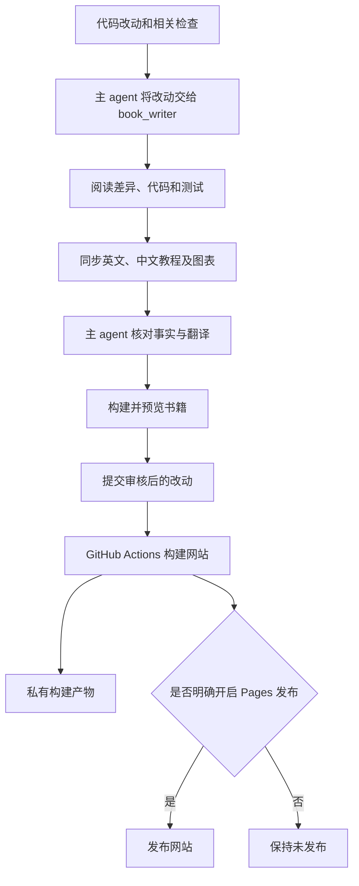

# 写作与更新流程

这本书和程序源码保存在同一个仓库中。默认语言是英文，完整的简体中文版本放在 `docs/zh/`。网站由 VitePress 构建，图表以 Mermaid 文本块保存在 Markdown 中。

## 专门负责写作的 subagent

项目在 [`.codex/agents/book_writer.toml`](https://github.com/qshine/mino/blob/main/.codex/agents/book_writer.toml) 中定义了名为 **`book_writer`** 的 Codex 专用 agent，沿用主任务的模型和权限。在 Codex 中打开并信任这个项目；已有任务若尚未发现新增配置，开启一个新任务即可重新加载。

[仓库规则](https://github.com/qshine/mino/blob/main/AGENTS.md) 要求主编码 agent 在每次完成代码改动后调用写作 agent，检查是否需要更新教程。写作 agent 阅读改动和实际实现，同步两种语言及其图表，然后交回主任务审核。

这是 **Codex 开发流程中的一个步骤**。它不是独立后台服务，也不会在每次手工 Git push 时自行运行。GitHub Actions 负责构建已经写好的页面，不调用模型生成文章。不需要额外配置云端 AI 密钥或定时任务。

较宽的图可以左右滚动，保持图中文字清晰可读。



主 agent 负责最终的事实审核。网站构建成功可以证明页面能够编译、内部链接可以找到，但不能代替对“原理是否符合代码”的检查。

## 写作 agent 更新什么

- 本章要解决的问题、预期成果、原理、实现路径、小实验，以及本章完成的能力。
- 交互变化对应的时序图、判断变化对应的流程图、关系变化对应的概念图。
- 相关版本标记、源码链接、安装步骤和章节进度。
- 同一次改动中的英文和中文，包括图表标签与图下说明。

必须区分已经实现的行为和未来计划。模型输出若没有实际观察过，应明确标为示例。源码链接应对应所讲解的版本，书中不能出现真实 API Key、私人配置或对话日志。

同章的小修复更新原章节，新能力可以开启下一章。若某项改动不影响读者，写作 agent 应说明无需更新正文的原因。

## 本地预览与检查

网站工具与 Go 程序互相独立。使用 `.node-version` 中记录的 Node.js 24，从仓库根目录运行：

```bash
npm ci --ignore-scripts
npm run book:dev
```

打开 VitePress 输出的本地地址，通常为 `http://127.0.0.1:5173/mino/`。默认显示英文，可以通过语言菜单切换到简体中文。

提交前运行：

```bash
npm audit --audit-level=moderate
npm run book:build
npm run book:preview
```

检查两种语言、章节页语言切换、站内搜索、浅色与深色图表、小屏阅读和内部链接。构建产物及依赖目录由 Git 忽略。

锁文件固定网站依赖版本。VitePress 1.6.4 默认依赖的 Vite 存在已知安全公告，因此项目覆盖使用已修补的 Vite 6.4.3，与当前 Vue 插件兼容。升级工具时需重新检查这个覆盖、依赖审计、正式构建和浏览器表现，不能为消除报错而取消检查。

## 以后如何发布

[Tutorial book 工作流](https://github.com/qshine/mino/blob/main/.github/workflows/book.yml) 会在相关代码推送和 PR 时构建，并在私有仓库中保存可下载的构建产物。**默认不公开部署。**

GitHub Pages 可以直接托管静态教程，不需要另租服务器。私有仓库使用 Pages 需要符合条件的付费 GitHub 方案；个人仓库私有并不意味着 Pages 网站私有。限制读者访问的私有 Pages 需要使用 GitHub Enterprise Cloud 的组织。参见 [Pages 可用范围](https://docs.github.com/en/pages/getting-started-with-github-pages/what-is-github-pages)与[网站访问权限](https://docs.github.com/en/enterprise-cloud@latest/pages/getting-started-with-github-pages/changing-the-visibility-of-your-github-pages-site)。

仓库所有者明确决定公开、且账号方案支持后：

1. 在仓库 Pages 设置中选择 **GitHub Actions** 作为来源。
2. 把仓库 Actions 变量 `BOOK_PUBLISH_ENABLED` 设为 `true`。
3. 手动运行 **Tutorial book**，或者向 `main` 推送教程更新。

项目路径已经配置为 `/mino/`。公开后通常使用 `https://qshine.github.io/mino/`，这只是预定地址，目前尚未发布。自定义域名是可选项。

删除该变量会停止之后的部署，但**不会下线已经发布的网站**。如果需要下线，请在仓库的 Pages 设置中取消发布。
